# A Real World Example

We are going to analyze a real world malware from the malware family [Agent Tesla](https://malpedia.caad.fkie.fraunhofer.de/details/win.agent_tesla). Agent Tesla is a .NET based information stealer. Here is the details of the malware sample that we are going to analyze:

| Key                | Value                                                                                            |
| ------------------ | ------------------------------------------------------------------------------------------------ |
| ZIP filename       | `e338fccdd4b7cf652e6e6af393184ab56f96a1777afac08ba346002806e89071.zip`                           |
| Password           | `infected`                                                                                       |
| Extracted filename | `e338fccdd4b7cf652e6e6af393184ab56f96a1777afac08ba346002806e89071.exe`                           |
| File Type          | `Windows Executable`                                                                             |
| Sample Source      | https://bazaar.abuse.ch/sample/e338fccdd4b7cf652e6e6af393184ab56f96a1777afac08ba346002806e89071/ |

First copy the malware sample zip file into both the Static and Dynamic analysis Windows 10 VMs, also copy it to the REMnux Dynamic Analysis VM and extract the zip file using the given password.

## Static Analysis

Let's start by identifying the file type of the given malware sample.

### Identifying the File Type

On the REMnux VM, run the `file` command on the given sample. Here is the output of the `file` command,


As shown in the above image, the given file is a PE Executable file and its a x32 executable.

### Fingerprinting the Malware

Let's calculate the MD5 and SHA256 hashes of the given sample using the commands `md5sum` and `sha256sum` as shown in the following image:

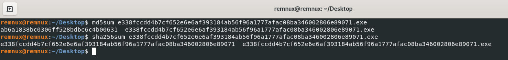

Here are the hash values:

| Algorithm | Hash                                                             |
| --------- | ---------------------------------------------------------------- |
| MD5       | ab6a1838bc0306ff528bdbc6c4b00631                                 |
| SHA256    | e338fccdd4b7cf652e6e6af393184ab56f96a1777afac08ba346002806e89071 |

### File Hash Lookup

Let's check VirusTotal for previous analysis results.

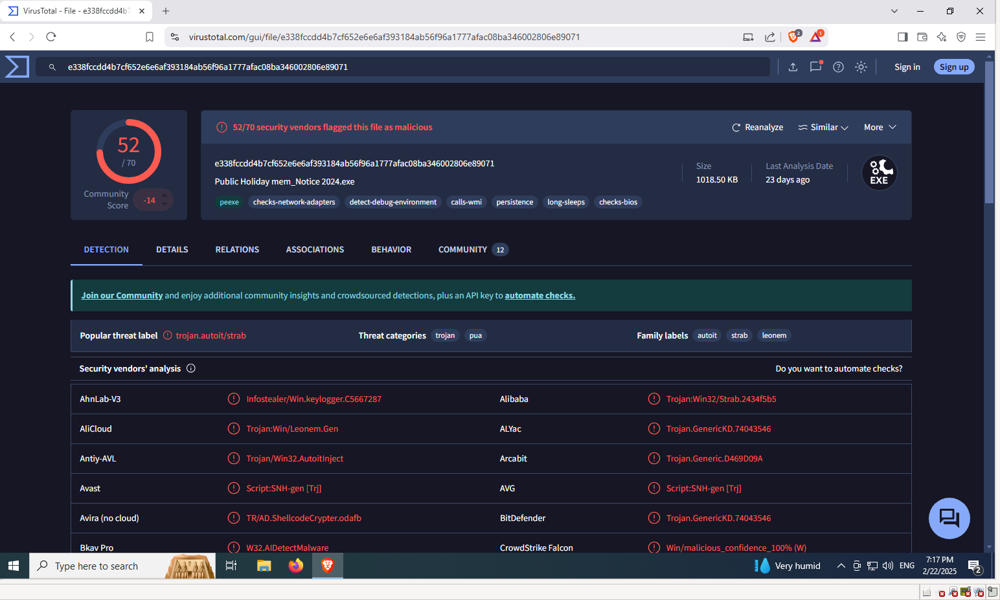

According to virus total, the malware sample is flagged malicious by 56 vendors as of the total 73 vendors.

### Comparing and Classifying the Malware

Let's now generate different signatures of the given malware sample.

#### Fuzzy Hashing

Let's generate fuzzy hash for the given sample using `ssdeep` from the REMnux VM.

```bash
ssdeep <filename>
```


#### Import Hashing

For generating the import hash, update the file path to the malware sample as shown in the following image.


Now run the script to get the import hash.


#### PE Sections Hashing

To get the PE section hashes of the given sample run the python script as shown in the following image.

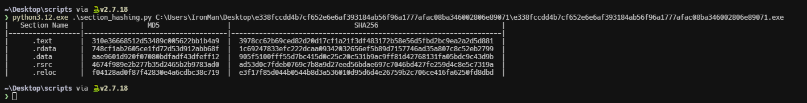

### Extracting and Analyzing Strings

Since the number strings extracted from the given sample is huge, I am redirecting the output to a text file, which makes it easy to analyze.

#### Using strings command

```bash
strings <filepath> > strings.txt
```


There isn't much of interest in the output of the strings command, as you can see in the following image. It contains some strings related to Windows registry paths and a line stating that this is an AutoIt compiled script, which shows that this executable is a generated by AutoIt.

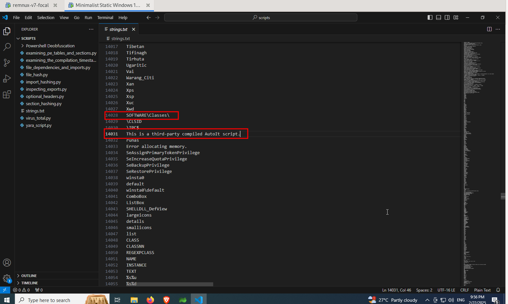

#### Using Flare Floss

```bash
floss <filepath> > floss.txt
```

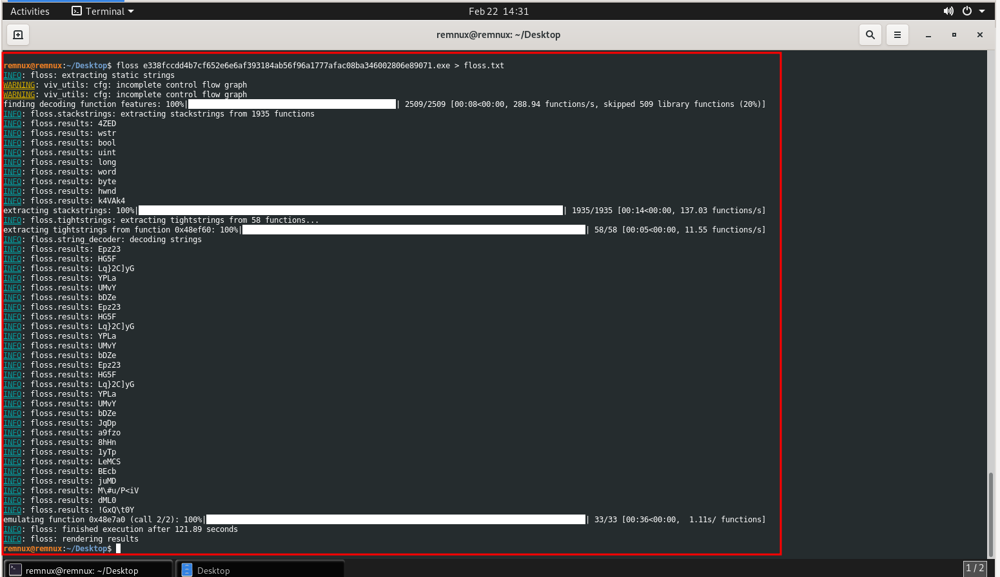

Similar to results of the `strings` command, the results from `floss` is also not that much interesting. We can some references to AutoIt3, which shows that this is a AutoIt compiled script.


### Detecting Packing and Obfuscation

#### Using DIE

`DIE` has detected that the given sample is of AutoIt3 format and eventually detected there is something compressed and stored in the `.rsrc` section of the PE file.

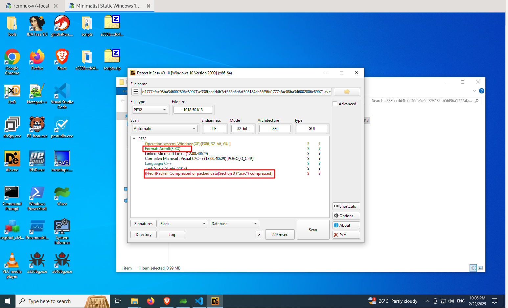

#### Using ExeInfo PE

`ExeInfo PE` has also detected that the given file is compiled by **AutoIt** and suggests to use `Exe2Aut` to extract the `AutoIt` script.


#### Using UPX

We can use the `upx` command with `-t` flag to test whether the given file is packed by **UPX** or not.

```powershell
# In Windows OS
upx.exe -t <path_to_file>
```

```bash
# In Remnux
upx -t <path_to_file>
```

The given file is not packed by **UPX** as shown in the following image.

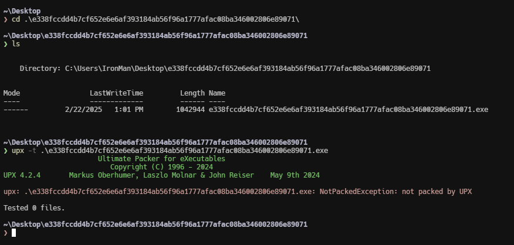

### Portable Executable Analysis

#### Inspecting file dependencies and imports

You can find the list of imports under the `imports` section in `PEStudio` as shown in the following image. You can also see that PEStudio maps certain imports with Mitre attack techniques.

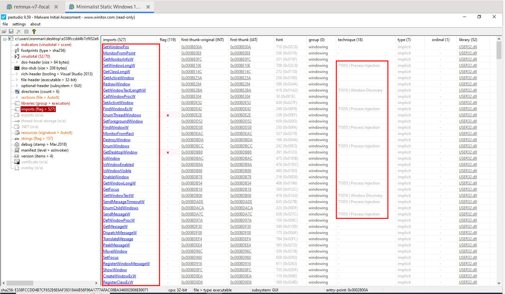

You can also try to match the imports with [MalAPI.io](https://malapi.io/) to understand the malicious possibilities of those Windows APIs.


#### Inspecting exports

You can find the exports under the `exports` section in `PEStudio` as shown in the following image. There is no exports for the given sample.


#### Examining PE Table and Sections

You can find the properties of all the PE sections under the sections tab in PeStudio. Recall the results from `DIE`, which detected that something compressed is stored in the `.rsrc` section. If you check the `.rsrc` section in PeStudio, you will see that there is a file present with an AutoIt signature, as shown in the following image.

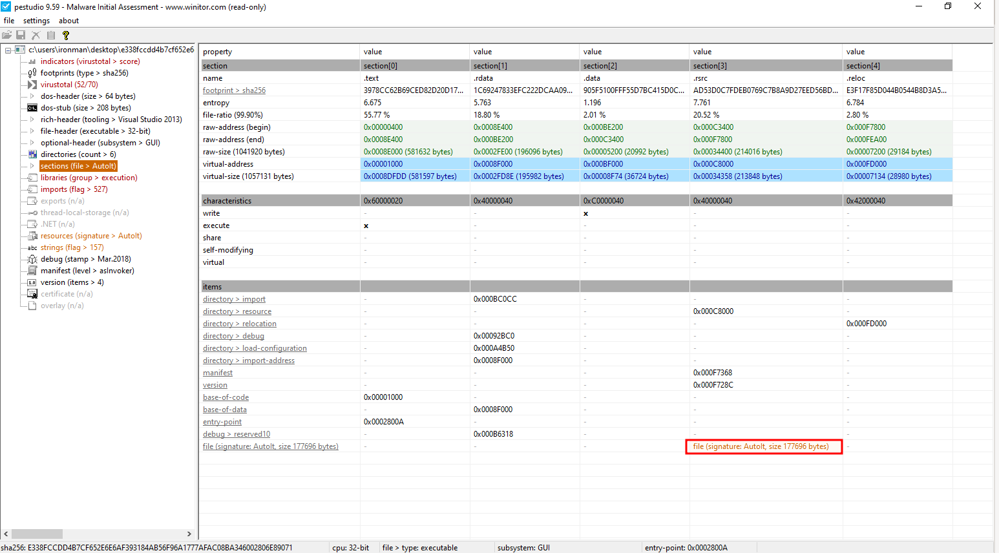

#### Examining the Compilation Timestamp

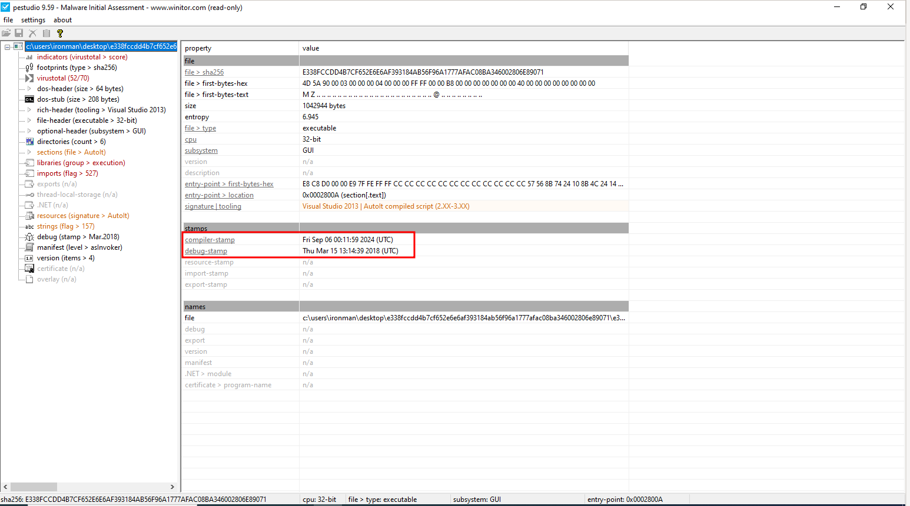

| Key                                       | Value                        |
| ----------------------------------------- | ---------------------------- |
| File Size                                 | 1042944 bytes                |
| Compiler-Stamp / Originally Created Stamp | Fri Sep 06 00:11:59 2024 UTC |
| Debug-Stamp                               | Thu Mar 15 13:14:39 2018 UTC |

#### Examining entry point and subsystem

The subsystem of the given sample is **GUI**.

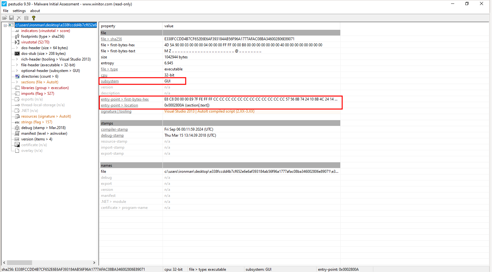

#### Examining overlays

There is no overlay present in the given sample as shown in the following image.


#### Extracting AutoIt script

Let's extract the AutoIt script using `autoit-ripper` tool.

```powershell
autoit-ripper.exe <file> output_dir
```

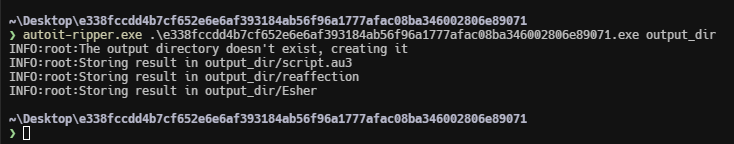

You can find the extracted AutoIt script (`.au3`) in the output_dir folder. You can reverse engineer the extracted AutoIt script to learn more about the malware. Since this workshop doesn't cover reverse engineering, it is beyond the scope of this workshop and is left for your exploration.


### Yara Analysis

Update the malware file path and output file path in the `yara` python script.

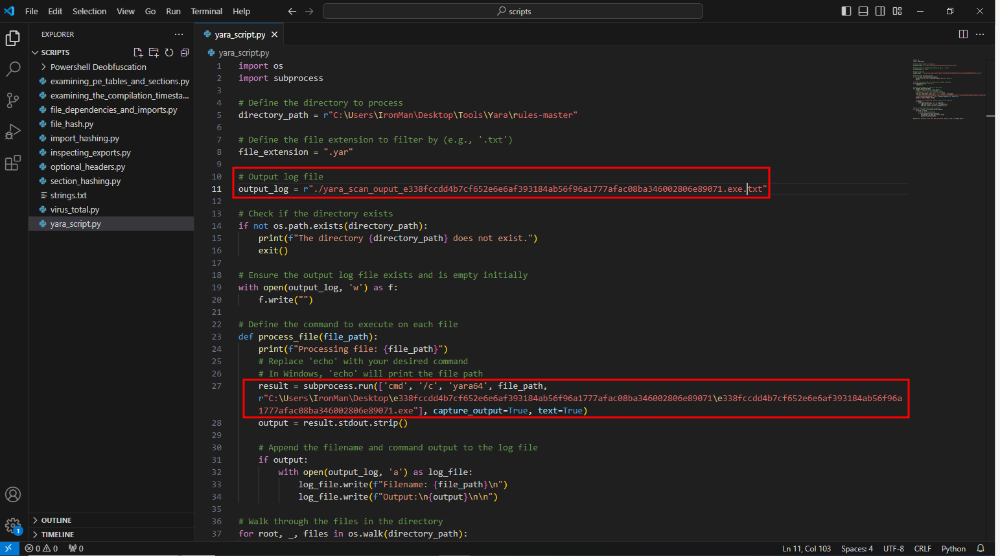

Now run the script as shown in the following image.


From the results of the above script, we can see that YARA has detected the signatures shown in the following image. From this we know that the given sample has the abilities to take screenshots, escalate privileges, act as a keylogger and much more.

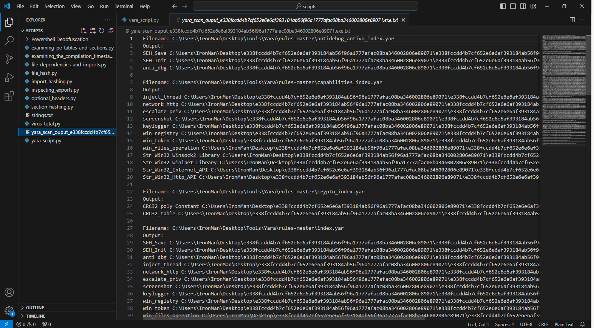

### Capa Analysis

**Capa** has detected that the given sample is compiled with AutoIt and suggest that we have to manually extract the AutoIt script and perform analysis.

```powershell
capa -r <rules_directory> -s <signatures_directory> <malicious_executable_file>
```


## Dynamic Analysis

### Initial Setup

On the Windows 10 Dynamic Analysis VM start the following tools,

- Regshot ( Take the first snapshot )
- Procmon ( Initially stop recording and start it before executing the malware )
- System Informer ( formerly Process Hacker )

On the Remnux Dynamic Analysis VM start the following tools,

- inetsim
- Wireshark

### Executing The Malware

Keep the desktop setup as shown in the following image and execute the malware. You can see that the `RegSvcs.exe` process is created once we executed the malware.


Let's confirm that this process is created by the malware by the checking the properties of this process. You can view the properties of this process by double clicking on it. The properties of the process `RegSvcs.exe` is shown in the following image.

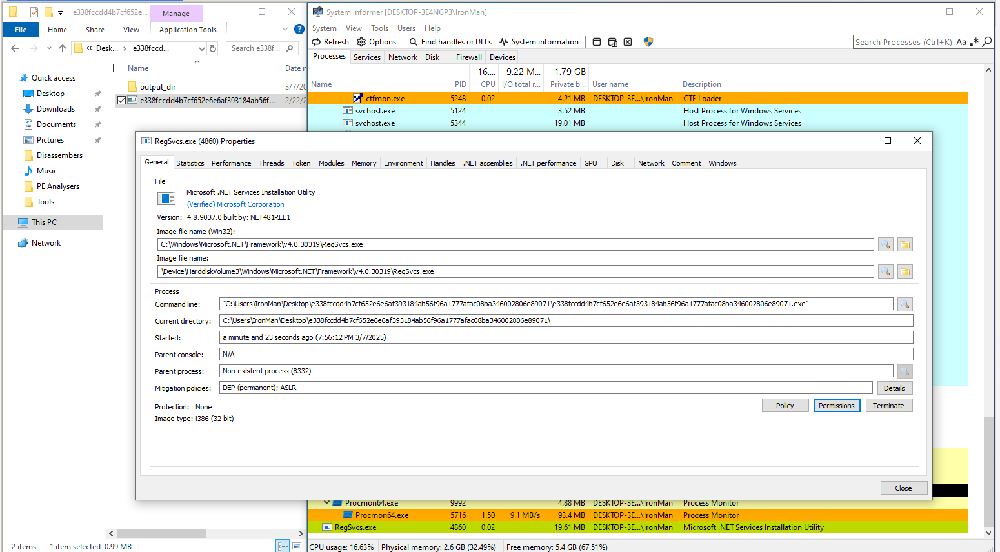

From the properties of `RegSvcs.exe`, it is confirmed that this process is created by the malware that we executed. Also this process is a managed process, as [clr.dll](https://dll.website/clr-dll) and [clrjit.dll](https://dll.website/clrjit-dll) are loaded by the process, thus there is a possibility of some managed code to be run.

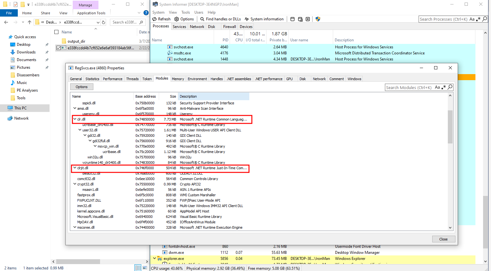

After about 30 to 60 seconds of executing the malware, stop `Wireshark` and `Procmon`. Then take the second snapshot in `Regshot` and compare the snapshots.

### Performing Analysis

#### Analyzing Registry Changes

Let's analyze the results of `Regshot`. In the `Values Added` section of the `Regshot` output, you can find an entry in the `SOFTWARE\Microsoft\Windows\CurrentVersion\Run` registry folder, which shows that the malware sets up persistence.


```
HKU\S-1-5-21-1935731052-3085740657-932754160-1000\SOFTWARE\Microsoft\Windows\CurrentVersion\Run\FTSKIaM: "C:\Users\IronMan\AppData\Roaming\FTSKIaM\FTSKIaM.exe"
```

As shown in the above image, the malware creates a entry named `FTSKIaM` under `SOFTWARE\Microsoft\Windows\CurrentVersion\Run` and sets its value to `C:\Users\IronMan\AppData\Roaming\FTSKIaM\FTSKIaM.exe`, which shows that the malware added the `FTSKIaM.exe` executable to the startup programs, ensuring its persistence across system reboots.

#### Analyzing Malware Activity

Let's now analyze the logs from `Procmon`. First, filter for entries related to processes by selecting the process filter from the toolbar, as shown in the following image. After filtering, you will find entries showing the malware we executed creating the process `RegSvcs.exe`.


Now let's filter out activity related to the `RegSvcs.exe` process by creating a new filter. Click on the filter icon in the toolbar and create a filter with the `Process Name`, as shown in the following image.

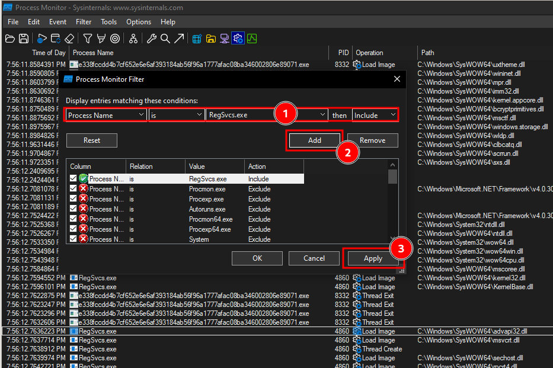

After creating the filter, now let's look out for activity by the `RegSvcs.exe` process related to registry by selecting the registry filter from the toolbar as shown in the following image. You can see that this process adds the `SOFTWARE\Microsoft\Windows\CurrentVersion\Run\FTSKIaM` entry with the value `C:\Users\IronMan\AppData\Roaming\FTSKIaM\FTSKIaM.exe`, which is added to startup apps to automatically execute upon reboot to remain persistent.


Now let's filter out activity related to files by selecting the file activity filter in the toolbar as shown in the following image. You can see that the `RegSvcs.exe` process tried to create the file `C:\Users\IronMan\AppData\Roaming\FTSKIaM\FTSKIaM.exe` and was able to create it successfully after some tries.


Let's generate the file hashes of the `C:\Users\IronMan\AppData\Roaming\FTSKIaM\FTSKIaM.exe` file as shown in the following image.

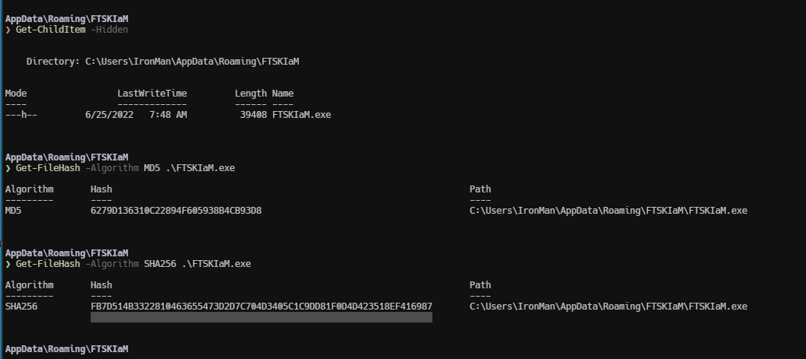

Now search the SHA256 hash in VirusTotal to get more details about the file. According to VirusTotal, this file is benign and its name is `RegSvcs.exe`, as obtained from its last analysis.


While surfing through the file activity, you could find a lot of [CreateFile](https://learn.microsoft.com/en-us/windows/win32/api/fileapi/nf-fileapi-createfilea), `QueryDirectory` and [ReadFile](https://learn.microsoft.com/en-us/windows/win32/api/fileapi/nf-fileapi-readfile) operations to files under the path `C:\Users\IronMan\AppData\Local\*`. All of these requests had the **Desired Access** as **Read Attributes** as shown in the following figure. This folder is part of the user-specific data directories and typically contains settings, cached files, logs, and other data that applications need to store on a per-user basis, but do not intend to share across different users.

> You can see a lot of `CreateFile` requests before `ReadFile` requests. This is because the [ReadFile](https://learn.microsoft.com/en-us/windows/win32/api/fileapi/nf-fileapi-readfile) function expects a file handle, as mentioned in the documentation, which is obtained from the `CreateFile` function. Therefore, whenever a `ReadFile` is executed, the `CreateFile` is always executed first.

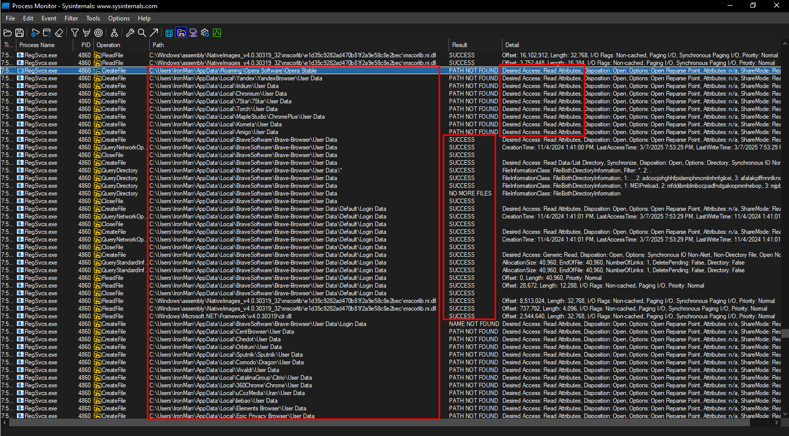

The above image shows that the `RegSvcs.exe` file is looking out for Brave Browser's User Data. Also the following image shows that the `RegSvcs.exe` trying to access the Google Chrome’s User Data and Microsoft Edge User Data.

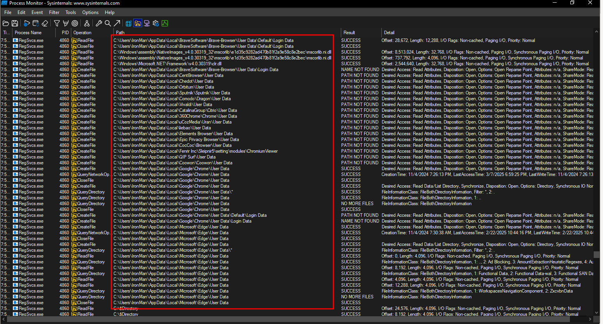

All these file activity of the process `RegSvcs.exe`shows that it is a information stealer which tries to steal all the information related to user data such as browser cookies, stored credentials, user profiles, etc.

#### Analyzing DNS Requests

Now let's filter DNS requests from the **Wireshark** capture by using the following **Wireshark** filter.

```
dns and ip.src == <WINDOWS_IP>
```

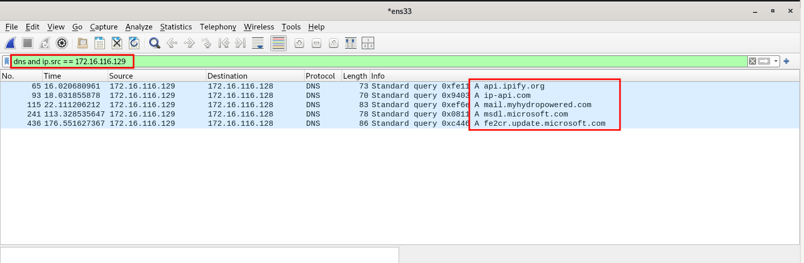

The following DNS requests were made by the Windows VM during the time period of capture as shown in the above image.

- api.ipify.org
- ip-api.com
- mail.myhydropowered.com
- msdl.microsoft.com
- fe2cr.update.microsoft.com

Let's filter out malicious DNS requests from the legitimate ones, by performing a domain lookup in **VirusTotal**.

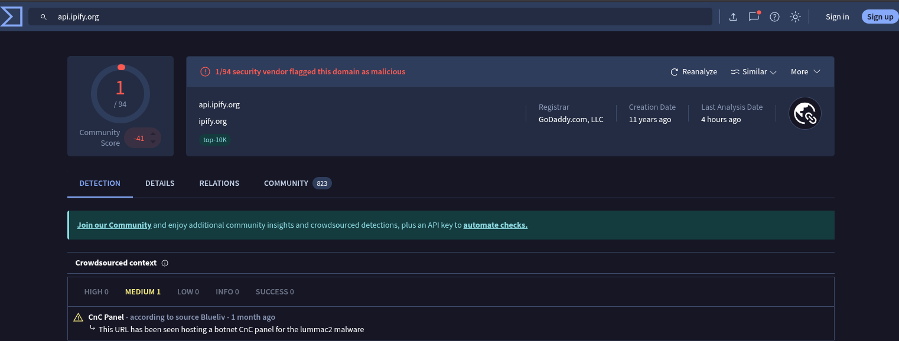

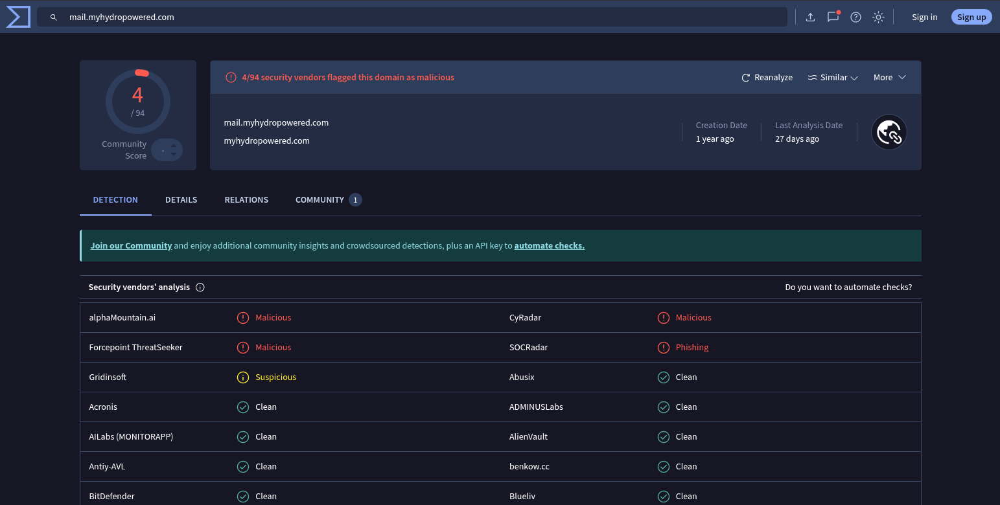

After checking all the domains in **VirusTotal**, the following domains were flagged malicious by **VirusTotal** as shown in the above images,

- api.ipify.org
- mail.myhydropowered.com

#### Analyzing HTTP Requests

Now let's filter HTTP requests from the **Wireshark** capture by using the following **Wireshark** filter.

```
http and ip.src == <WINDOWS_IP>
```


The following HTTP requests were made by the Windows VM during the capture. None of these requests are malicious according to **VirusTotal**.

- http://wpad.localdomain/wpad.dat
- http://ip-api.com/line/?fields=hosting
- http://wpad.localdomain/wpad.dat

#### Indicators of Compromise

##### Main Malware File

| Key       | Value                                                                |
| --------- | -------------------------------------------------------------------- |
| File Name | e338fccdd4b7cf652e6e6af393184ab56f96a1777afac08ba346002806e89071.exe |
| MD5       | ab6a1838bc0306ff528bdbc6c4b00631                                     |
| SHA256    | e338fccdd4b7cf652e6e6af393184ab56f96a1777afac08ba346002806e89071     |

##### Dropped File

| Key               | Value                                                            |
| ----------------- | ---------------------------------------------------------------- |
| File Name         | FTSKIaM.exe                                                      |
| Dropped File Path | C:\Users\IronMan\AppData\Roaming\FTSKIaM\FTSKIaM.exe             |
| MD5               | 6279D136310C22894F605938B4CB93D8                                 |
| SHA256            | FB7D514B3322810463655473D2D7C704D3405C1C9DD81F0D4D423518EF416987 |

##### Persistance

```
HKU\S-1-5-21-1935731052-3085740657-932754160-1000\SOFTWARE\Microsoft\Windows\CurrentVersion\Run\FTSKIaM: "C:\Users\IronMan\AppData\Roaming\FTSKIaM\FTSKIaM.exe"
```

##### DNS Requests

- api.ipify.org
- mail.myhydropowered.com

### Using Automated Sandbox

[Link to any.run submission](http://app.any.run/tasks/b04a1b72-ec23-4c72-9bc9-c18d38955063)

From the analysis results of Any.Run, the following information is obtained:

- The malware dropped another PE file named RegSvcs.exe.
  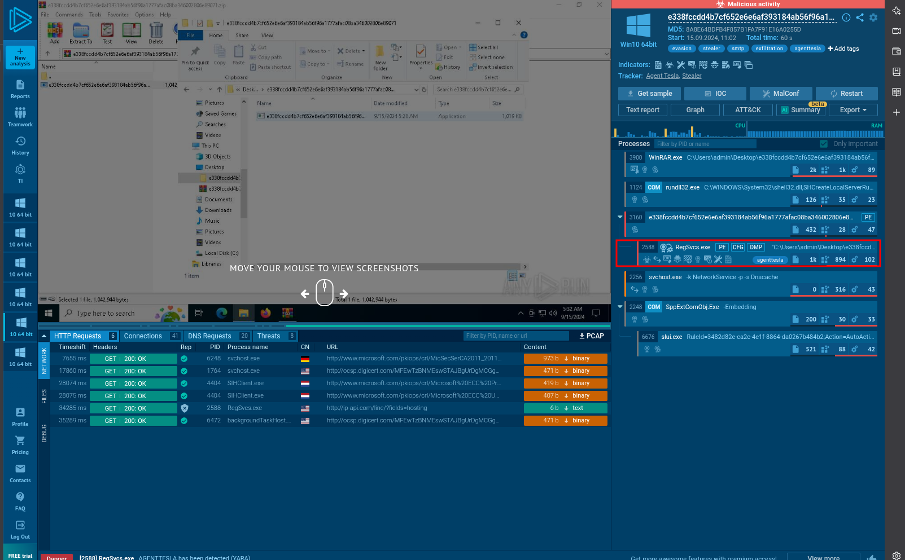

- The dropped file made a http request to http://ip-api.com/line/?fields=hosting
  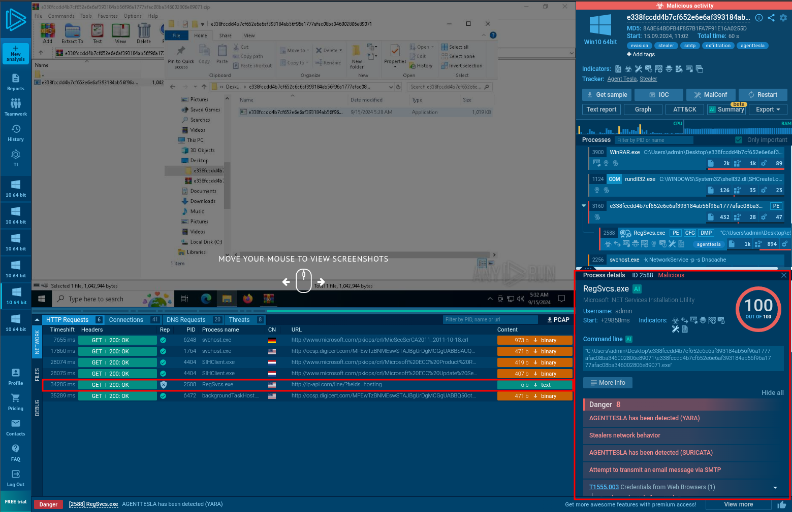

- The dropped file also made DNS requests to the following domains: - [api.ipify.org](http://api.ipify.org/) - [mail.myhydropowered.com](http://mail.myhydropowered.com/) - [ip-api.com](http://ip-api.com/)
  

- The dropped file also attempted to transmit an email via SMTP to the domain [mail.myhydropowered.com](http://mail.myhydropowered.com/)
  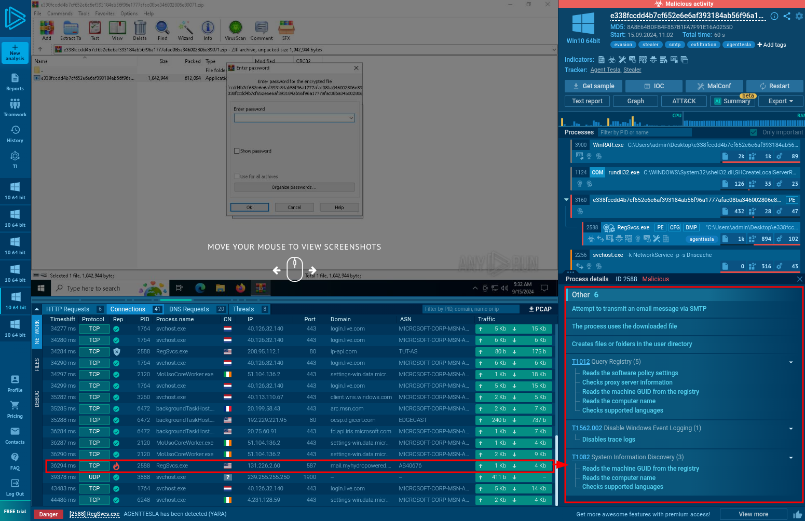

- The dropped file was added to the startup for persistence and also flagged as a information stealer.

- You can also find the indicators of compromise.
  

- Also if you click the `MalConf` button, you can get the configuration used by the malware, if its available as shown in the following image.
  

- You can also get the report by clicking on the `Text Report` button.
  
