import { Code } from "@astrojs/starlight/components";
import { Aside } from "@astrojs/starlight/components";

## Initial Setup

On the Windows 10 Dynamic Analysis VM start the following tools,

- Regshot ( Take the first snapshot )
- Procmon ( Initially stop recording and start it before executing the malware )
- System Informer ( formerly Process Hacker )

On the Remnux Dynamic Analysis VM start the following tools,

- inetsim
- Wireshark

## Executing The Malware

Keep the desktop setup as shown in the following image and execute the malware. You can see that the `RegSvcs.exe` process is created once we executed the malware.

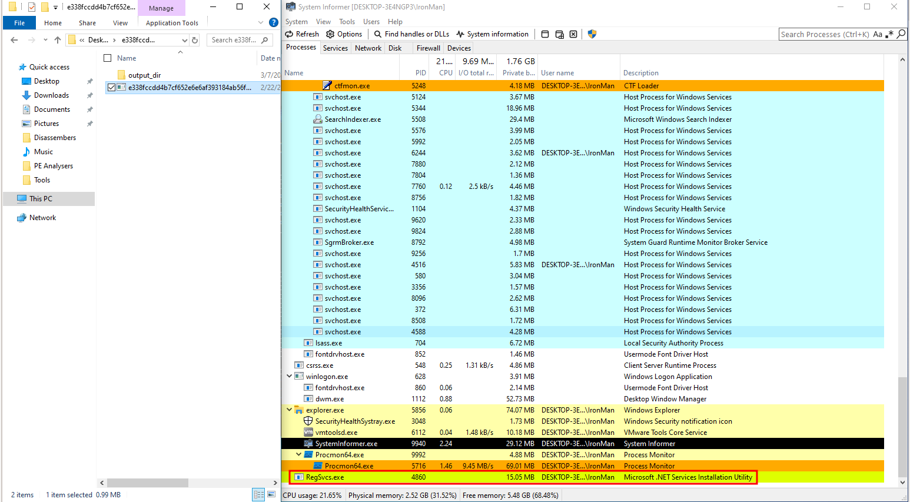

Let's confirm that this process is created by the malware by the checking the properties of this process. You can view the properties of this process by double clicking on it. The properties of the process `RegSvcs.exe` is shown in the following image.

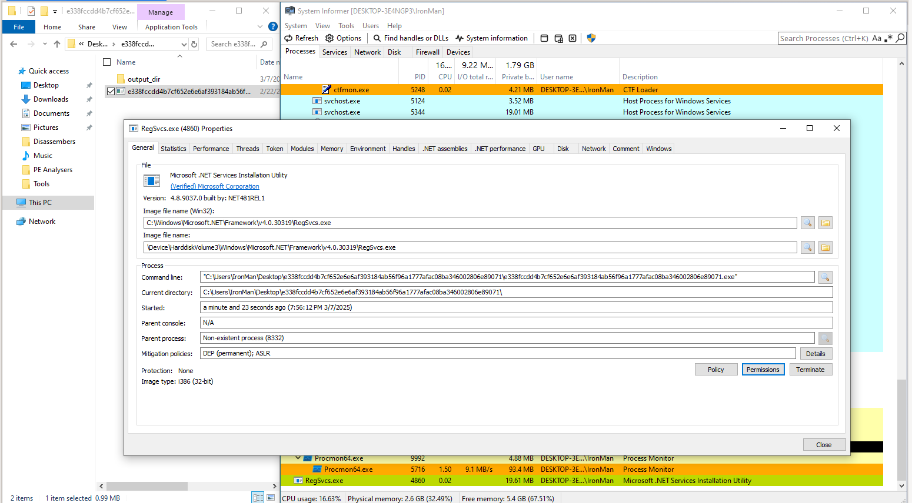

From the properties of `RegSvcs.exe`, it is confirmed that this process is created by the malware that we executed. Also this process is a managed process, as [clr.dll](https://dll.website/clr-dll) and [clrjit.dll](https://dll.website/clrjit-dll) are loaded by the process, thus there is a possibility of some managed code to be run.

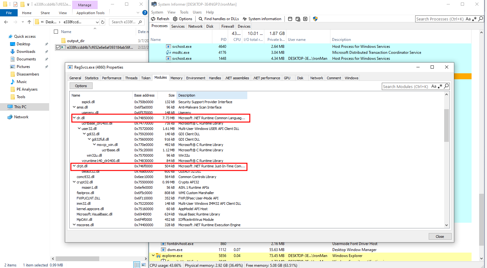

After about 30 to 60 seconds of executing the malware, stop `Wireshark` and `Procmon`. Then take the second snapshot in `Regshot` and compare the snapshots.

## Performing Analysis

### Analyzing Registry Changes

Let's analyze the results of `Regshot`. In the `Values Added` section of the `Regshot` output, you can find an entry in the `SOFTWARE\Microsoft\Windows\CurrentVersion\Run` registry folder, which shows that the malware sets up persistence.

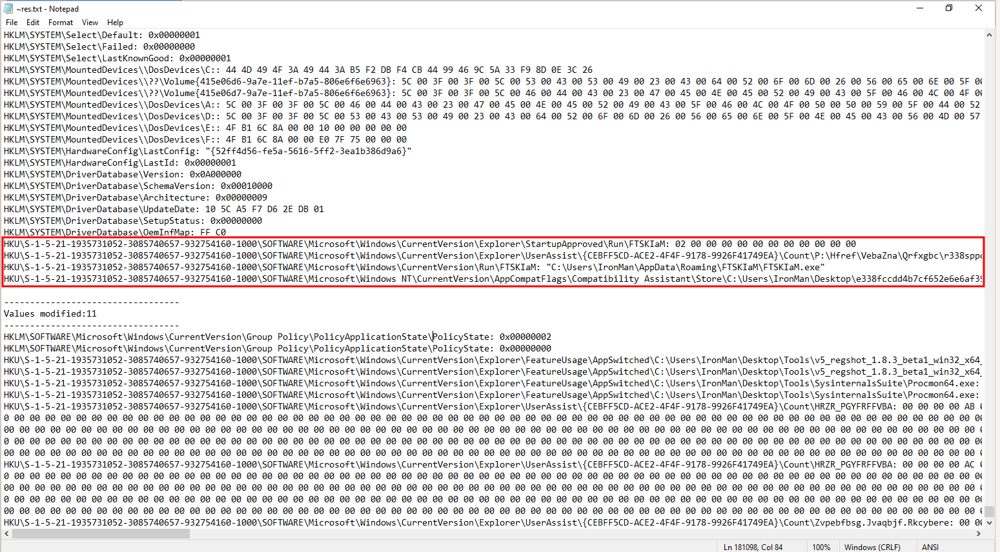

import RegistryKey from "../scripts/registry_key.txt?raw";

<Code code={RegistryKey} lang="plaintext" title="Registry Entry" wrap />

As shown in the above image, the malware creates a entry named `FTSKIaM` under `SOFTWARE\Microsoft\Windows\CurrentVersion\Run` and sets its value to `C:\Users\IronMan\AppData\Roaming\FTSKIaM\FTSKIaM.exe`, which shows that the malware added the `FTSKIaM.exe` executable to the startup programs, ensuring its persistence across system reboots.

### Analyzing Malware Activity

Let's now analyze the logs from `Procmon`. First, filter for entries related to processes by selecting the process filter from the toolbar, as shown in the following image. After filtering, you will find entries showing the malware we executed creating the process `RegSvcs.exe`.

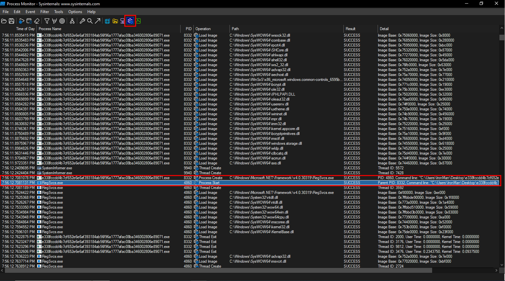

Now let's filter out activity related to the `RegSvcs.exe` process by creating a new filter. Click on the filter icon in the toolbar and create a filter with the `Process Name`, as shown in the following image.

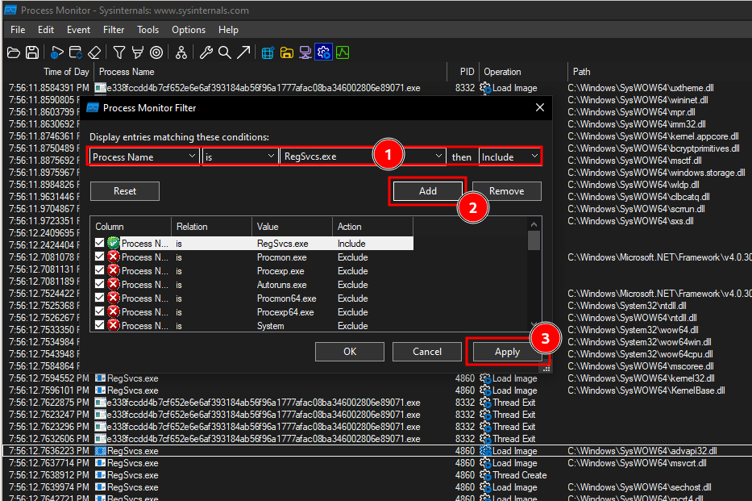

After creating the filter, now let's look out for activity by the `RegSvcs.exe` process related to registry by selecting the registry filter from the toolbar as shown in the following image. You can see that this process adds the `SOFTWARE\Microsoft\Windows\CurrentVersion\Run\FTSKIaM` entry with the value `C:\Users\IronMan\AppData\Roaming\FTSKIaM\FTSKIaM.exe`, which is added to startup apps to automatically execute upon reboot to remain persistent.

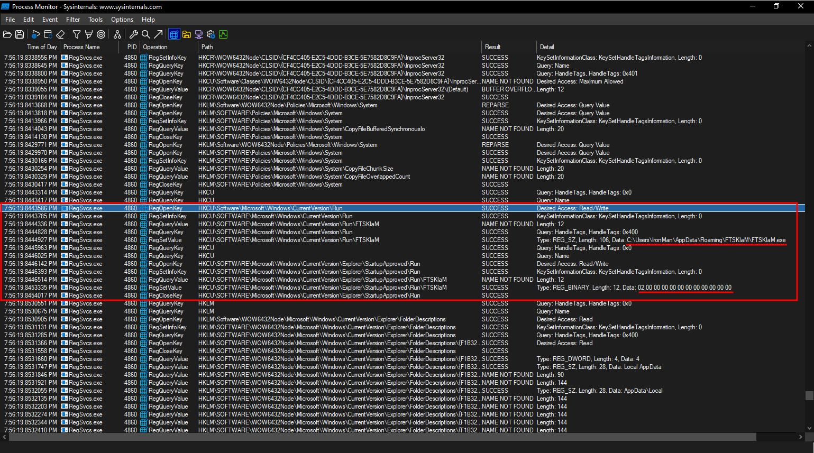

Now let's filter out activity related to files by selecting the file activity filter in the toolbar as shown in the following image. You can see that the `RegSvcs.exe` process tried to create the file `C:\Users\IronMan\AppData\Roaming\FTSKIaM\FTSKIaM.exe` and was able to create it successfully after some tries.

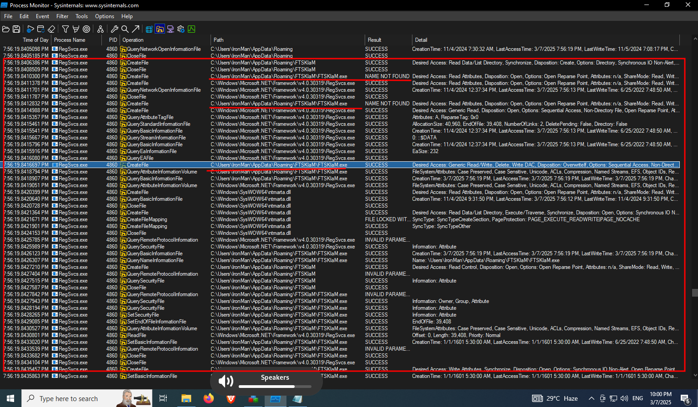

Let's generate the file hashes of the `C:\Users\IronMan\AppData\Roaming\FTSKIaM\FTSKIaM.exe` file as shown in the following image.

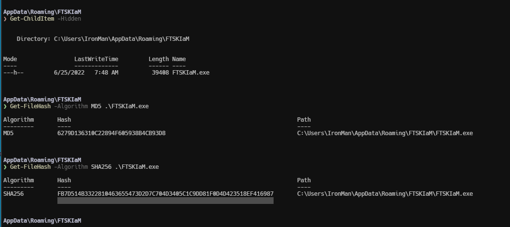

Now search the SHA256 hash in VirusTotal to get more details about the file. According to VirusTotal, this file is benign and its name is `RegSvcs.exe`, as obtained from its last analysis.

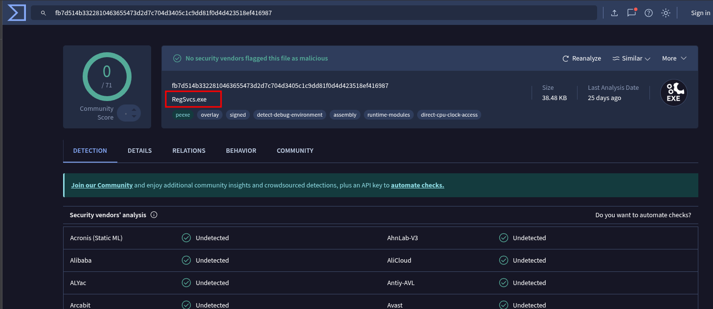

While surfing through the file activity, you could find a lot of [CreateFile](https://learn.microsoft.com/en-us/windows/win32/api/fileapi/nf-fileapi-createfilea), `QueryDirectory` and [ReadFile](https://learn.microsoft.com/en-us/windows/win32/api/fileapi/nf-fileapi-readfile) operations to files under the path `C:\Users\IronMan\AppData\Local\*`. All of these requests had the **Desired Access** as **Read Attributes** as shown in the following figure. This folder is part of the user-specific data directories and typically contains settings, cached files, logs, and other data that applications need to store on a per-user basis, but do not intend to share across different users.

> You can see a lot of `CreateFile` requests before `ReadFile` requests. This is because the [ReadFile](https://learn.microsoft.com/en-us/windows/win32/api/fileapi/nf-fileapi-readfile) function expects a file handle, as mentioned in the documentation, which is obtained from the `CreateFile` function. Therefore, whenever a `ReadFile` is executed, the `CreateFile` is always executed first.

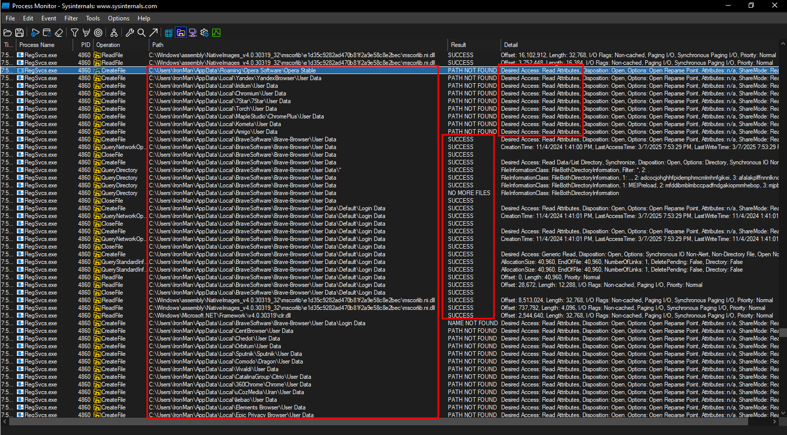

The above image shows that the `RegSvcs.exe` file is looking out for Brave Browser's User Data. Also the following image shows that the `RegSvcs.exe` trying to access the Google Chrome’s User Data and Microsoft Edge User Data.

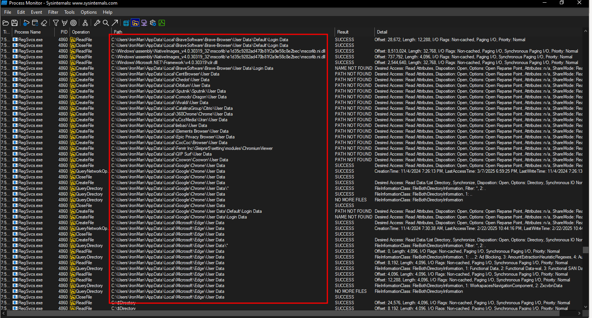

All these file activity of the process `RegSvcs.exe`shows that it is a information stealer which tries to steal all the information related to user data such as browser cookies, stored credentials, user profiles, etc.

### Analyzing DNS Requests

Now let's filter DNS requests from the **Wireshark** capture by using the following **Wireshark** filter.

<Code
  code="dns and ip.src == <WINDOWS_IP>"
  lang="plaintext"
  title="Wireshark Filter"
/>

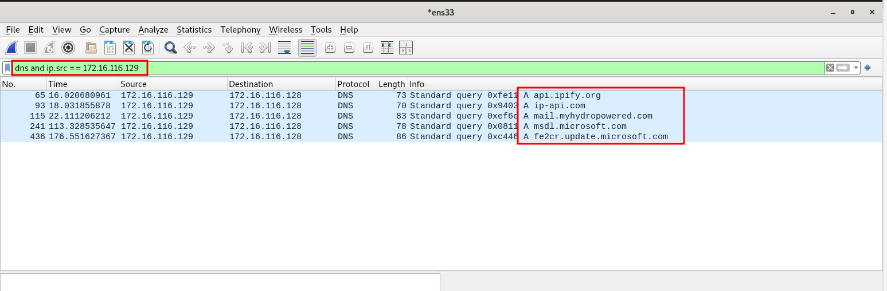

The following DNS requests were made by the Windows VM during the time period of capture as shown in the above image.

- `api.ipify.org`
- `ip-api.com`
- `mail.myhydropowered.com`
- `msdl.microsoft.com`
- `fe2cr.update.microsoft.com`

Let's filter out malicious DNS requests from the legitimate ones, by performing a domain lookup in **VirusTotal**.

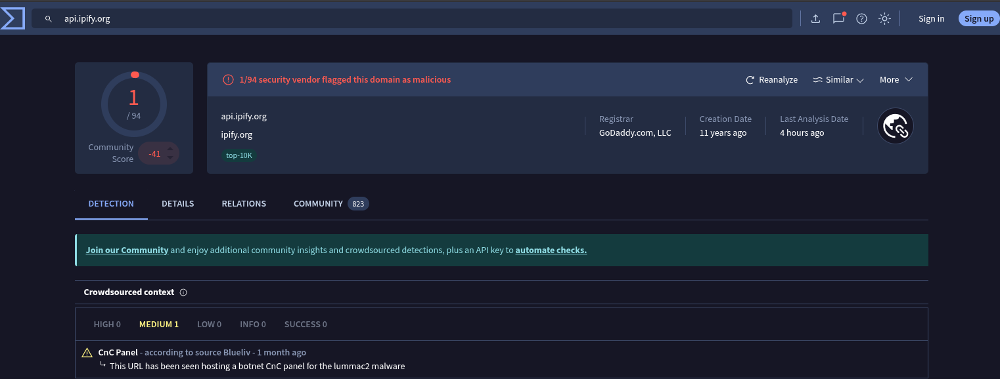

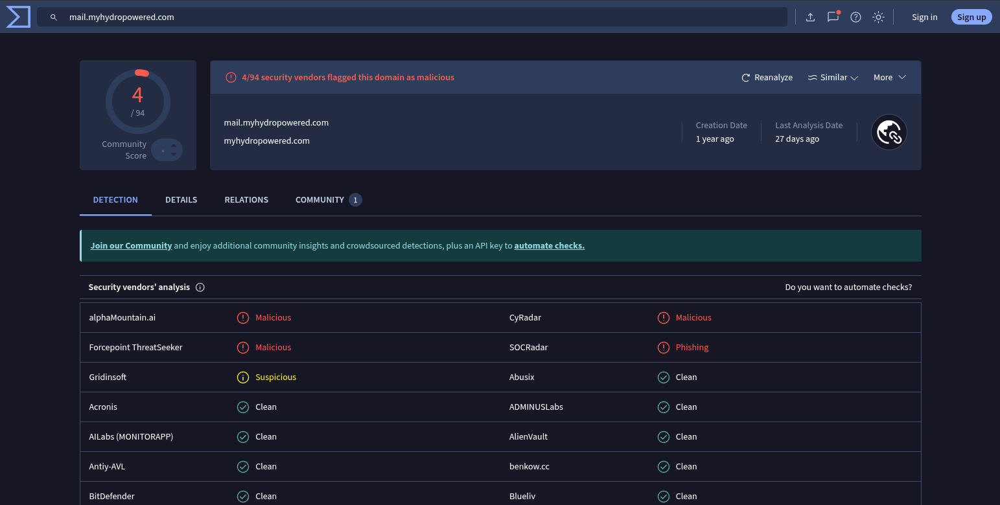

After checking all the domains in **VirusTotal**, the following domains were flagged malicious by **VirusTotal** as shown in the above images,

- `api.ipify.org`
- `mail.myhydropowered.com`

### Analyzing HTTP Requests

Now let's filter HTTP requests from the **Wireshark** capture by using the following **Wireshark** filter.

<Code
  code="http and ip.src == <WINDOWS_IP>"
  lang="plaintext"
  title="Wireshark Filter"
/>

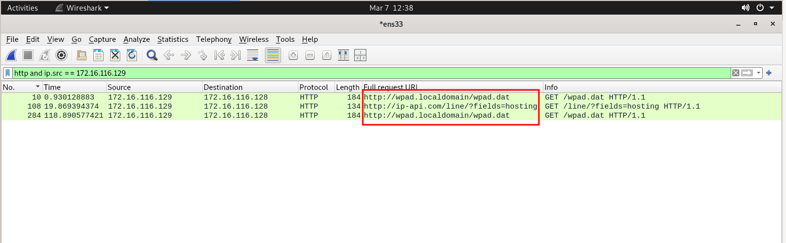

The following HTTP requests were made by the Windows VM during the capture. None of these requests are malicious according to **VirusTotal**.

- `http://wpad.localdomain/wpad.dat`
- `http://ip-api.com/line/?fields=hosting`
- `http://wpad.localdomain/wpad.dat`

### Indicators of Compromise

#### Main Malware File

| Key       | Value                                                                |
| --------- | -------------------------------------------------------------------- |
| File Name | e338fccdd4b7cf652e6e6af393184ab56f96a1777afac08ba346002806e89071.exe |
| MD5       | ab6a1838bc0306ff528bdbc6c4b00631                                     |
| SHA256    | e338fccdd4b7cf652e6e6af393184ab56f96a1777afac08ba346002806e89071     |

#### Dropped File

| Key               | Value                                                            |
| ----------------- | ---------------------------------------------------------------- |
| File Name         | FTSKIaM.exe                                                      |
| Dropped File Path | C:\Users\IronMan\AppData\Roaming\FTSKIaM\FTSKIaM.exe             |
| MD5               | 6279D136310C22894F605938B4CB93D8                                 |
| SHA256            | FB7D514B3322810463655473D2D7C704D3405C1C9DD81F0D4D423518EF416987 |

#### Persistance

```
HKU\S-1-5-21-1935731052-3085740657-932754160-1000\SOFTWARE\Microsoft\Windows\CurrentVersion\Run\FTSKIaM: "C:\Users\IronMan\AppData\Roaming\FTSKIaM\FTSKIaM.exe"
```

#### DNS Requests

- `api.ipify.org`
- `mail.myhydropowered.com`

## Using Automated Sandbox

[Link to any.run submission](http://app.any.run/tasks/b04a1b72-ec23-4c72-9bc9-c18d38955063)

From the analysis results of Any.Run, the following information is obtained:

- The malware dropped another PE file named RegSvcs.exe.

  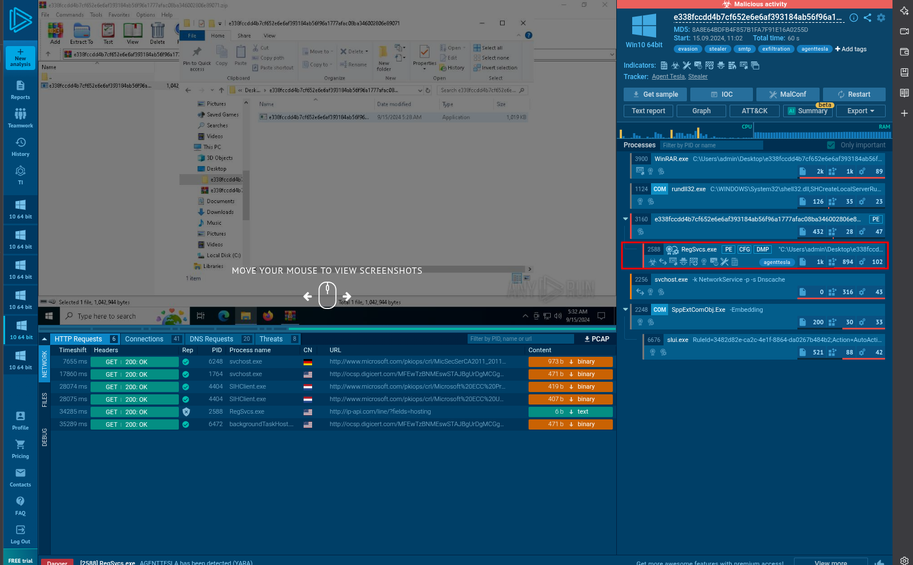

- The dropped file made a http request to http://ip-api.com/line/?fields=hosting

  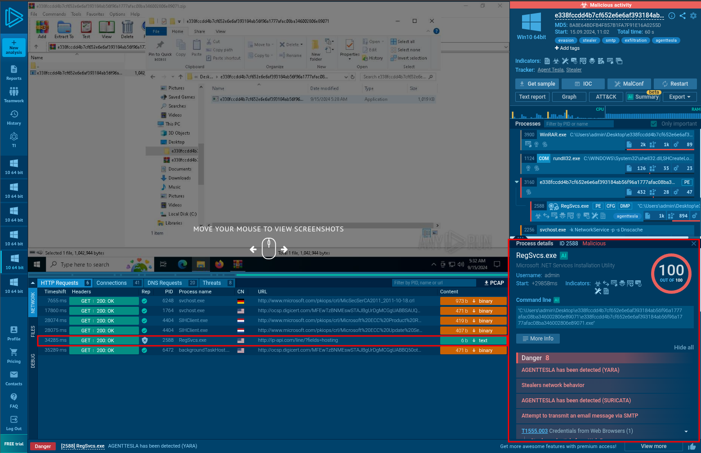

- The dropped file also made DNS requests to the following domains: - [api.ipify.org](http://api.ipify.org/) - [mail.myhydropowered.com](http://mail.myhydropowered.com/) - [ip-api.com](http://ip-api.com/)

  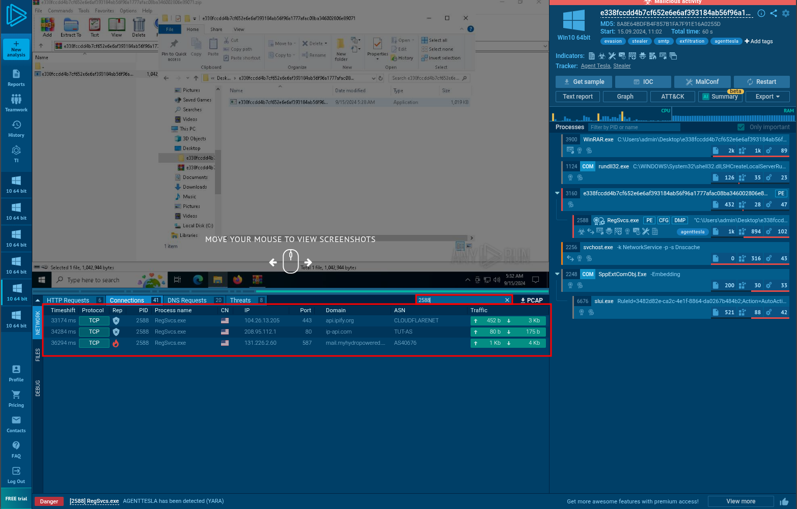

- The dropped file also attempted to transmit an email via SMTP to the domain [mail.myhydropowered.com](http://mail.myhydropowered.com/)

  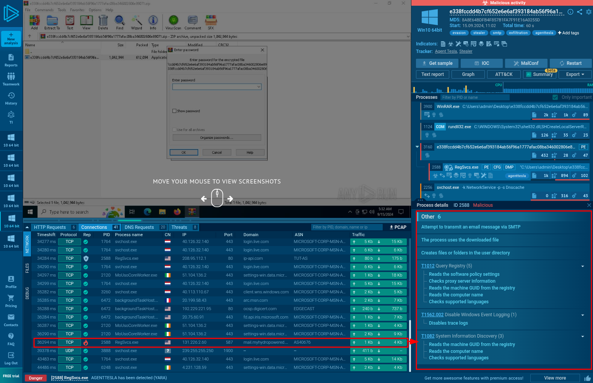

- The dropped file was added to the startup for persistence and also flagged as a information stealer.

- You can also find the indicators of compromise.

  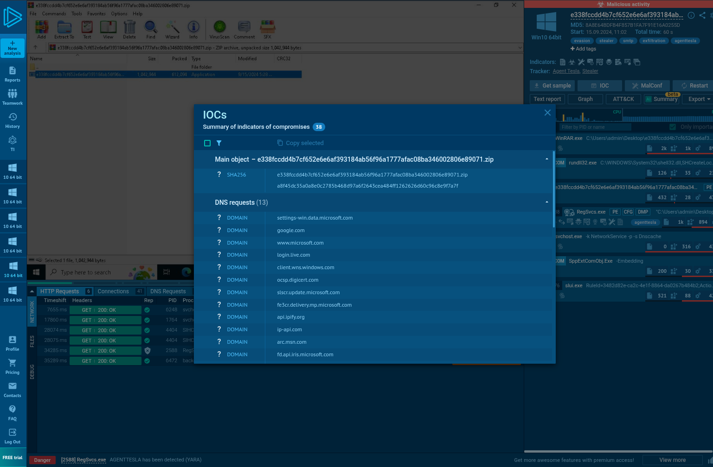

- Also if you click the `MalConf` button, you can get the configuration used by the malware, if its available as shown in the following image.

  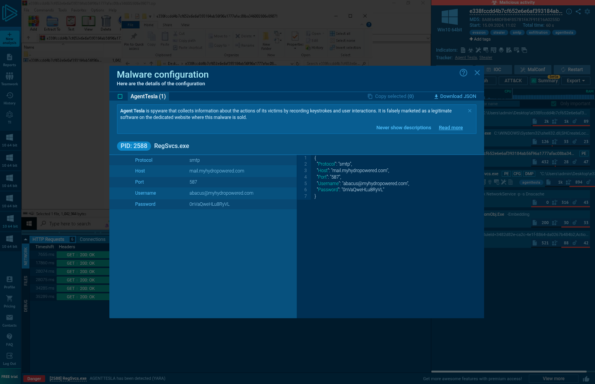

- You can also get the report by clicking on the `Text Report` button.

  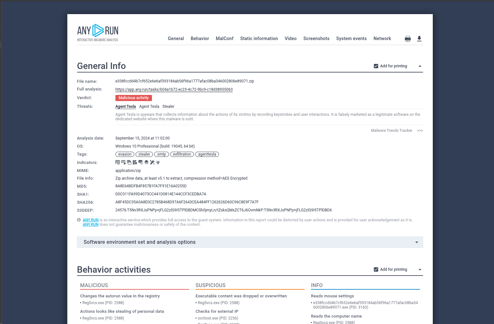
