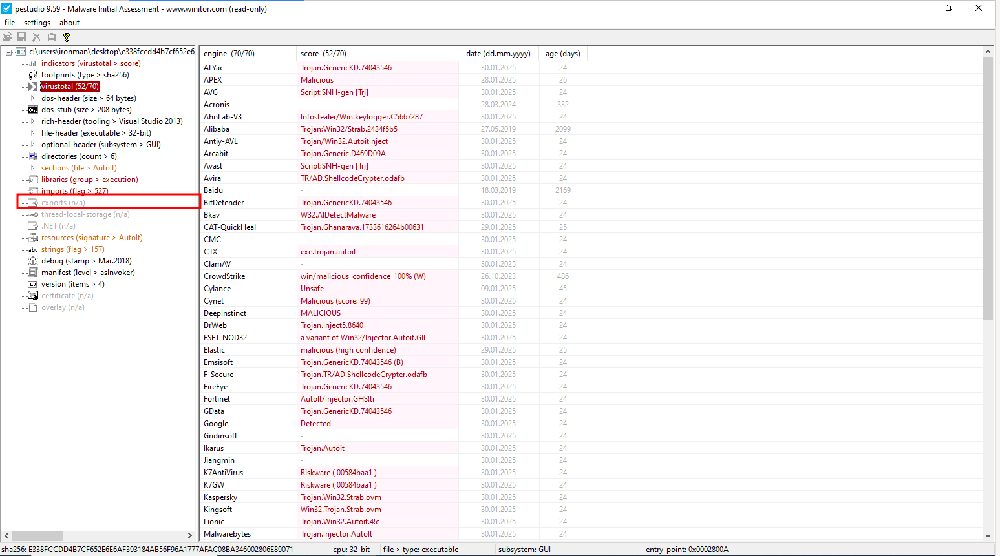

import { Code } from "@astrojs/starlight/components";
import { Aside } from "@astrojs/starlight/components";

Let's start by identifying the file type of the given malware sample.

## Identifying the File Type

On the REMnux VM, run the `file` command on the given sample. Here is the output of the `file` command,

As shown in the above image, the given file is a PE Executable file and its a x32 executable.

## Fingerprinting the Malware

Let's calculate the MD5 and SHA256 hashes of the given sample using the commands `md5sum` and `sha256sum` as shown in the following image:

Here are the hash values:

| Algorithm | Hash                                                             |
| --------- | ---------------------------------------------------------------- |
| MD5       | ab6a1838bc0306ff528bdbc6c4b00631                                 |
| SHA256    | e338fccdd4b7cf652e6e6af393184ab56f96a1777afac08ba346002806e89071 |

## File Hash Lookup

Let's check VirusTotal for previous analysis results.

According to virus total, the malware sample is flagged malicious by 56 vendors as of the total 73 vendors.

## Comparing and Classifying the Malware

Let's now generate different signatures of the given malware sample.

### Fuzzy Hashing

Let's generate fuzzy hash for the given sample using `ssdeep` from the REMnux VM.

<Code code="ssdeep <filename>" lang="bash" title="Bash" />

### Import Hashing

For generating the import hash, update the file path to the malware sample as shown in the following image.

Now run the script to get the import hash.

### PE Sections Hashing

To get the PE section hashes of the given sample run the python script as shown in the following image.

## Extracting and Analyzing Strings

Since the number strings extracted from the given sample is huge, I am redirecting the output to a text file, which makes it easy to analyze.

### Using strings command

<Code code="strings <filepath> > strings.txt" lang="bash" title="Bash" />

There isn't much of interest in the output of the strings command, as you can see in the following image. It contains some strings related to Windows registry paths and a line stating that this is an AutoIt compiled script, which shows that this executable is a generated by AutoIt.

### Using Flare Floss

<Code code="floss <filepath> > floss.txt" lang="bash" title="Bash" />

Similar to results of the `strings` command, the results from `floss` is also not that much interesting. We can some references to AutoIt3, which shows that this is a AutoIt compiled script.

## Detecting Packing and Obfuscation

### Using DIE

`DIE` has detected that the given sample is of AutoIt3 format and eventually detected there is something compressed and stored in the `.rsrc` section of the PE file.

### Using ExeInfo PE

`ExeInfo PE` has also detected that the given file is compiled by **AutoIt** and suggests to use `Exe2Aut` to extract the `AutoIt` script.

### Using UPX

We can use the `upx` command with `-t` flag to test whether the given file is packed by **UPX** or not.

<Code
  code="# In Windows OS
upx.exe -t <path_to_file>"
  lang="powershell"
  title="Powershell"
/>

<Code
  code="# In Remnux
upx -t <path_to_file>"
  lang="bash"
  title="Bash"
/>

The given file is not packed by **UPX** as shown in the following image.

## Portable Executable Analysis

### Inspecting file dependencies and imports

You can find the list of imports under the `imports` section in `PEStudio` as shown in the following image. You can also see that PEStudio maps certain imports with Mitre attack techniques.

You can also try to match the imports with [MalAPI.io](https://malapi.io/) to understand the malicious possibilities of those Windows APIs.

### Inspecting exports

You can find the exports under the `exports` section in `PEStudio` as shown in the following image. There is no exports for the given sample.

### Examining PE Table and Sections

You can find the properties of all the PE sections under the sections tab in PeStudio. Recall the results from `DIE`, which detected that something compressed is stored in the `.rsrc` section. If you check the `.rsrc` section in PeStudio, you will see that there is a file present with an AutoIt signature, as shown in the following image.

### Examining the Compilation Timestamp

| Key                                       | Value                        |
| ----------------------------------------- | ---------------------------- |
| File Size                                 | 1042944 bytes                |
| Compiler-Stamp / Originally Created Stamp | Fri Sep 06 00:11:59 2024 UTC |
| Debug-Stamp                               | Thu Mar 15 13:14:39 2018 UTC |

### Examining entry point and subsystem

The subsystem of the given sample is **GUI**.

### Examining overlays

There is no overlay present in the given sample as shown in the following image.

### Extracting AutoIt script

Let's extract the AutoIt script using `autoit-ripper` tool.

<Code
  code="autoit-ripper.exe <file> output_dir"
  lang="powershell"
  title="Powershell"
/>

You can find the extracted AutoIt script (`.au3`) in the output_dir folder. You can reverse engineer the extracted AutoIt script to learn more about the malware. Since this workshop doesn't cover reverse engineering, it is beyond the scope of this workshop and is left for your exploration.

## Yara Analysis

Update the malware file path and output file path in the `yara` python script.

Now run the script as shown in the following image.

From the results of the above script, we can see that YARA has detected the signatures shown in the following image. From this we know that the given sample has the abilities to take screenshots, escalate privileges, act as a keylogger and much more.

## Capa Analysis

**Capa** has detected that the given sample is compiled with AutoIt and suggest that we have to manually extract the AutoIt script and perform analysis.

<Code
  code="capa -r <rules_directory> -s <signatures_directory> <malicious_executable_file>"
  lang="powershell"
  title="Powershell"
/>

<Aside>
  You can get the CAPA signatures here:
  [https://github.com/mandiant/capa/tree/master/sigs][https://github.com/mandiant/capa/tree/master/sigs]
</Aside>

