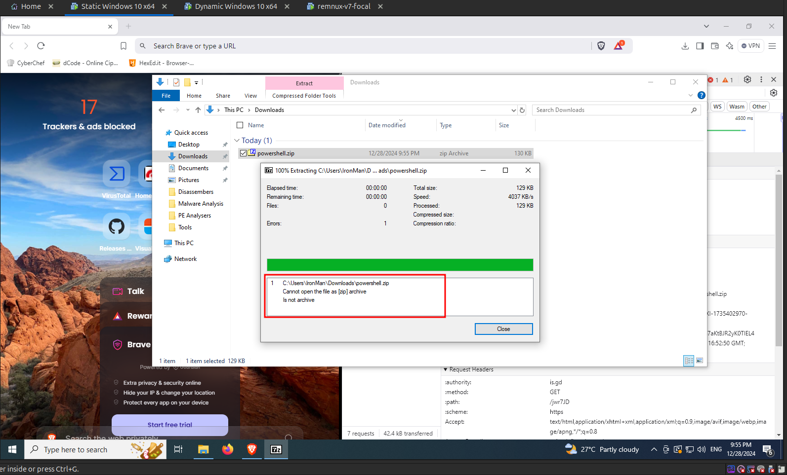
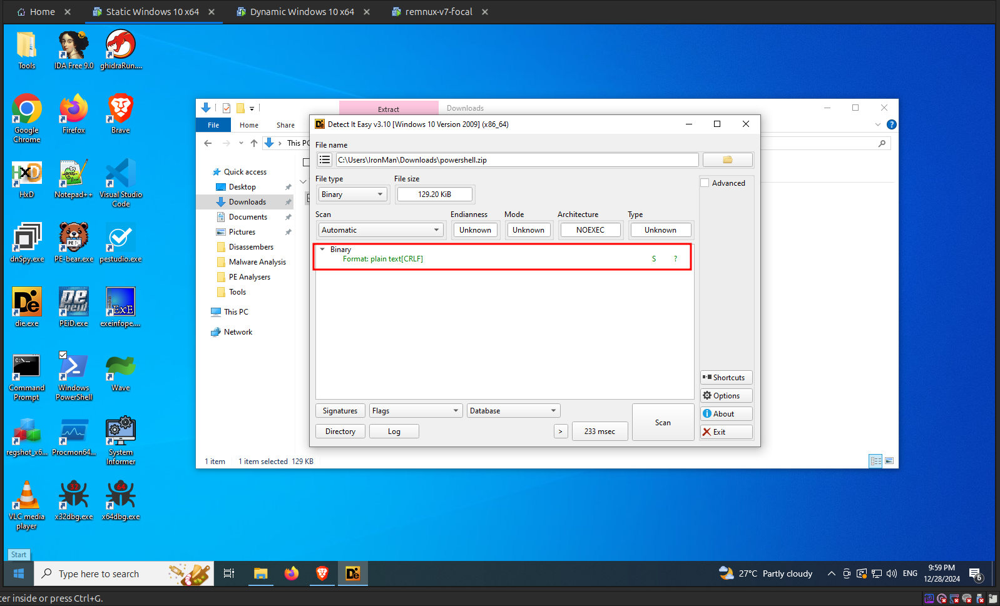
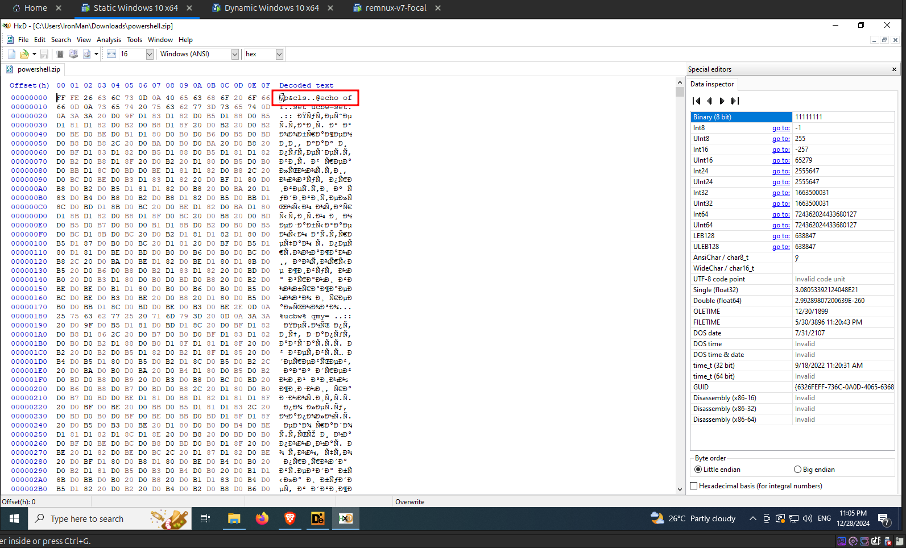
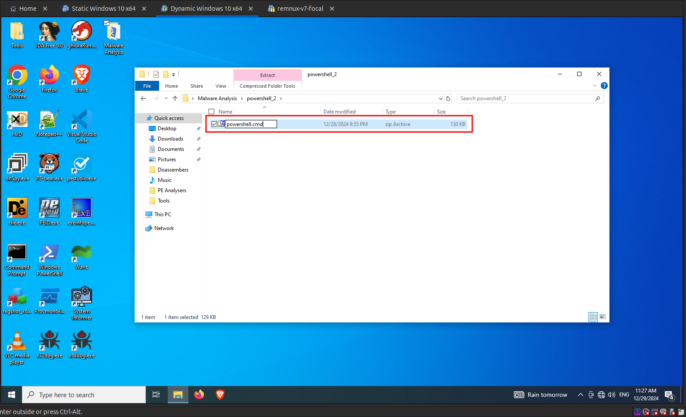
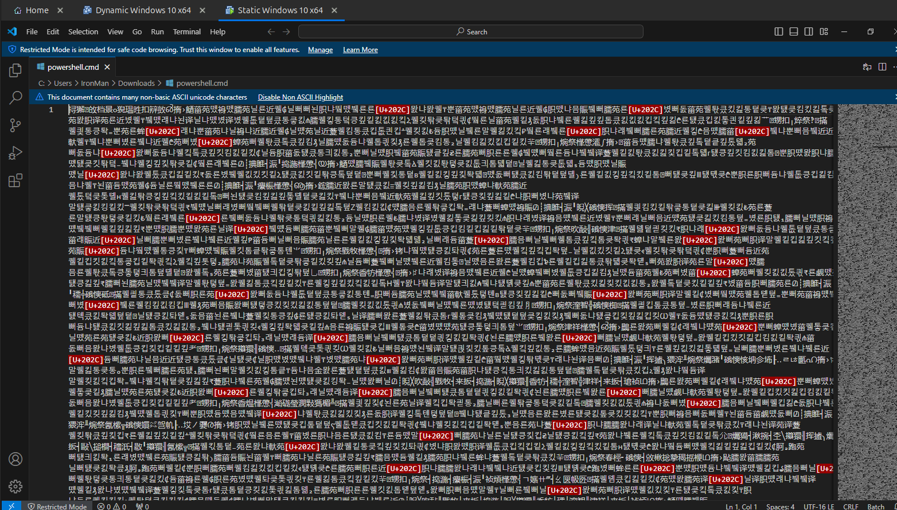
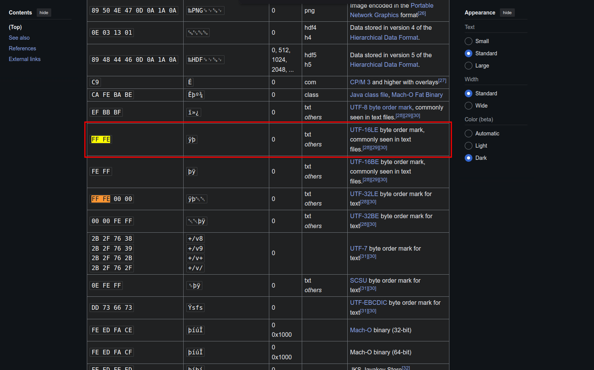
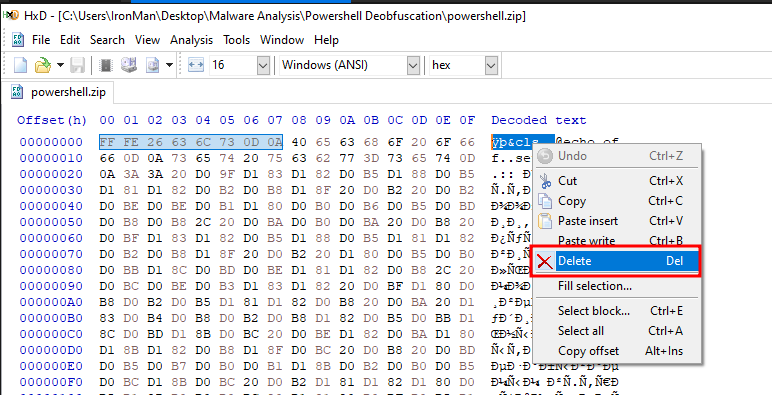
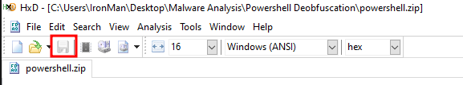
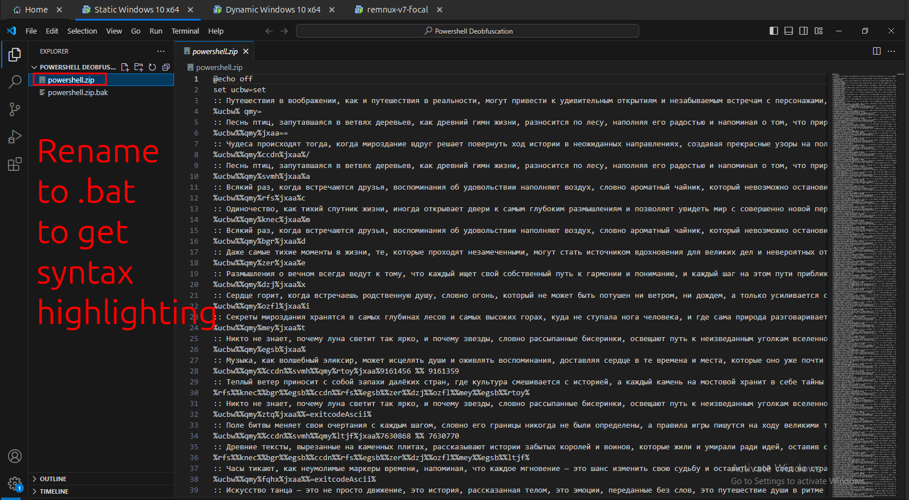

import { Code } from "@astrojs/starlight/components";
import { Steps } from "@astrojs/starlight/components";

<Steps>

1. Let's proceed by analyzing the downloaded payload. I tried to extract the zip file, but it failed as shown in the following image. The error was that the downloaded payload is not a valid zip file.

   

2. So, I loaded the payload into **DiE** to get more information about the payload. As shown in the following image, the downloaded payload is a plain text file according to **DiE**

   

3. To further verify this, I opened the downloaded `powershell.zip` file in `HxD Hex Editor`. In the first line of the decoded text, I was able to see `@echo of` keyword, which is a batch script command as shown in the following image.

   

4. Remember the powershell command that we got from the `base64` encoded sting initially, it was as trying to rename the downloaded payload to `.cmd`, which is a type of batch script extension. With all of these in mind, I came to a conclusion that the downloaded file is a batch script and renamed the file extension to `.cmd` as shown in the following image.

   

5. And I tried to open this file in **VScode**. I wasn't able to see the batch script line that we were able to see from the Hex Editor. The output that is showing to us as shown in the following image is some other language.

   

6. Let's find out why this is happening. First jump to Hex Editor and let's manually verify the file type of this file by searching for the first few bytes in the [List of File Signatures](https://en.wikipedia.org/wiki/List_of_file_signatures). The first few bytes that I looked out for is `FF FE 26 63`. As you can see from the following image that I was able find the first two bytes, which is type of text file which contains [UTF-16 LE](https://en.wikipedia.org/wiki/UTF-16#UTF-16LE) characters ( the characters that we saw when we opened the file in **VScode** )

   

7. Thus these bytes are the reason that makes **VScode** to interpret the characters in the file as `UTF-16 LE` characters. Let's delete these bytes. I deleted all the bytes from the start of the file until the string `@echo of` starts as shown in the following image.

   

8. Once you have deleted the bytes, click on save as shown in the following image.

   

9. Now open the file in `VScode` and rename the extension to `.bat` or `.cmd` to get syntax highlighting in VScode, in case you haven't done it yet.

   

</Steps>