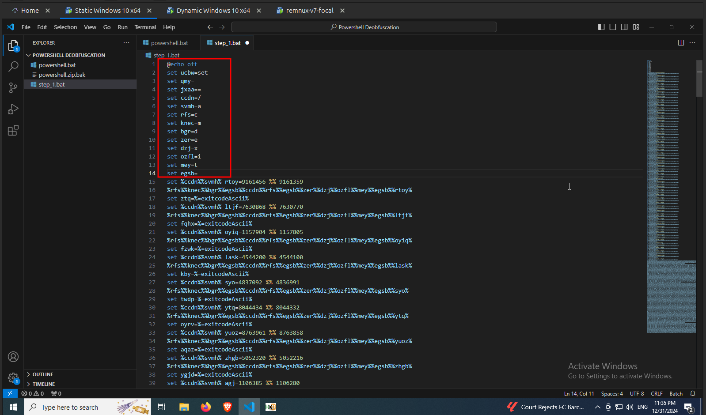

import { Code } from "@astrojs/starlight/components";
import { Steps } from "@astrojs/starlight/components";
import BatchScriptThreeLines from "../../../scripts/batch_script_three_lines.txt?raw";
import CyberChefRawOutput from "../../../scripts/cyber_chef_raw_output.txt?raw"
import CsharpRawCode from "../../../scripts/csharp_raw_code.txt?raw"
import CsharpBeautifiedCode from "../../../scripts/csharp_beautified_code.txt?raw"
import CsharpDecryptCode from "../../../scripts/csharp_decrypt_code.txt?raw"

<Steps>

1.  Once you got the syntax highlighted, you can probably see a lot of lines highlighted in green color as shown in the following image. In batch script lines starting with `::` or `rem` are considered as comments. These unwanted commented lines that contain some Russian characters are added for obfuscation and to confuse and evade detection mechanisms. Let's remove all of these commented out lines.

    

2.  Once you have removed all the comments, you should be able to see the batch script as shown in the following image. The batch script is heavily obfuscated. Let's manually deobfuscate the batch script

    

3.  In batch scripting `set` keyword is used to create a new variable. In the above image `ucbw` is set to `set` keyword. Also a variable can be referenced in another command using the syntax `%variable%`. Which means all the instances of `%ucbw%` is replaced with the keyword `set`. Now lets replace all the instances of `%ucbw%` with `set` in the batch script.

    

4.  We have replaced all the instances of `%ucbw%` with `set` in the batch script as shown in the above image. Similarly lets replace `%qmy%` with ` ` since `qmy` is set to ` ` in line 3.

    

5.  Now we have replaced all instances of `%qmy%` with ` ` as shown in the above image. Next lets replace `%jxaa%` with `=`.

    

6.  After replacing all instances of `%jxaa%` with `=` as shown in the above image, we got some variables. Let's replace all of these variables with their values.

    

7.  After replacing all of those variables with their values as shown in the above image, we can see some new `set` commands and some `cmd` commands. Let's try to understand the first three lines of the new commands. The first three lines are as follows:

    <Code code={BatchScriptThreeLines} lang="batch" title="Batch Script" wrap />

    - The `set /a` is a batch script command used to perform arithmetic operations. `%%` represents the modulo operator, which calculates the remainder of a division. Thus `set /a rtoy=9161456 %% 9161359` command sets the variable `rtoy` with the value of `97`.
    - The command `cmd` runs a new instance of the command prompt (cmd) and executes the specified command. After executing the command, the new cmd instance closes automatically. The `exit %rtoy%` command tells the new cmd instance to terminate and return an exit code equal to the value of `%rtoy%`. Thus the line `cmd /c exit %rtoy%` returns `97`.
    - `%=exitcodeAscii%` is a special syntax in batch scripting. It takes the exit code of the last command (stored in `%ERRORLEVEL%`) and converts it to its corresponding ASCII character. In this case the `%ERRORLEVEL%` is `97`, `%=exitcodeAscii%` evaluates to the ASCII character `a` (since `97` is the ASCII code for `a`). Thus the third line results to `set ztq=a`.

8.  Likewise let's deobfuscate all the remaining sets of lines and replace them with the third line of each set. I started by extracting all the calculations that are to be to separate file as shown in the following image.

    

9.  Next I pasted all of the extracted calculations in powershell ( Remember to replace `%%` with a single `%` ) to get the results of these calculations as shown in the following image and press `Enter`.

    

10. As shown in the following image powershell should output the results of all the calculations.

    

11. The next step I did was to copy all of the results in the same order and paste it in **CyberChef** and used the following recipe to convert these decimal values to its equivalent ASCII characters.

    <Code
      code="https://gchq.github.io/CyberChef/#recipe=From_Decimal('CRLF',false)Split('','%5C%5Cn')"
      lang="plaintext"
      title="CyberChef Recipe URL"
      wrap
    />

12. **CyberChef** has successfully converted all the decimal values to ASCII characters as shown in the following image.

    

13. Now replace all the calculations in the batch script with its equivalent results as shown in the following image.

    

14. Now again replace all instances of the new variables with their values.

    

15. In a batch script, `rem` is used to add a comment. Everything after rem on the same line is ignored by the script during execution.
    So remove all the lines starting with the command `rem` or with `::`.

    

16. After removing the comments, you could find a Base64 Encoded string in the above code. But all of those lines ends with `^` symbol. Let's remove these symbols using CyberChef and decode the Base64 string. Here is the CyberChef Recipe:

    <Code
    code="https://gchq.github.io/CyberChef/#recipe=Find_/_Replace(%7B'option':'Regex','string':'%5C%5C%5E'%7D,'',true,false,true,false)From_Base64('A-Za-z0-9%2B/%3D',true,false)Remove_null_bytes()"
    lang="plaintext"
    title="CyberChef Recipe URL"
    wrap
    />

    

16. Here is the code in the above image.

    <Code
    code={CyberChefRawOutput}
    lang="powershell"
    title="CyberChef Recipe URL"
    wrap
    />

18. Let's remove stuff related to powershell from the above code. You would get the following code, which is a [C#](<https://en.wikipedia.org/wiki/C_Sharp_(programming_language)>) code. Remember that **System Informer** showed that the `powershell.exe` process that was spawned by the shortcut is a **managed process** and we identified that there is going to be some **managed code** is to be run by that powershell process, we have finally found the managed code that was to be executed.

    <Code
    code={CsharpRawCode}
    lang="csharp"
    title="CSharp"
    wrap
    />

19. Let's beautify the above code using the `Generic Code Beautify` recipe in **CyberChef** as shown in the following image.

    

20. Here is the beautified code,

    <Code
    code={CsharpBeautifiedCode}
    lang="csharp"
    title="CSharp"
    />

        And here is the simplified breakdown of the above code generated by ChatGPT:

        - **Enables Special Privileges**:
            - The program uses RtlAdjustPrivilege to enable a special system privilege (likely for shutting down or crashing the system).
        - **Forces a System Error**:
            - It calls NtRaiseHardError to trigger a critical system error (0xc0000022, meaning "Access Denied"). This may cause a crash (e.g., a blue screen of death) depending on system settings.
        - **Decrypts Encrypted Data**:
            - It takes Base64-encoded strings: a ciphertext, a key, and an initialization vector (IV).
            - It uses AES (a strong encryption algorithm) to decrypt the ciphertext with the provided key and IV.
            - The decrypted result is returned as a string.
        - **Potential Harm**:
            - The code appears to have malicious intent since it both tries to crash the system and processes hidden encrypted data.
            - The decrypted payload could be instructions or additional malicious code.

21. I also made ChatGPT to generate `C#` code to decrypt the cipher text. The code is as follows,

    <Code
    code={CsharpDecryptCode}
    lang="csharp"
    title="CSharp"
    />

22. I executed the above code in a [Online Compiler](https://www.programiz.com/csharp-programming/online-compiler/) and got the flag as shown in the following image.

    

</Steps>
