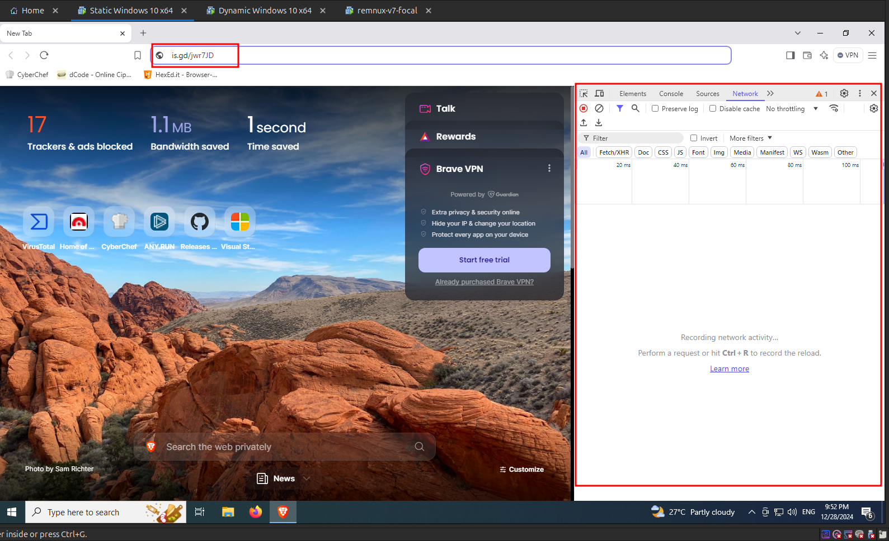
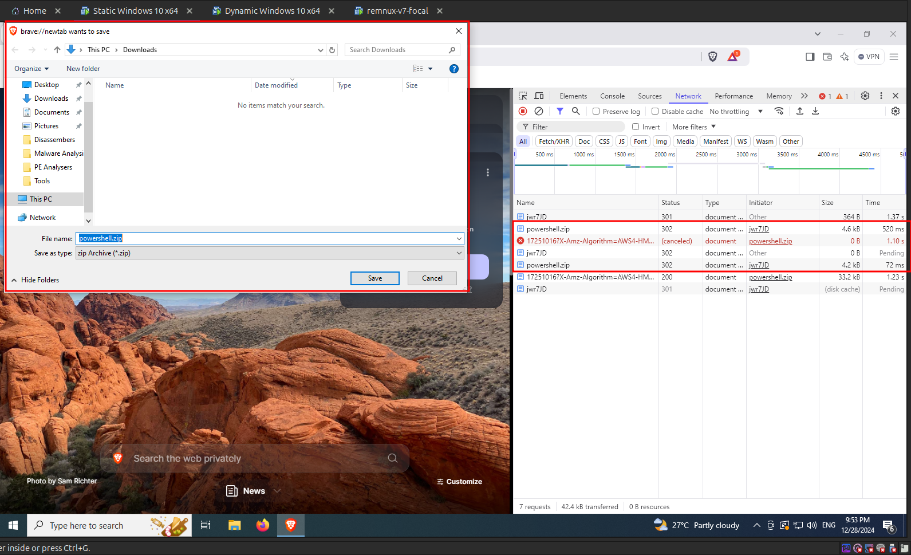
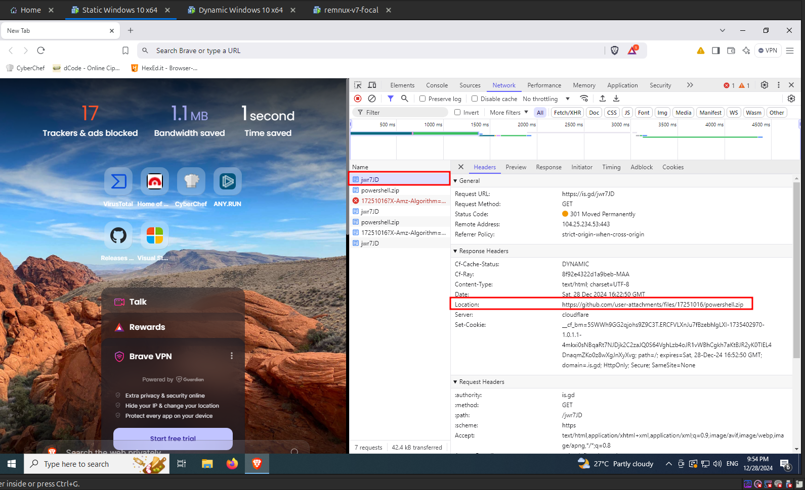

import { Steps } from "@astrojs/starlight/components";

<Steps>

1. Let's try to resolve the shortened URL and download the staged payload from the Windows Static Analysis VM, since it is connected to internet. Open a browser in the static VM and make a request to the shortened URL as shown in the following image. Also keep the network tab opened from the browser developer tools to monitor the resolved URL and other network activity.

   

2. Once the request is successfully made, a file named `powershell.zip` is getting downloaded. Let's save this file for further analysis.

   

3. First let's check what was the actual URL that the shortened URL resolved to, by clicking on the first request entry and switching to the Headers tab as shown in the following image.

   

4. From the above image, we can see that the malware was trying to download the second stage payload from a github attachment. Using **github attachments** is a common technique used my malware's to download payloads. [Living Off Trusted Sites (LOTS) Project](https://lots-project.com/) has a list of such websites that are used to share payloads and other malicious activities by malware's and malware authors to evade detection.

</Steps>