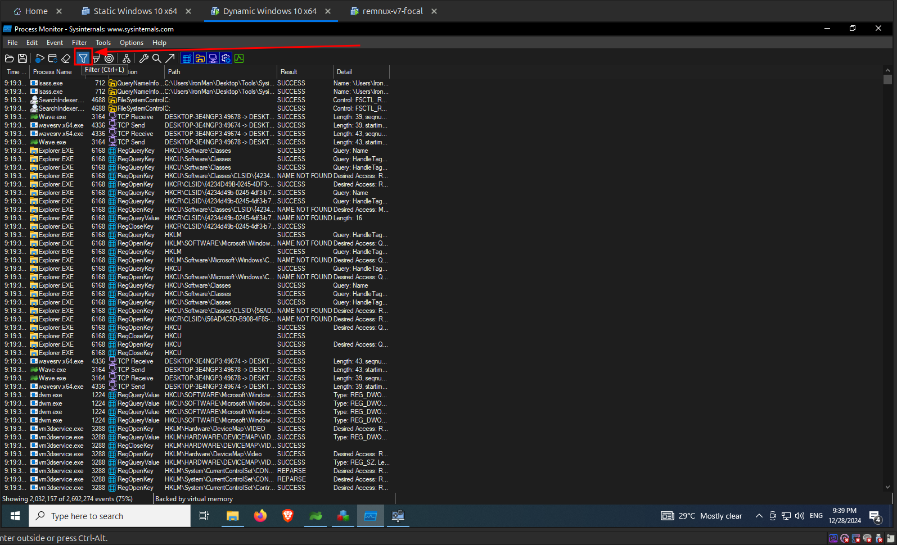
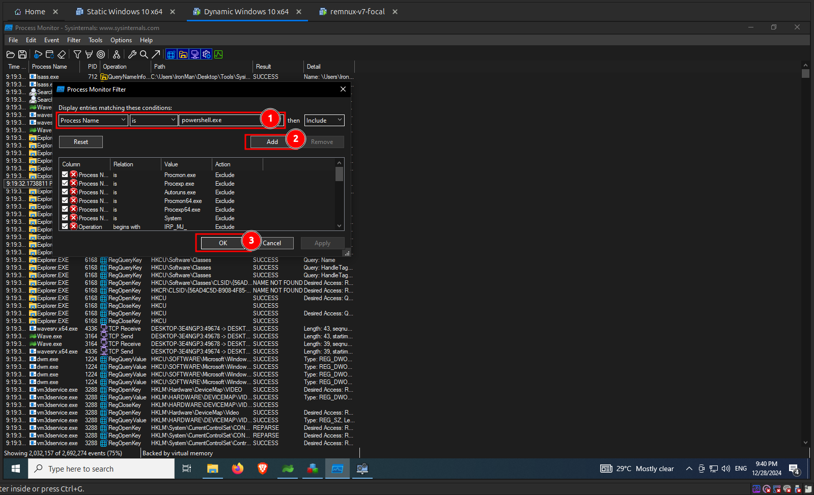
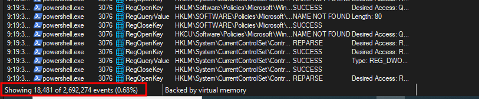
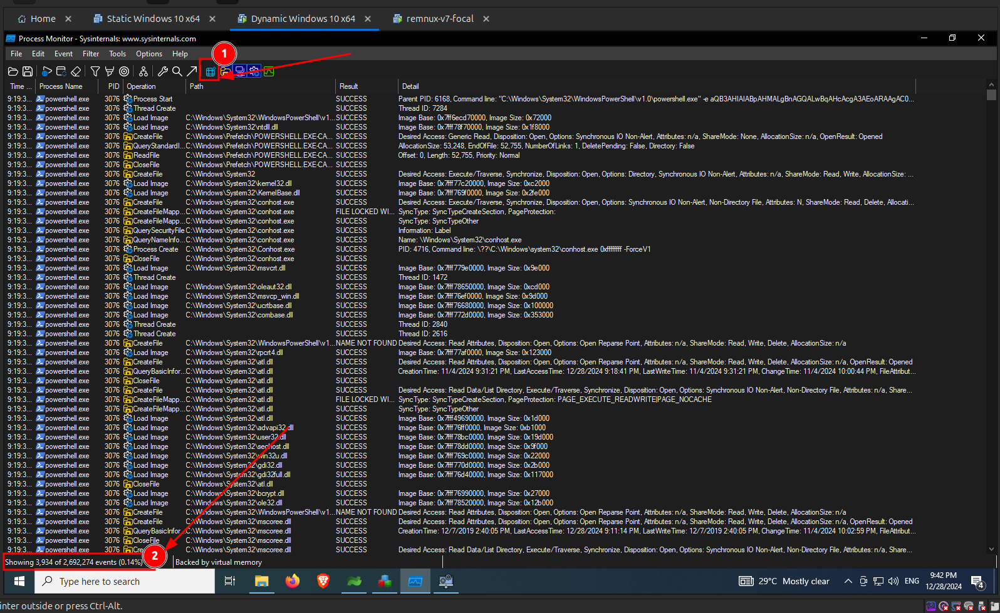

import { Steps } from "@astrojs/starlight/components";

## Filtering Procmon Logs

<Steps>

1. Since **Procmon** logs huge amounts of data, lets start by filtering logs. First click on the filter icon as shown in the following image.

   

2. Since we know the process name that was spawned after running the malware, we can filter logs by the process name. Select `Process Name` from the drop down menu and set it to `powershell.exe` as shown in the following image, and click on `Add`, then click `Apply` and `Ok`.

   

3. Once `Procmon` has completed filtering the logs, you can see that the number of entries displayed is drastically reduced on the left bottom corner of the application as shown in the following image.

   

4. Since we have analyzed registry related activity with **Regshot**, we can filter out logs related to registry by deselecting the registry icon as shown in the image below. After filtering registry related logs we can see that amount of logs displayed is again drastically reduced.

   

</Steps>