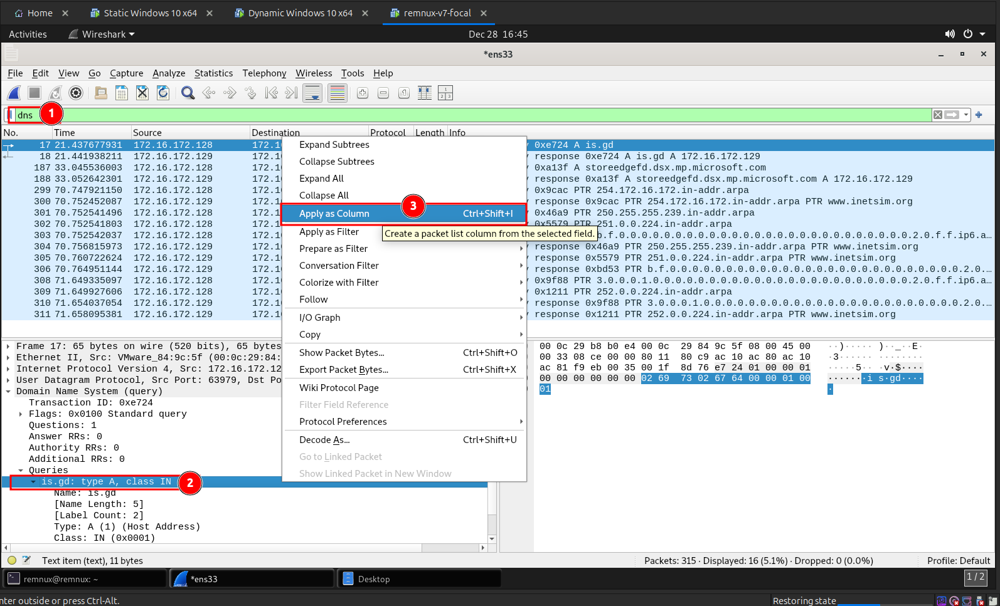

Now let's the **Wireshark** capture to find out whether there is any network activity was made by the malware. First I filtered for DNS requests by using the `dns` keyword as shown in the following image. Also I used the `Apply as Column` feature to show all the DNS query details in the table to easily find the unique domain requests made by the Windows Static Analysis VM. 

But nothing interesting found.