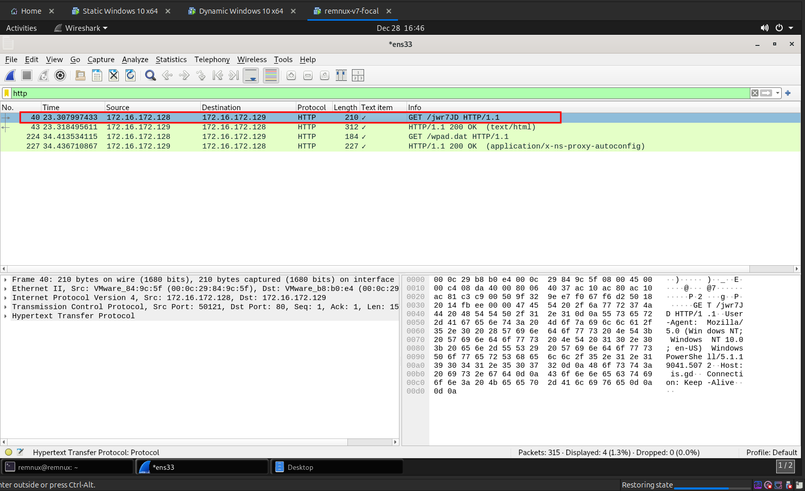

Next I filter for HTTP requests using the `http` keyword as shown in the following image.

You can see that there was a request to `is.gd/jwr7JD` URL that was made by the malware. No other requests was found.