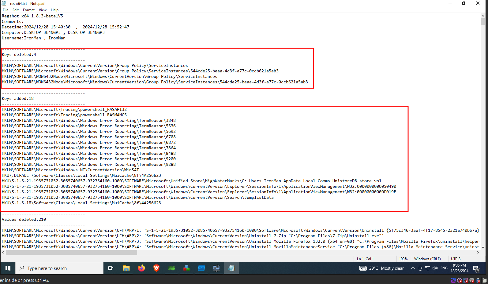
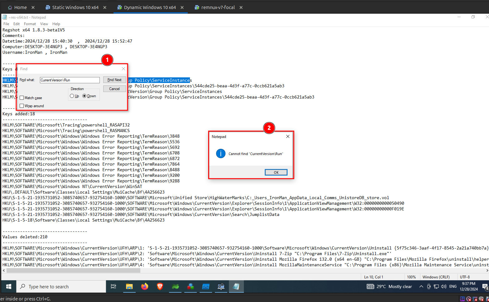

Its time to analyze the output of all the tools that we initially setup. Let's start with `Regshot`.

From the output of `Regshot`, we can see that some keys are deleted and also some keys are added as shown in the following image. None of the keys that are modified are of interest or suspicious.

Next I used the find feature to look out for activities related to `SOFTWARE\Microsoft\Windows\CurrentVersion\Run` registry folder, since malware's use this folder to maintain persistence. But no activity related to this registry.

As of our analysis with the registry, nothing is found interesting. Thus lets move on to **Procmon** logs.
