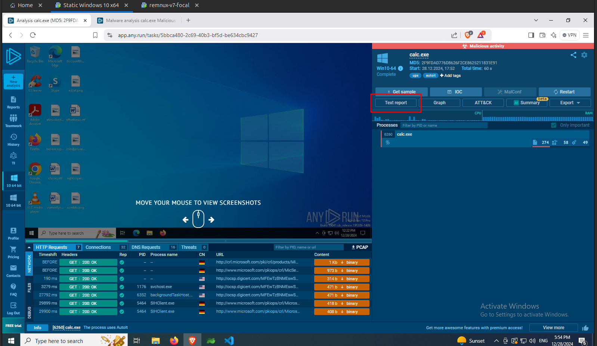

import { Aside } from "@astrojs/starlight/components";
import { Steps } from "@astrojs/starlight/components";
import { LinkButton } from "@astrojs/starlight/components";

Using automated sandboxes saves some time and flexibility. One such sandbox is [any.run](https://any.run/). You need to create a free account to use `any.run`. Once you have created the account you will see the dashboard as shown in the following image.

<Aside type="tip">
  You can find other available sandboxes in this
  [post](https://su13ym4n.medium.com/15-online-sandboxes-for-malware-analysis-f8885ecb8a35).
</Aside>

### Automated Analysis for `calc.exe` sample

<LinkButton
  href="https://app.any.run/tasks/5bbca480-2c69-40b3-bf5d-be634cbc9427"
  icon="external"
  target="_blank"
  style={{ color: "var(--sl-color-white)" }}
  class="font-bold"
>
  Link to my any.run submission
</LinkButton>

<Steps>

1. To start analysis click on `Submit File/Email` or `New Analysis` on the sidebar and upload the binary, choose the operating system and click on `Run a public analysis` as shown in the following image.

   

2. Click on `Agree` on the dialog box.

   

3. In the free verision, the instance will run for 60 seconds. While running you can see the HTTP requests made by the binary as shown in the following image.

   

4. Once the analysis is completed, click on the `IOC` button to check the summary of indicators of compromises as shown in the following image.

   

5. **Any.run** also generates a text report of all the activity of the malware. Click on the `Text report` as shown in the following image.

   

6. **Any.run** will open the text report in a new page as shown in the image below. In this report you can find detailed insights about the activity of the malware.

   

7. You can view others public submissions on `any.run` [here](https://app.any.run/submissions).

   

</Steps>

### Automated Analysis for `Windows Powershell.lnk` shortcut sample

<LinkButton
  href="https://app.any.run/tasks/28f3d1d1-2dc1-44d0-afed-80c5a68669a3"
  icon="external"
  target="_blank"
  style={{ color: "var(--sl-color-white)" }}
  class="font-bold"
>
  Link to my any.run submission
</LinkButton>

<Aside type="note">
  Upload this malware sample to `any.run` from a linux host. Since the given
  file is a Windows Shortcut file, when you upload this file to `any.run` from a
  Windows Host, Windows will resolve the shortcut and you will end up uploading
  the legitimate Windows `powershell.exe` file. Thus its ideal to upload it from
  a Linux host to upload the given sample `Windows Powershell.lnk` file.
</Aside>

<Steps>

1. Again start by creating a new submission by clicking on `Submit File/Email` or `New Analysis` on the sidebar and upload the binary, choose the operating system and click on `Run a public analysis` as shown in the following image.

   

2. Once the malware is executed, you can see the malicious shortcut executing the powershell code with the base64 encoded string, that contains the link to the staged payload as shown in the following image.

   

3. One advantage of using `any.run` or any other sandbox is they are connected to the internet. This simulates a more real environment, thus the malware has access to the actual staged payload. You can see that the request made by the malware to the shortened URL as shown in the following image and also the staged batch script has been running successfully as you can see all the exit commands made by the script to generate the ASCII characters, that we did while manually deobfuscating batch script.

   

4. Hence, `any.run` also logs the second powershell command that was executed by the batch script which has a large `base64` encoded string, from which we got the `C#` code as shown in the following image. This really makes it easier and helps us to skip the part of manually deobfuscating the batch script.

   

</Steps>
