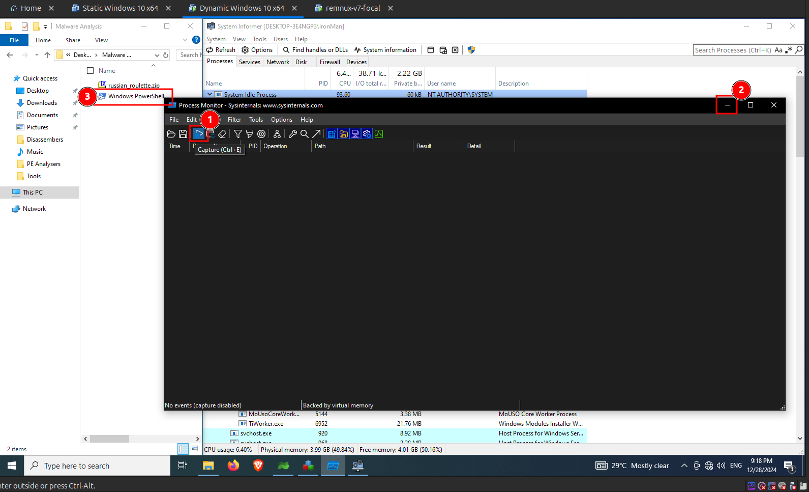
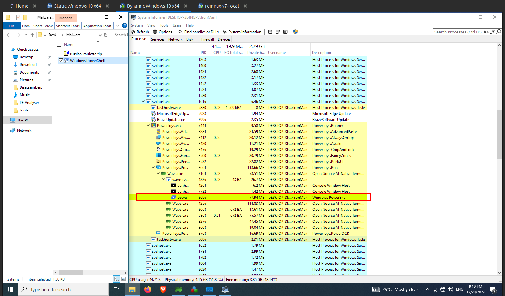
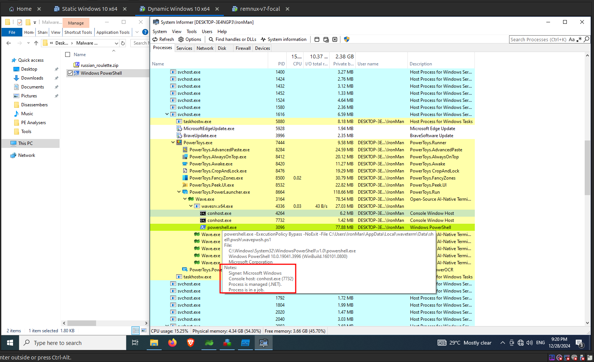
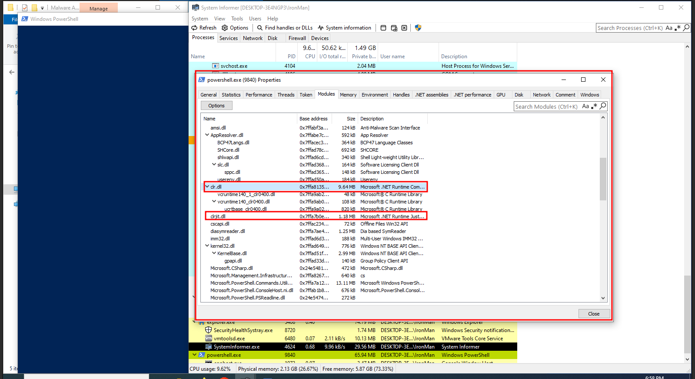
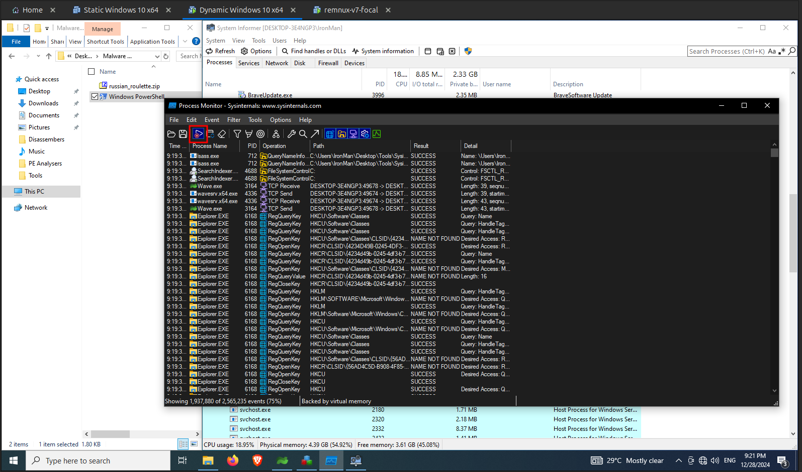
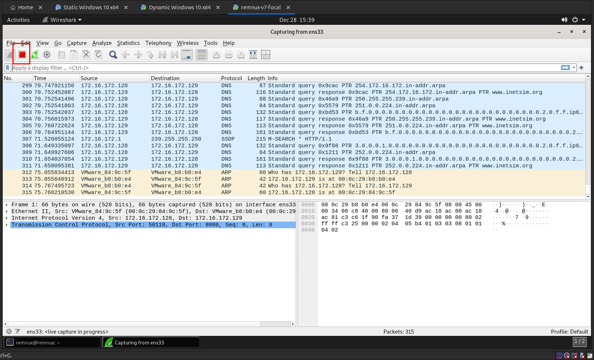
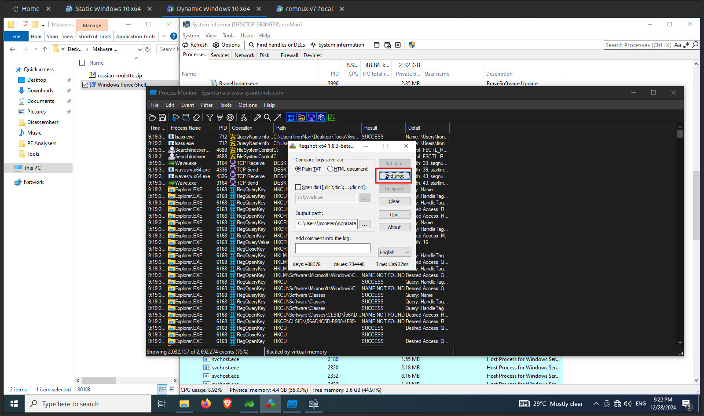
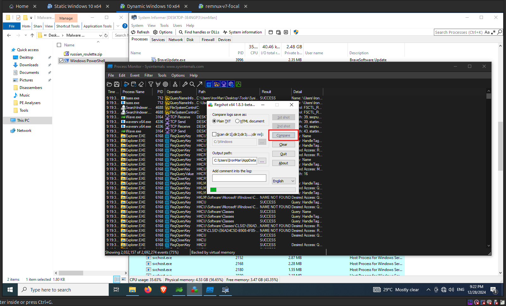
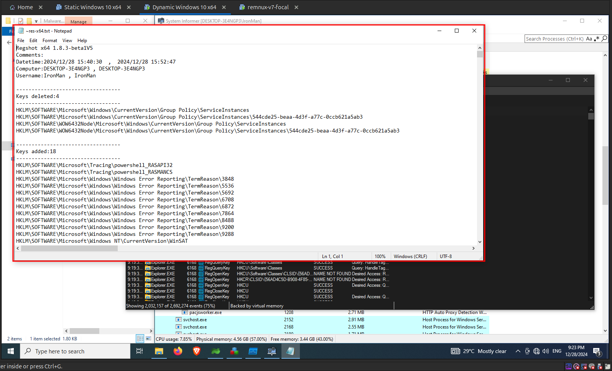

import { Steps } from "@astrojs/starlight/components";

Now its time to execute the malware.

<Steps>

1.  Resume Procmon as shown in the following image and minimize it and then run the malware. Let the malware to run for 30 to 60 seconds. After that stop Procmon.

    

2.  Once the malware is executed, we are able to see a new `powershell.xe` process in the **System Informer** as shown in the following image.

    

3.  This `powershell.exe` process is a managed process as shown in the following image, which means this process is about to execute some [managed code](https://learn.microsoft.com/en-us/dotnet/standard/managed-code). Basically **managed code** is a code which requires a backend runtime to run. **Managed code** does not directly run as assembly; instead, it is compiled into a bytecode format that the runtime processes and executes. Here, the backend runtime environment is [Common Language Runtime (CLR)](https://learn.microsoft.com/en-us/dotnet/standard/clr). Managed code is written in one of the high-level languages that can be run on top of **.NET**, such as **C#**, **Visual Basic**, **F#** and others.

    

4.  Let's examine the properties of this managed process. Right click the process and then select `Properties` or double click the process to open the properties window as shown in the following image.

    

5.  In the above image there are two DLLs [clr.dll](https://dll.website/clr-dll) and [clrjit.dll](https://dll.website/clrjit-dll), which are part of the **Common Language Runtime**. This makes sure that there is some managed code is about to run. This is suspicious since normally powershell won't run as a managed process. Let's proceed with further analysis to find more details.

6.  Pause `Procmon` if the malware has ran for 30+ seconds.

    

7.  Also `stop` **Wireshark** on the Remnux VM.

    

8.  Now take the 2nd snapshot in **Regshot** by clicking on `2nd Shot` -> `Shot` as shown in the following image.

    

9.  Once **Regshot** successfully took the 2nd snapshot, click on `compare` as shown in the image below to compare the snapshots.

    

10. Once **Regshot** has successfully analyzed the snapshots, it will provide the results as a text file opened in notepad as shown in the following image.

    

</Steps>
