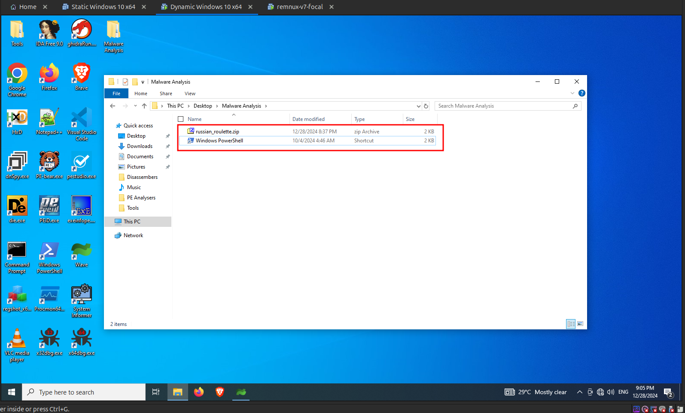

import { Code } from "@astrojs/starlight/components";

Unzip the malware on the Windows Dynamic Analysis VM.

To start the dynamic analysis process, first we have to start all the necessary tools as follows:

## Windows Dynamic Analysis VM

Here is a list of tools that are to be started on the Windows Dynamic Analysis VM.

### Regshot

Regshot is used to analyze modifications in the Windows Registry. It works by taking a snapshot of the registry before and after execution of the malware and comparing the snapshots. Open Regshot and click on `1st Shot` -> `Shot` as shown in the following image. This is the snapshot before executing the malware.

### Procmon

[Process Monitor ( Procmon )](https://learn.microsoft.com/en-us/sysinternals/downloads/procmon) is an advanced monitoring tool for Windows that shows real-time file system, Registry and process/thread activity. Open the Process Monitor and pause the process monitor first, then clear the entries of the Process Montior as shown in the following image. Since Procmon captures all the system events, the amount of data that Procmon logs is huge. Thus we will only start Procmon while we are about to run the malware and will stop it once the malware is executed successfully for some period of time.

### System Informer ( formerly Process Hacker )

[System Informer ( formerly Process Hacker )](https://www.systeminformer.com/) is a free, powerful, multi-purpose tool that helps you monitor system resources, debug software and detect malware. Its almost like the Task Manager for Windows but advanced with more details. Just launch the System Informer. No setup is required.

### Desktop Setup

Keep the **File Explorer** and **System Informer** windows side by side as shown in the following image. This will be helpful to identify what processes that are spawned by the malware once executed.

## Remnux Dynamic Analysis VM

Here is a list of tools that are to be started on the Remnux Dynamic Analysis VM.

### INetSim

[INetSim](https://www.inetsim.org/) INetSim is a software suite for simulating common internet services in a lab environment, e.g. for analyzing the network behaviour of unknown malware samples. Start INetSim by using the following command.

<Code code="inetsim" lang="bash" title="Bash" />

If INetSim is successfully started, you should be able to see similar output as shown in the following image.

### Wireshark

[Wireshark](https://www.wireshark.org/) is a network protocol analyzer. It lets you see what's happening on your network at a microscopic level. With the help of Wireshark we can montior and capture all the network requests that are made by the Windows Dynamic Analysis VM. Start Wireshark and select the ethernet interface as shown in the following image and start the capture.

