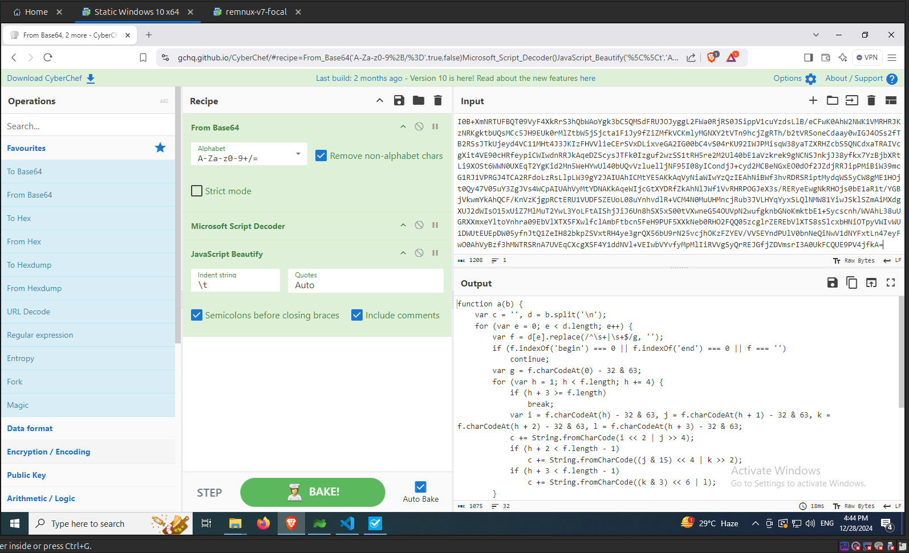
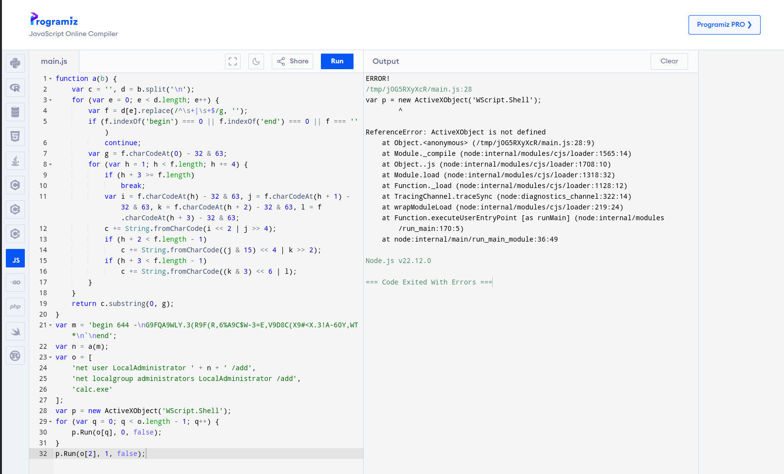
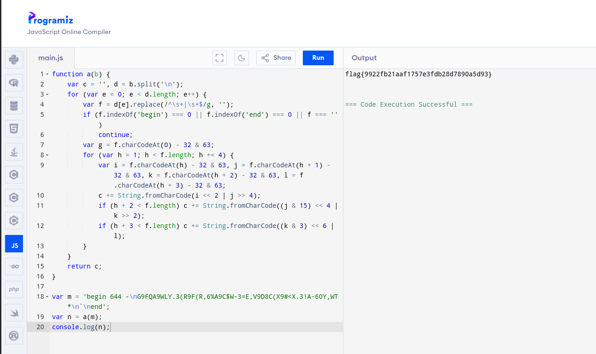

import { Code } from "@astrojs/starlight/components";
import CodeDeobfuscationJavascriptCode from "../../scripts/code_deobfuscation.js?raw";

In this section we will try to decode the `base64` string that we found in the last section. I will be using [CyberChef](https://gchq.github.io/CyberChef/) to decode the `base64` string. The CyberChef recipe is as follows.

<Code
  lang="plaintext"
  title="CyberChef Recipe URL"
  code="https://gchq.github.io/CyberChef/#recipe=From_Base64('A-Za-z0-9%2B/%3D',true,false)Microsoft_Script_Decoder()JavaScript_Beautify('%5C%5Ct','Auto',true,true)"
  wrap
/>

By using the above recipe, we were successfully able to decode the string. The decoded output is a Javascript code as shown in the following image.

Here is the Javascript code that is shown in the above image.

<Code
  lang="javascript"
  title="Javascript"
  code={CodeDeobfuscationJavascriptCode}
/>

I tried running the above Javascript code in a [Online Javascript](https://www.programiz.com/javascript/online-compiler/) comipler. But the code failed as shown in the below image.

There are a few issues in the decoded Javascript code. Got it fixed with the help of ChatGPT. The script ran successfully as shown in the following image.

