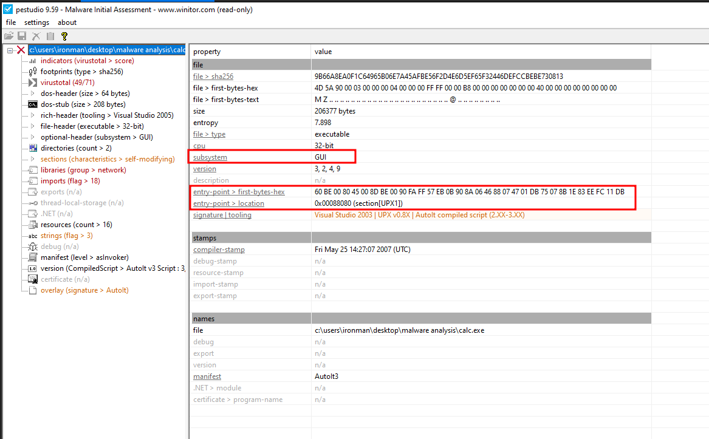
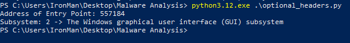

import { Code } from "@astrojs/starlight/components";
import ExaminingEntryPointAndSubsystemPythonCode from "../../scripts/examining_entry_point_and_subsystem.py?raw";

In a Portable Executable (PE) binary, AddressOfEntryPoint is a field located in the Optional Header of the PE file. It specifies the relative virtual address (RVA) of the entry point of the executable or DLL. The entry point is the starting address of the program’s code, where the Windows loader begins execution when the program is loaded into memory. For executable files, this is the starting address of the program’s main function. For device drivers, this is the address of the initialization function.

The [Windows Subsystem](https://learn.microsoft.com/en-us/windows/win32/debug/pe-format#windows-subsystem) is an integer value that identifies the target subsystem for the executable file. This field indicates the type of environment in which the executable is intended to run.

## Using pestudio

You can find the entry point and subsystem of a binary in the summary section of **pestudio** as shown in the following image.

## Using PE-Bear

In **PE-Bear** the entry point and subsystem of a binary can be found under the `Optional Hdr` as shown in the below image.

## Using Python

The following python script extracts the address of the entry point and the subsystem value with its equivalent description.

<Code
  lang="python"
  title="examining_entry_point_and_subsystem.py"
  code={ExaminingEntryPointAndSubsystemPythonCode}
/>

The above python script has extracted the entry point address and the subsystem value with its description as shown in the following image.

