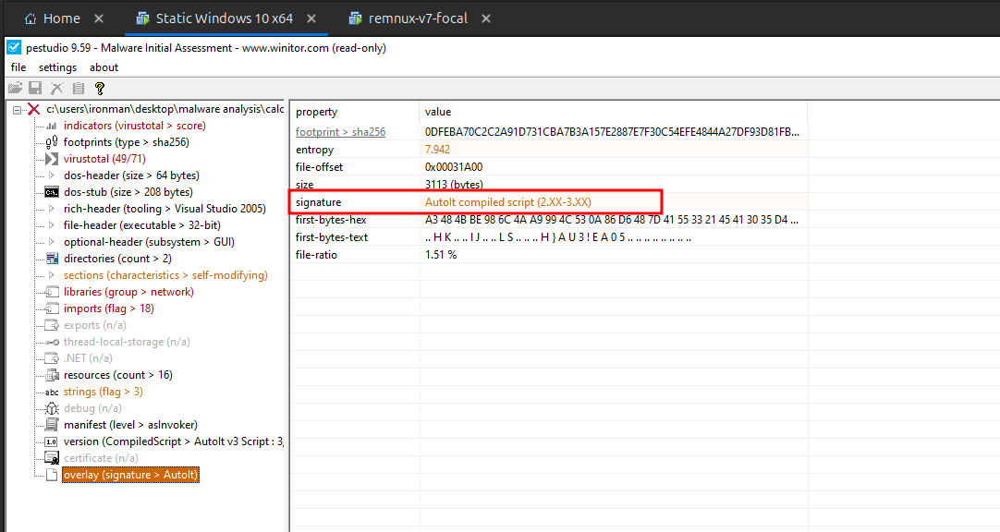
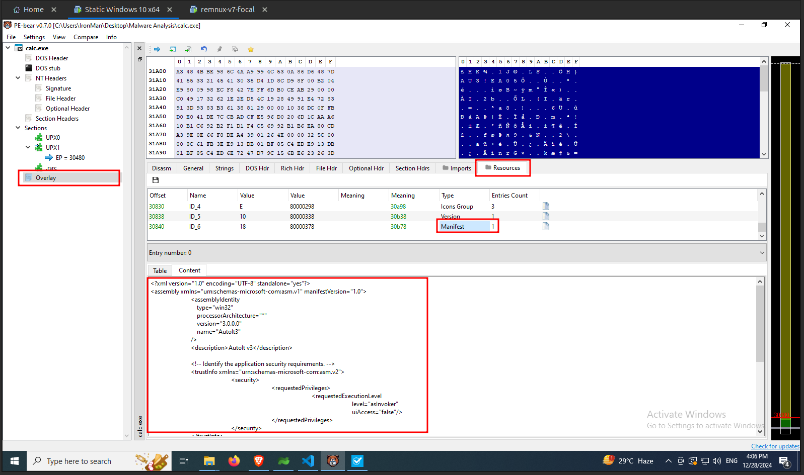
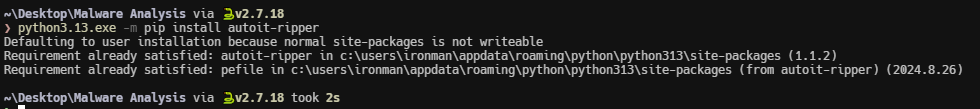
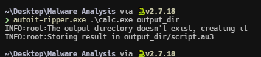
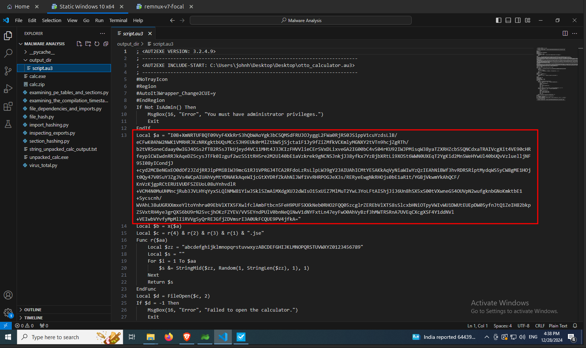

import { Code } from "@astrojs/starlight/components";

An overlay in a Portable Executable (PE) file refers to additional data appended to the end of the file, beyond the executable code and sections defined by the PE header. This data can be important, such as setup packages, Authenticode signatures, or overlays for AutoIt scripts.

We have seen some tools like **DiE** identified that the `calc.exe` has a [AutoIt script](https://www.autoitscript.com/site/) attached is present in the overlay. In this section we will discuss about how to find more about it using `pestudio` and `PE-Bear`. Also we will see how to extract the [AutoIt script](https://www.autoitscript.com/site/).

## Using pestudio

You can find details about overlay under the `overlay` section as shown in the following image.

## Using PE-Bear

In PE-Bear you can find overlay under the `Resources` tab as shown in the following image.

## Extracting an AutoIt script from overlay

To extract the AutoIt script using the [AutoIt-Ripper](https://github.com/nazywam/AutoIt-Ripper) tool. You can install it using `pip`. The installation command is as follows.

<Code lang="powershell" title="Powershell"
    code="
    python3 -m pip install autoit-ripper
    "

/>

Once installed, run the following command to extract the AutoIt script from the `calc.exe` file.

<Code lang="powershell" title="Powershell"
    code="
    autoit-ripper.exe .\calc.exe output_dir
    "

/>

The `auto-ripper` tool has extracted the AutoIt script successfully and stored in under the output directory as shown in the following image.

Let's examine the extracted AutoIt script. The script contains a long string as shown in the following image. It looks like a `base64` encode string.

