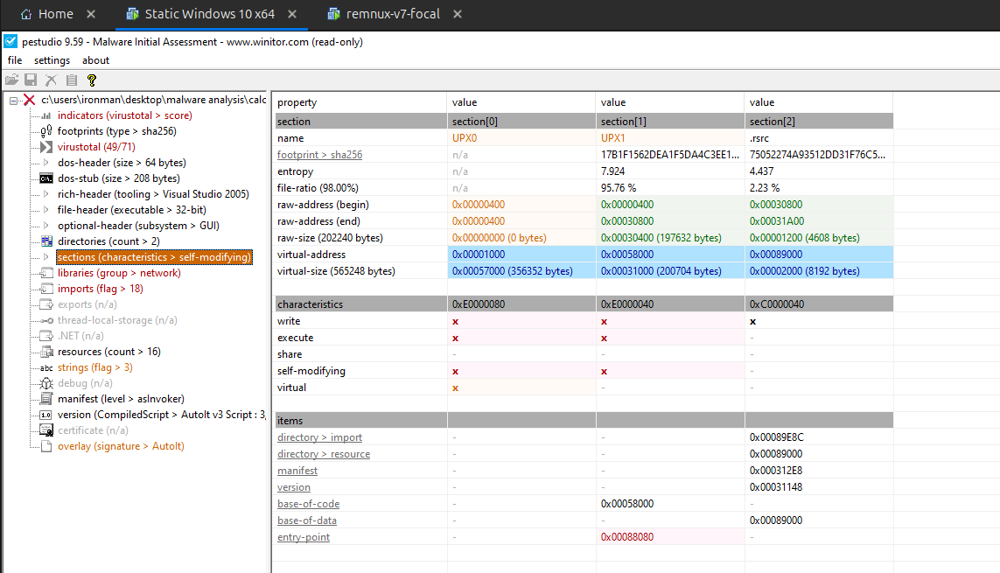
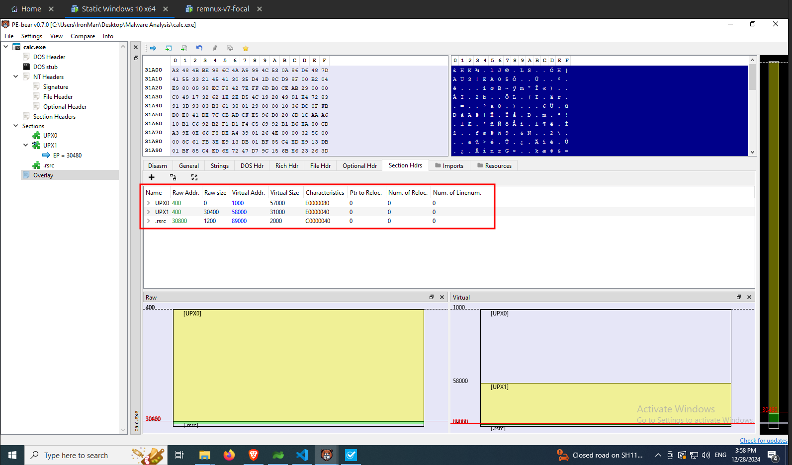
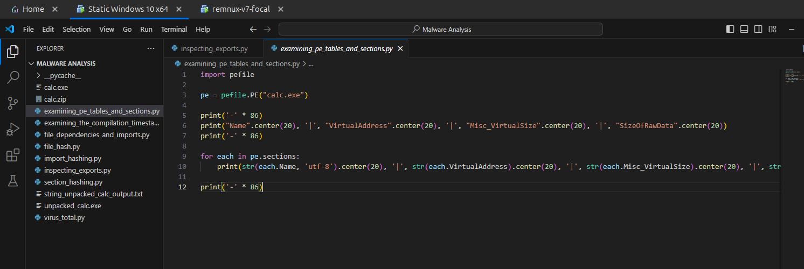
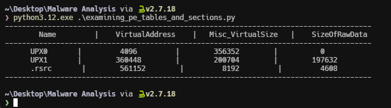

import { Code } from "@astrojs/starlight/components";
import ExaminingPeTablesAndSectionsPythonCode from "../../scripts/examining_pe_tables_and_sections.py?raw";

Its important to analyse the sections of a PE file as it will be useful while reverse engineering. Understanding the offsets between each section will help us to identify the correct section under the disassembled view of a decompiler. It will also help to identify whether if a shellcode or some executable binary that is to be loaded into memory is already memory mapped or not.

## Using pestudio

The PE sections can be found under the `sections` section of the **pestudio** as shown in the following image. We can see the `raw-address` and `raw-size` which refers to the address offsets while stored in disk and the `virtual-address` and `virtual-size` refers to the address offsets while loaded into memory or disassembler.

## Using PE-Bear

In PE-Bear you can find the PE-Sections under the Section Headers tab.

## Using Python

The following python script extracts the section details.

<Code
  lang="python"
  title="examining_pe_tables_and_sections.py"
  code={ExaminingPeTablesAndSectionsPythonCode}
/>

Update the file path and save the script.

Now run the script. The results of the above script is shown in the following image.

