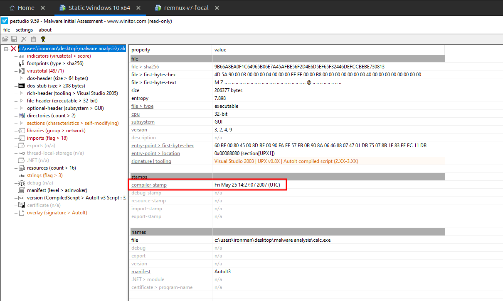
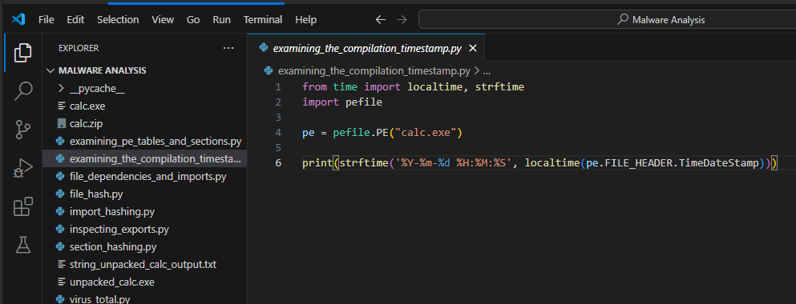

import { Code } from "@astrojs/starlight/components";
import ExaminingTheCompilationTimestampPythonCode from "../../scripts/examining_the_compilation_timestamp.py?raw";

Checking the compilation timestamp of binary helps to understand when the malware was created/compiled.

## Using pestudio

In **pestudio** you can find the compilation timestamp under the summary section, which you can get by clicking on the file name on the sidebar as shown in the following image.

## Using PE-Bear

In **PE-Bear** you can find the timestamp under the `File Hdr` tab as shown in the below image.

## Using Python

The following python script extracts the timestamp from the given binary.

<Code
  lang="python"
  title="examining_the_compilation_timestamp.py"
  code={ExaminingTheCompilationTimestampPythonCode}
/>

Update the file path and save the script.

The above python script has successfully extracted the timestamp from the `calc.exe` as shown in the following image.

