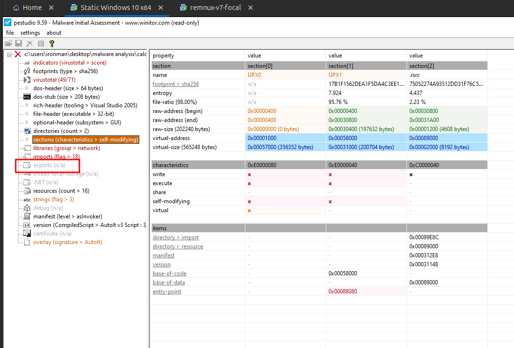
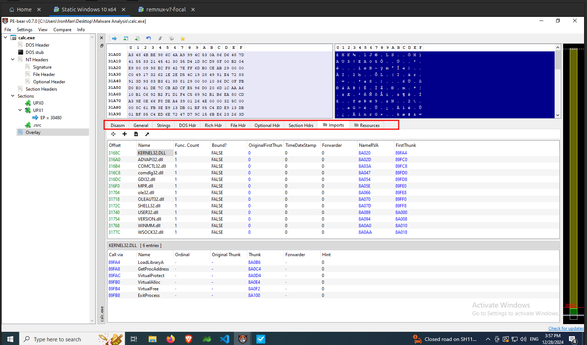
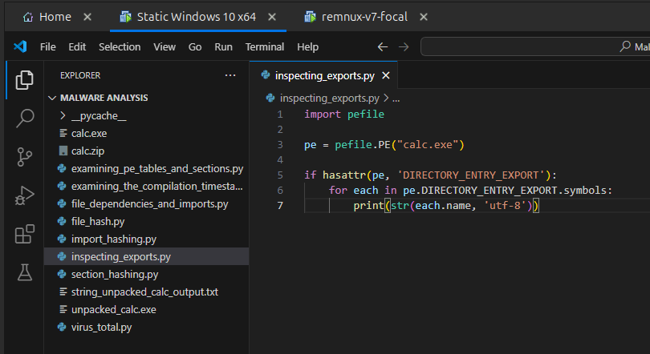
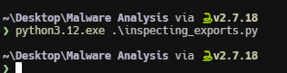
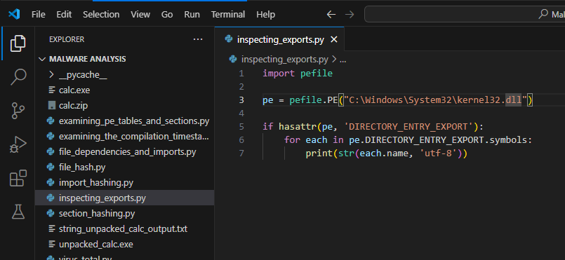
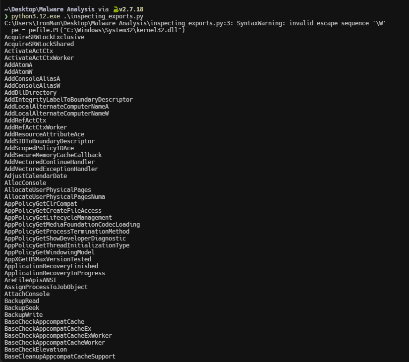

import { Code } from "@astrojs/starlight/components";
import InspectingExportsPythonCode from "../../scripts/inspecting_exports.py?raw";

Exports in Dynamic Link Libraries (DLLs) and executables are functions made available for use by other programs. While exports in executables are uncommon, they are abundant in DLLs, as their primary purpose is to provide reusable library functions. Notably, malware can also manifest itself as malicious DLLs.

## Using pestudio

In **pestudio** you can find the exports under the `exports` section. In this case there is `Not Available (n/a)` in the `calc.exe` binary as shown in the following image.

## Using PE-Bear

In PE-Bear there will be a tab called `Exports` which lists all the exports, but you can't see it for the `calc.exe` as there are no exports.

But let's try to view the exports of the `C:\Windows\System32\kernel32.dll` file. We are able to see a lot of exports under the `Exports` tab as shown in the following image.

## Using Python

Now lets extract the exports using the following python script.

<Code
  lang="python"
  title="inspecting_exports.py"
  code={InspectingExportsPythonCode}
/>

First lets try for `calc.exe`. Update the file path in the above script and save it.

Execute the script. The script doesn't print any output as there are no exports present in the `calc.exe` file.

Now let's try to extract the exports from `C:\Windows\System32\kernel32.dll`. Upate the script and execute it.

The above script successfully extracted all the exports available in the `kernel32.dll` as shown in the following image.

