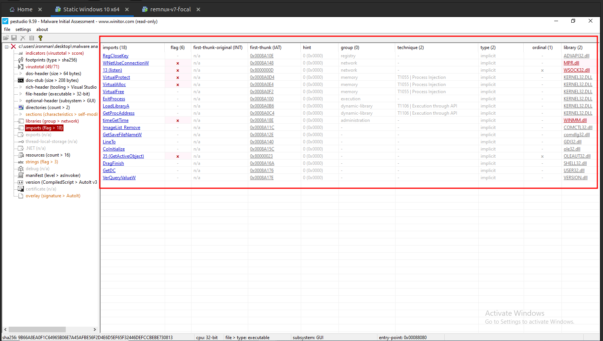
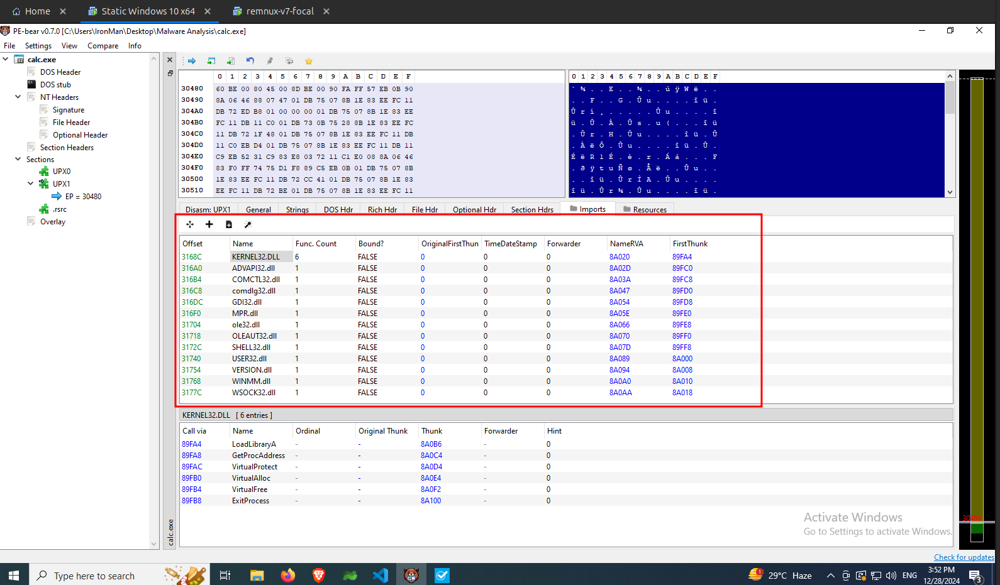
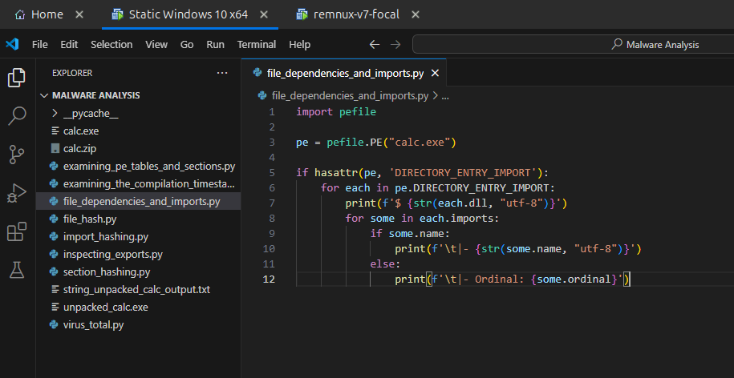
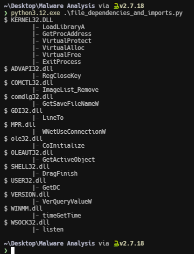

import { Code } from "@astrojs/starlight/components";
import FileDependenciesAndImportsPythonCode from "../../scripts/file_dependencies_and_imports.py?raw";

Understanding the imports and dependencies of a binary can help us to understand the capabilities of a binary. For example, if a binary imports `Kernel32.dll`, then it has the ability to create new threads, allocate memory etc.,. Another example is the `advapi32.dll`, which provides abilities to interact with the Windows registry.

[MalAPI.io](https://malapi.io/) maps Windows APIs to common techniques used by malware. By comparing the APIs that a malware use by importing from these DLLs with [MalAPI.io](https://malapi.io/), we can get some more insights on what the malware is trying to achieve.

## Using pestudio

First open the malware with **pestudio**. In **pestudio** you can find the imports under the `imports` section as shown in the following image. **pestudio** directly shows all the APIs that are imported from the specific DLLs. It also shows the possible MITRE attack techniques such as `Process Injection` under the `techniques` column.

## Using PE-Bear

In **PE-Bear**, you can find the imports under the `Imports` tab. You can see the API functions that the malware uses from those specific DLLs by click on each of them. The APIs are shown in the tab below the list of DLLs as shown in the following image.

## Using Python

The following python script extracts all the APIs that are imported from specific DLLs and prints them.

<Code lang="python" title="file_dependencies_and_imports.py" code={FileDependenciesAndImportsPythonCode} />

Update the file name and save the script.

Now run the script. The following image shows the output of the above python script for the `calc.exe` binary.

