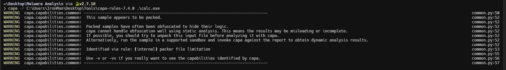
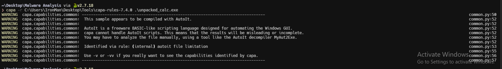

import { Code } from "@astrojs/starlight/components";

[capa](https://github.com/mandiant/capa/) detects capabilities in executable files. You run it against a PE, ELF, .NET module, shellcode file, or a sandbox report and it tells you what it thinks the program can do. For example, it might suggest that the file is a backdoor, is capable of installing services, or relies on HTTP to communicate. You can find the installation instructions [here](https://github.com/mandiant/capa/?tab=readme-ov-file#download-and-usage). The syntax for `capa` command is as follows.

<Code
  lang="powershell"
  title="Powershell"
  code="capa -r <rules_directory> -s <signatures_directory> <malicious_executable_file>"
/>

Let's try `capa` on `calc.exe`. `capa` has detected that the binary is packed.

Now let's try `capa` on `unpacked_calc.exe`. `capa` has detected that the binary is compiled with AutoIt.

