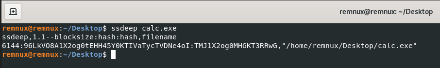
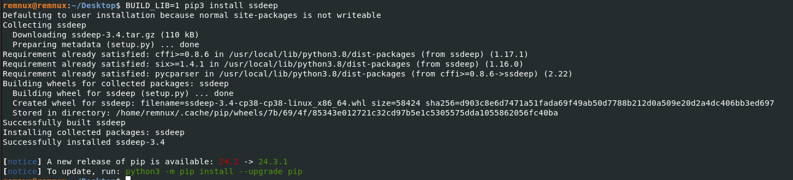
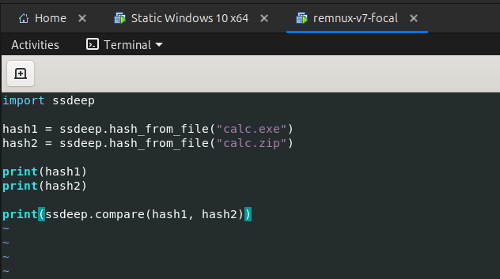
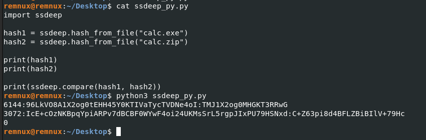
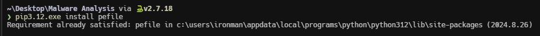
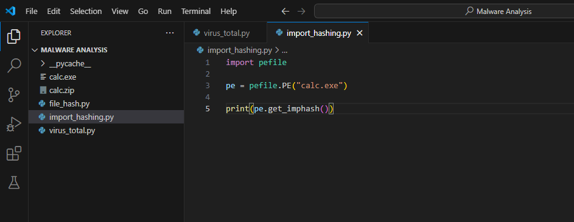
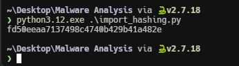
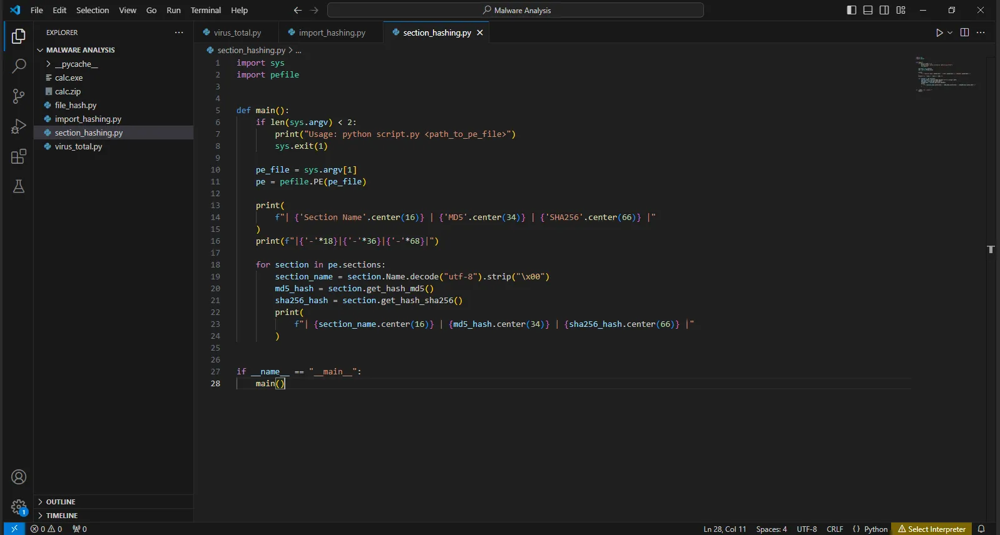
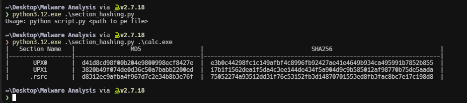

import { Aside } from "@astrojs/starlight/components";
import { Code } from "@astrojs/starlight/components";
import SsdeepPythonCode from "../scripts/ssdeep.py?raw";
import ImportHashingPythonCode from "../scripts/import_hashing.py?raw";
import SectionHashingPythonCode from "../scripts/section_hashing.py?raw";

Malware comparison and classification involves analyzing distinct malware samples to identify similarities and differences in their behavior, techniques, and origins.

## Fuzzy Hashing

[Fuzzy Hashing](https://en.wikipedia.org/wiki/Fuzzy_hashing) involves dividing a file into smaller segments, often based on continuous strings of significant length. Each segment is then hashed individually, and the resulting hash values are combined to create a single, representative hash for the entire file. This technique is particularly useful for identifying similarities between files, especially when dealing with malware variants that exhibit the same core functionality despite minor variations.

[ssdeep](https://github.com/ssdeep-project/ssdeep) is a fuzzy hashing tool that can be used to compare similarities between malware.

### Using ssdeep standalone version

You can get the latest release of `ssdeep` [here](https://github.com/ssdeep-project/ssdeep/releases). The syntax for running `ssdeep` is given below .

<Code lang="bash" title="Bash"
    code="
    ssdeep <path_to_file/files>
    "

/>

You can see the output of `ssdeep` in the following image.

### Using ssdeep with python

The [https://pypi.org/project/ssdeep/](https://pypi.org/project/ssdeep/) is a `ssdeep` Python wrapper. Thus the ssdeep tool is a prerequisite. We can use this to calculate ssdeep hash using python.

The build will fail if the ssdeep library isn’t installed. To use the included version of the ssdeep library use the following command.

<Code lang="bash" title="Bash"
    code="
    BUILD_LIB=1 pip3 install ssdeep
    "

/>

The following python script generates the `ssdeep` hash for two files and comparse them.

<Code lang="python" title="ssdeep.py" code={SsdeepPythonCode} />

Copy and paste the above code and save the python script.

Now run the script. The result of the above script is shown in the following image. From the result we can see a `0` in the last line, which means that are no similarites between the files.

## Import Hashing

[Import hashing](https://cloud.google.com/blog/topics/threat-intelligence/tracking-malware-import-hashing/) is the process of creating a hash based on the names of library and API imports in a executable file in the order they are imported. You can calculate the import hash of a executable using python's [pefile](https://github.com/erocarrera/pefile) library.

You can install the `pefile` library using `pip`.

<Code lang="powershell" title="Powershell"
    code="
    pip3 install pefile
    "

/>

Once installed, create a new python script with the following code. The python script calculates the import hash for the given file.

<Code lang="python" title="import_hashing.py" code={ImportHashingPythonCode} />

The import hash generated for the `calc.exe` file is shown in the following image.

## PE Sections Hashing

PE Section Hashing involves generating a unique hash value for each section within a Portable Executable (PE) file. This technique enables the comparison of different versions of malware by identifying modifications made to specific sections of the PE file.

The following python script uses the `pefile` python library to calculate the section hashes.

<Code
  lang="python"
  title="section_hashing.py"
  code={SectionHashingPythonCode}
/>

The output of the above script is shown in the following image.

