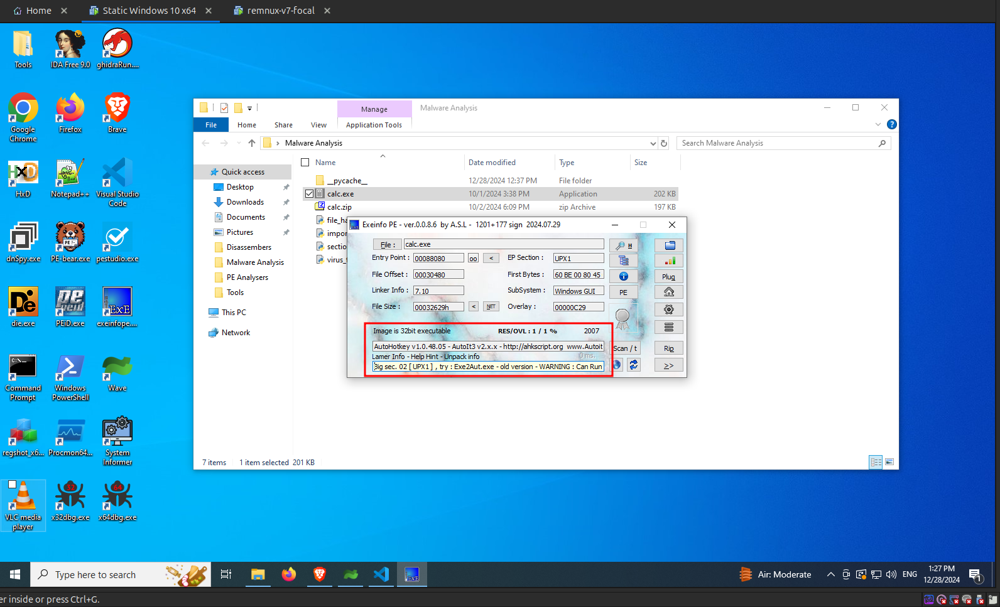
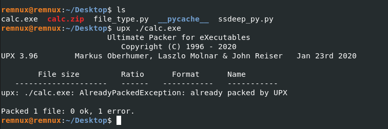
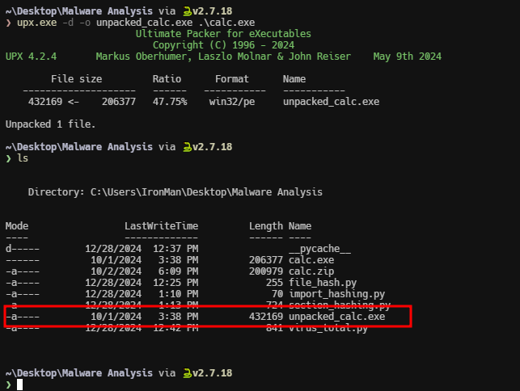
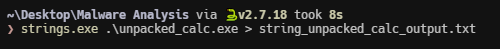
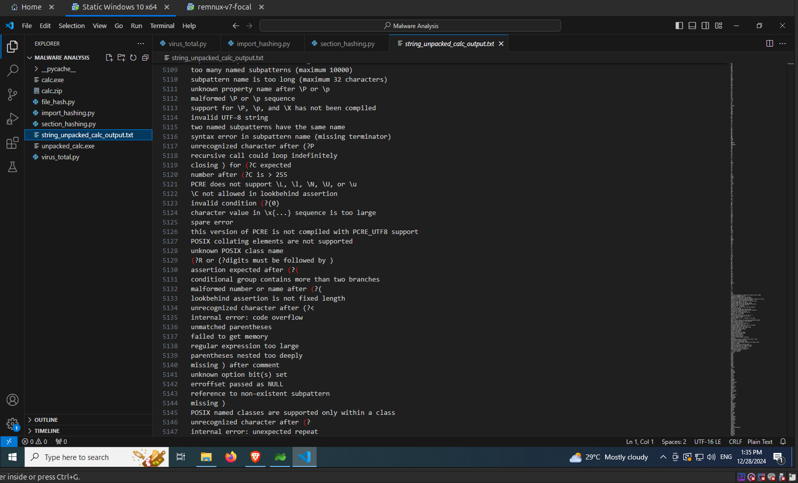
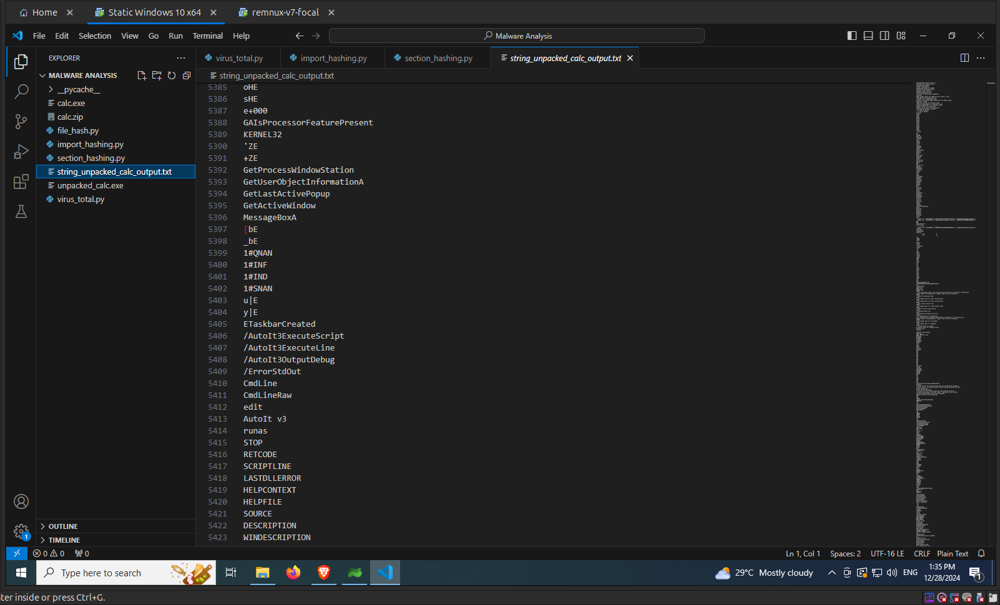
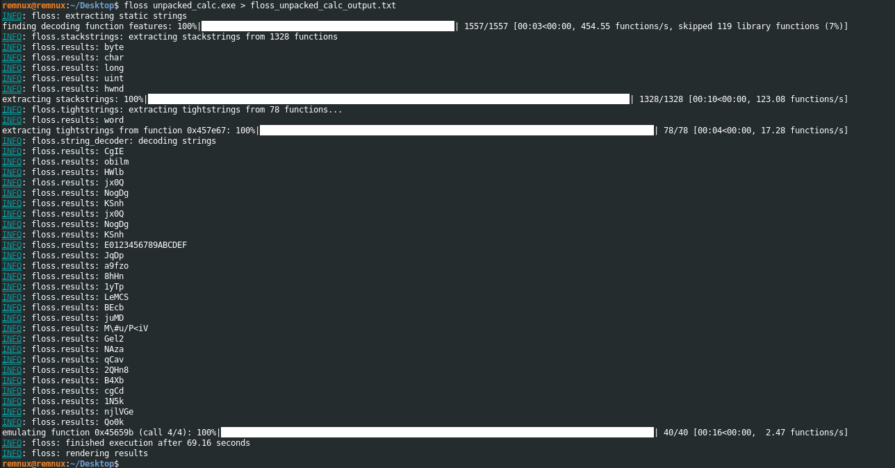
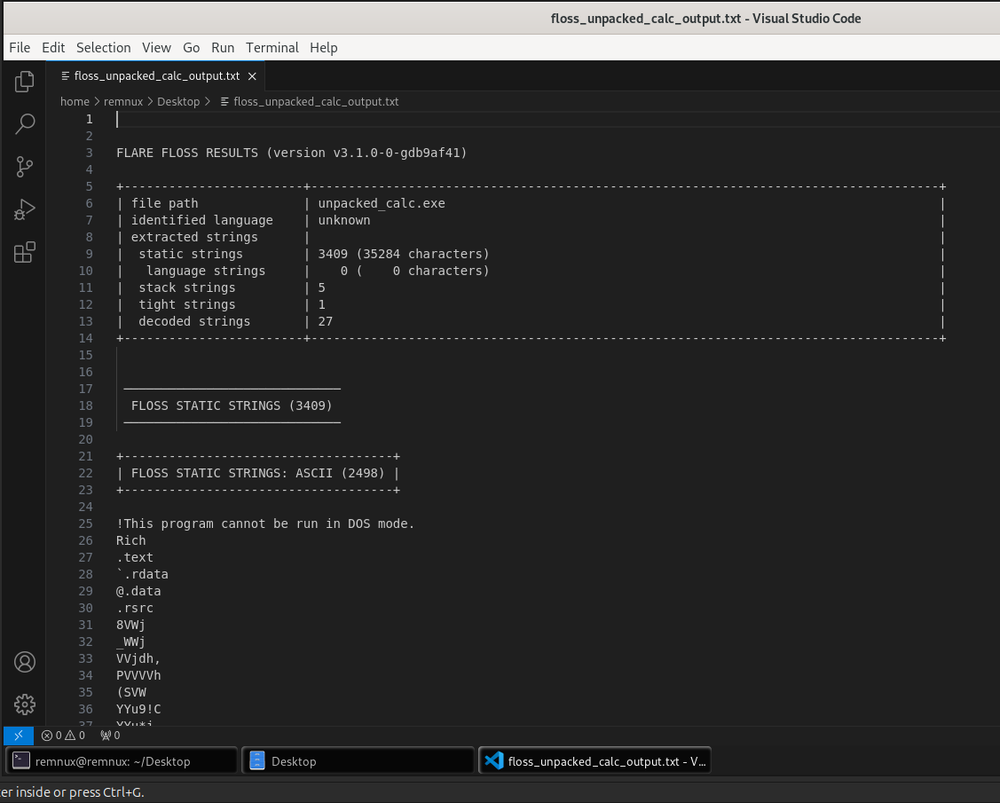
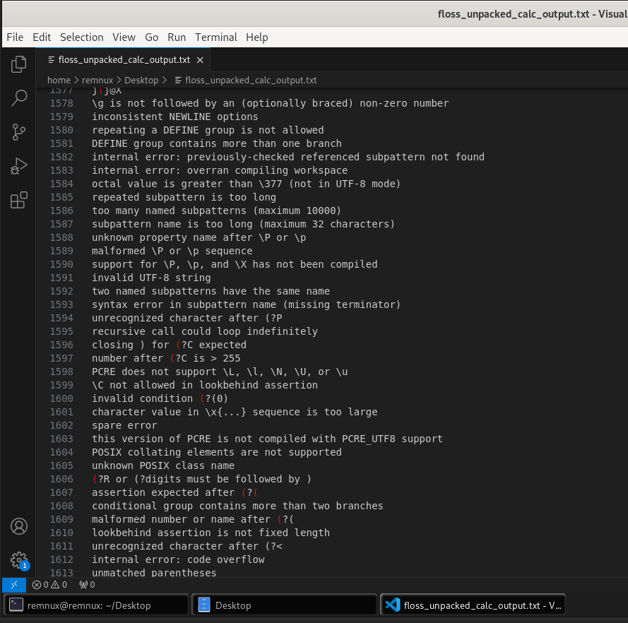

import { Code } from "@astrojs/starlight/components";

Malware often uses obfuscation or packing to hide its code. PE packers modify Portable Executable (PE) files, which are the standard format for executables in Windows. Packers compress or obfuscate the executable’s code to hinder analysis and reverse engineering. This is widely used in both legitimate software (to protect intellectual property) and malware (to evade detection).

## Executable Compression

```
Original PE File:
+----------------------+-----------------+--------------+
| PE Header & Sections | Executable Code | Overlay Data |
+----------------------+-----------------+--------------+

Executable Compression:
+----------------------+-----------------+--------------+
| PE Header & Sections | COMPRESSED Code | Overlay Data |
+----------------------+-----------------+--------------+
```

- **Definition:**
  Executable compression refers to reducing the size of the PE file by compressing its executable code and resources. When executed, the packed file decompresses itself in memory to restore its original form.
- **Purpose:**
  - To save disk space or reduce download size.
  - To protect against static analysis and reverse engineering.
- **Process:**
  - Compress the `.text` (code) section and other sections of the PE file.
  - Embed a decompression routine within the PE header.
- **Example Tool:**
  - **UPX (Ultimate Packer for Executables):** Open-source tool widely used to compress executables.

## Overlay Compression

```
Original PE File:
+----------------------+-----------------+--------------+
| PE Header & Sections | Executable Code | Overlay Data |
+----------------------+-----------------+--------------+

Overlay Compression:
+----------------------+-----------------+--------------------+
| PE Header & Sections | Executable Code | COMPRESSED Overlay |
+----------------------+-----------------+--------------------+

```

- **Definition:**
  An overlay in a PE file refers to any data appended to the end of the file that is not part of the standard PE structure (e.g., signatures, metadata, or additional resources).
- **Overlay Compression:**
  - Compresses the appended data (overlay) separately from the rest of the PE file.
  - Useful when the PE file contains non-executable resources like embedded configuration data or payloads.
- **Real-World Use:**
  - Malware often uses overlays to hide encrypted payloads or malicious code.
- **Process:**
  - The packer compresses the overlay data and inserts decompression logic within the PE file.

## Hybrid compression

```
Original PE File:
+----------------------+-----------------+--------------+
| PE Header & Sections | Executable Code | Overlay Data |
+----------------------+-----------------+--------------+

Hybrid Compression:
+----------------------+-----------------+--------------------+
| PE Header & Sections | COMPRESSED Code | COMPRESSED Overlay |
+----------------------+-----------------+--------------------+

```

- **Definition:**
  Hybrid compression combines both executable compression and overlay compression. It compresses the executable sections of the PE file along with any overlay data appended to the file.
- **Purpose:**
  - Maximizes compression efficiency.
  - Provides an additional layer of obfuscation for files containing both executable code and appended data.
- **Example Scenario:**
  - Compressing both the PE file’s `.text` section and the appended payload to evade detection and reduce file size.

The following image shows the tools to detect packing and obfuscation


## Using DIE

Open the malicious file in Detect It Easy (DiE). **DiE** has detected that the `calc.exe` is packed with UPX and also it detects that there is overlay which is a Autoit compiled script as shown in the following image.


## Using ExeInfo PE

Now let's try ExeInfo PE. ExeInfo PE detects that the given file has an overlay which is a AutoIt script and provides suggestions on how to extract the script, in this case it suggests to use the tool `Exe2Aut.exe` as shown in the following image.



## UPX

[UPX](https://github.com/upx/upx) - The Ultimate Packer for eXecutables

- A widely used open-source tool for executable compression.
- Compresses the `.text` section of the PE file while leaving other sections untouched.

We can detect whether an executable is packed with **UPX** or not by using the following command.

<Code lang="powershell" title="Powershell"
    code="
    # In Windows OS
    upx.exe .\calc.exe
    "

/>

<Code lang="bash" title="Bash"
    code="
    # In Remnux
    upx ./calc.exe
    "

/>

UPX detects that `calc.exe` is already packed with `UPX` as shown in the following image.


The same thing in Remnux as follows,



We can unpack/decompress a `UPX` packed binary using the following command.

<Code lang="powershell" title="Powershell"
    code="
    # In Windows OS
    upx.exe -d -o unpacked_calc.exe .\calc.exe
    "

/>

<Code lang="bash" title="Bash"
    code="
    # In Remnux
    upx -d -o unpacked_calc.exe ./calc.exe
    "

/>

We can see that `UPX` has unpacked the calc.exe as shown in the following image.



The same thing in Remnux as follows,


Now let's try the `strings` command on the unpacked binary to see the difference between packed and unpacked binary. I have redirected the output of the `strings` command to a text file as the output of `strings` command will be large as shown in the following image.



This time we can see more long strings from the output of strings command as shown in the following image.



We can see some functions, DLL names as shown in the following image.



Let's try the `floss` command on the unpacked binary. I am also redirecting the floss output to a text file as shown in the following image.



This time, from the `floss` results summary, we can see that it have found some stack and tight strings, also it has decoded some strings as shown in the image below.



Floss has also detected some long strings, some of which are error messages.



There are some windows registry paths in the output as shown in the following image.

