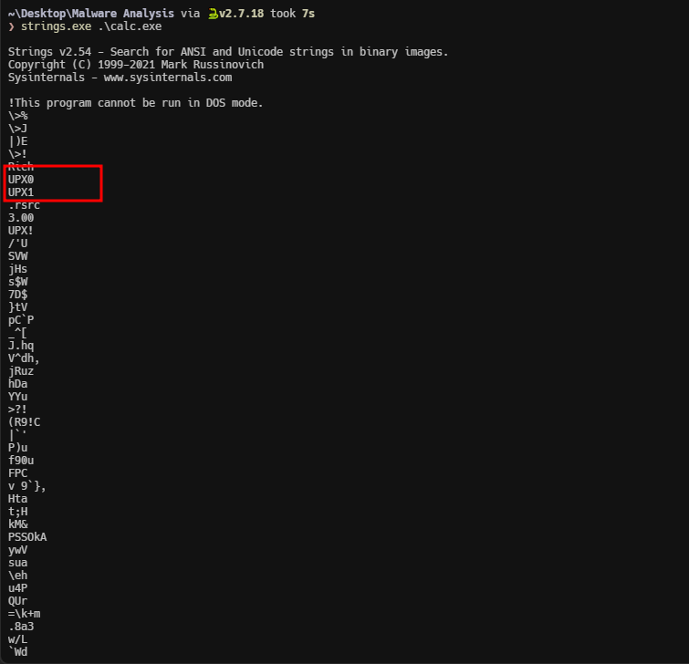
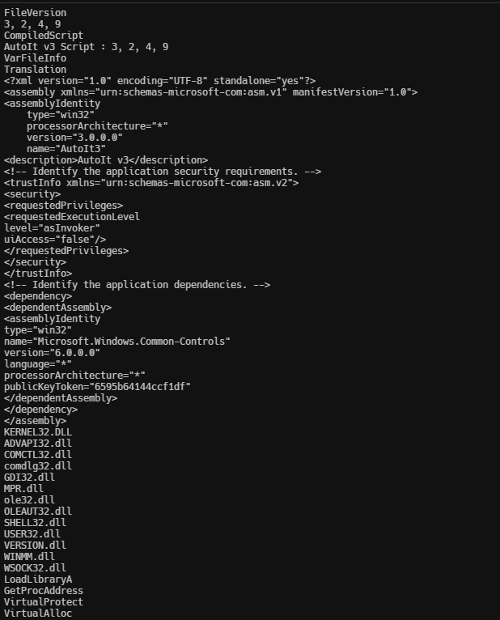
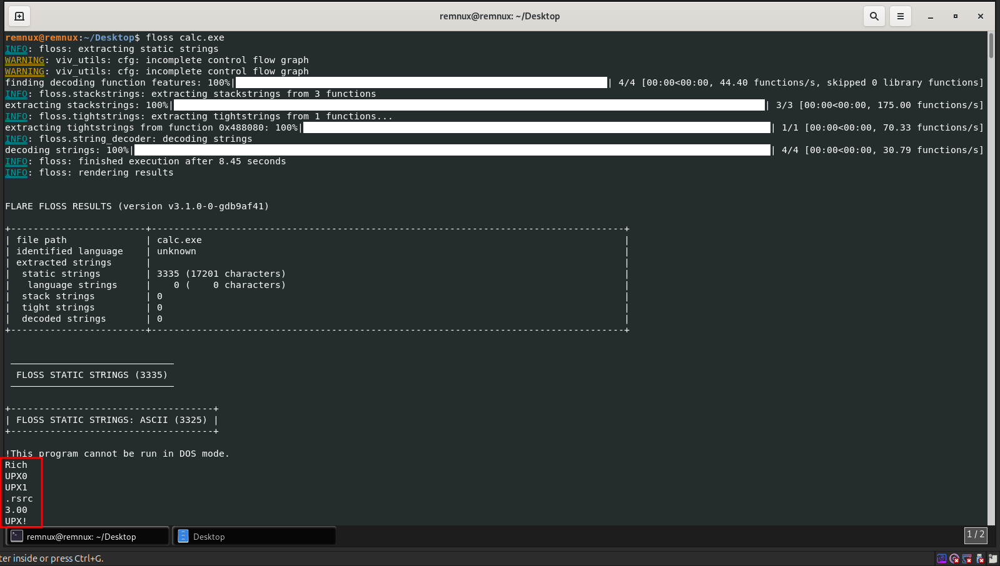
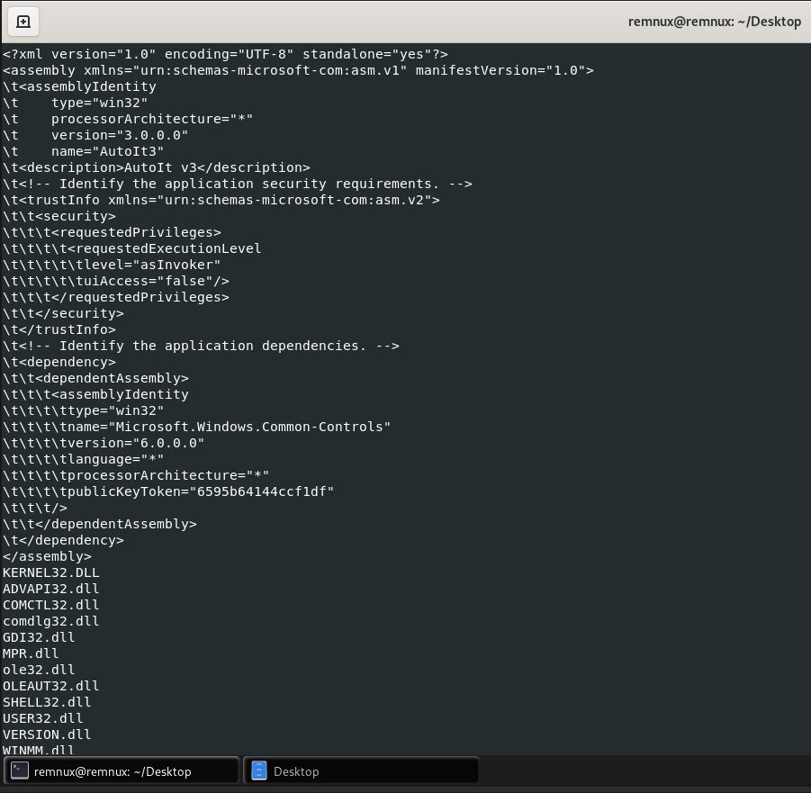

import { Code } from "@astrojs/starlight/components";

Extracting and analyzing strings from a binary file can provide valuable insights into its purpose and functionality. By identifying and examining text sequences within the file, you can gain clues about its file type, intended behavior, and potential malicious activities.

### Using strings command

The `strings` command is available on Linux systems. It can be used to extract strings from a binary. For Windows you can get the Strings executable from the **Sysinternals Suite** [here](https://learn.microsoft.com/en-us/sysinternals/downloads/strings).

The strings command, by default, extracts the ASCII strings that are at least four characters long. With the -a option it is possible to extract all the strings from the entire file.

<Code lang="bash" title="Bash"
    code="
    strings -a calc.exe
    "

/>

Malware specimens also use Unicode (2 bytes per character) strings. To get useful information from the binary, sometimes you need to extract both ASCII and Unicode strings. To extract Unicode strings using the strings command, use the `-el` option.

<Code lang="bash" title="Bash"
    code="
    strings -a -el calc.exe
    "

/>

From the output of the `strings` command for the `calc.exe` file, we can see some strings such as `UPX0`, `UPX1` which shows that the file is compressed with UPX.

We can also see some XML details which are part of the `manifest.xml` file as shown in the following image.

### Using Flare Floss

Most of the times, malware authors use simple string obfuscation techniques to avoid detection. In such cases, those obfuscated strings will not show up in the strings utility and other string extraction tools.[FireEye Labs Obfuscated String Solver (FLOSS)](https://github.com/mandiant/flare-floss) is a tool designed to identify and extract obfuscated strings from malware automatically. It can help you determine the strings that malware authors want to hide from string extraction tools. FLOSS can also be used just like the strings utility to extract human-readable strings (ASCII and Unicode).

<Code lang="bash" title="Bash"
    code="
    floss <path_to_file>
    "

/>

The `floss` command provides a concise summary of its functionality, while producing significantly less output compared to the `strings` command.

The following image shows the same XML details which are part of the `manifest.xml` that the `strings` command extracted.

