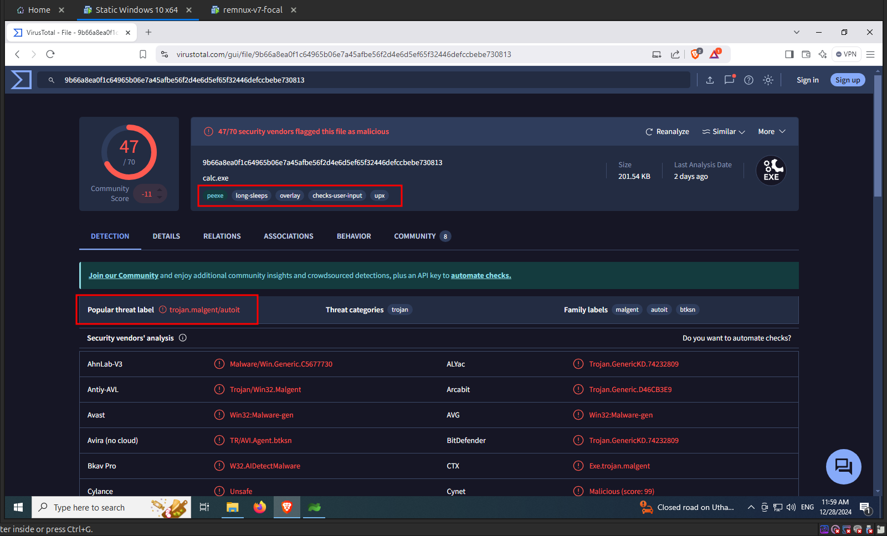
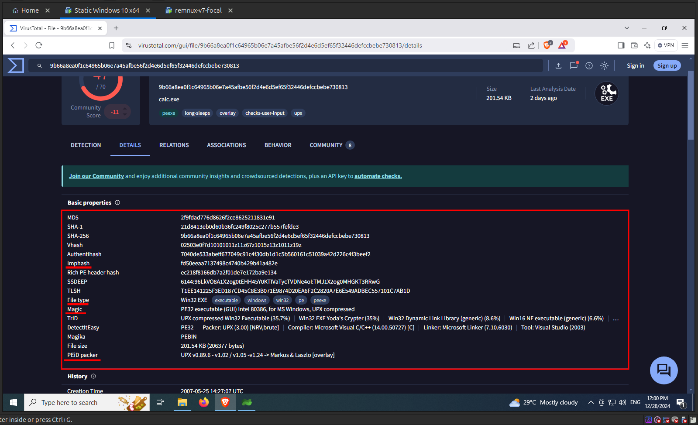
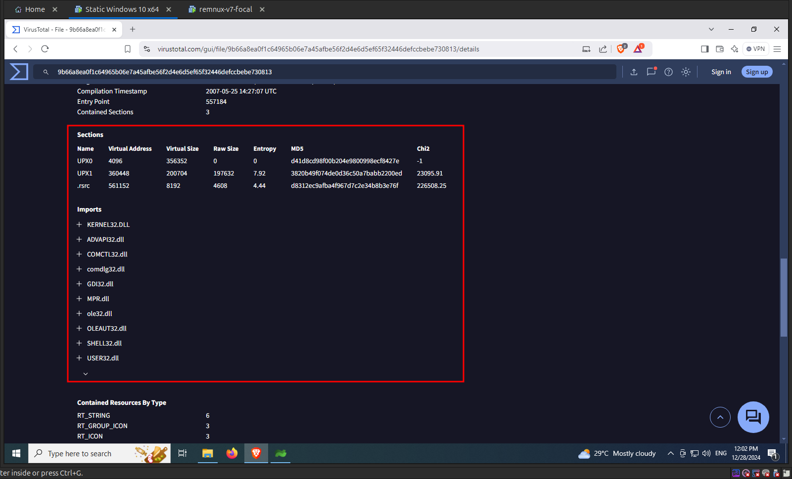
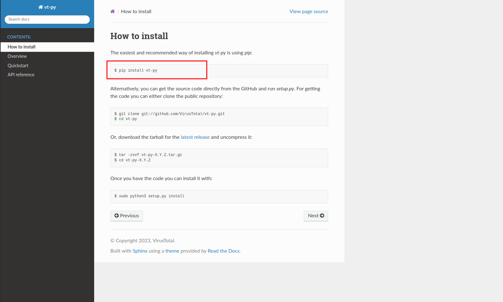
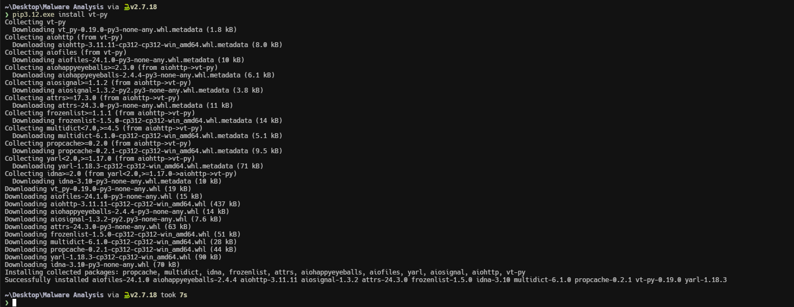
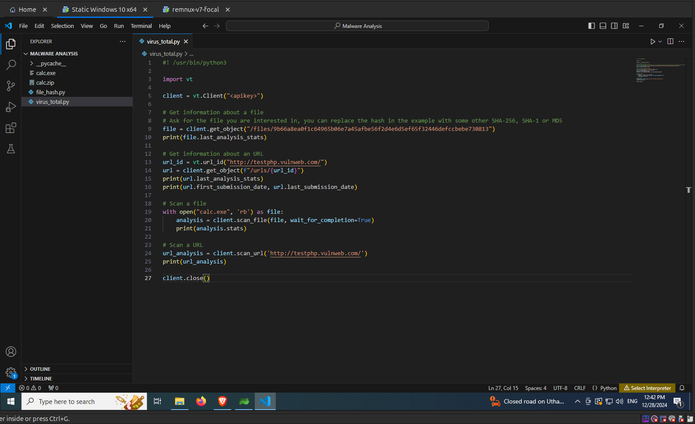

import { Aside } from "@astrojs/starlight/components";
import { Code } from "@astrojs/starlight/components";
import VirusTotalPythonCode from "../scripts/virus_total.py?raw";

File Hash Lookup is the process of searching large antivirus databases for the file hash that we have generated in the previous section. This search aims to determine if the malware is new or has already been identified and analyzed by security experts. The primary objective is to understand the malware's behavior and characteristics based on previous analyses. If the file signature matches an entry in the database, it helps determine whether the given file is malicious. One such well known database is [VirusTotal](https://www.virustotal.com/).

### Using the VirusTotal Website

You can search for file hashes in **VirusTotal** using the search feature present in their website. Here is the link for the search feature in their website: [https://www.virustotal.com/gui/home/search](https://www.virustotal.com/gui/home/search). We will use the `SHA256` hash of the given file that we generated in the last section to search the **VirusTotal** database as shown in the following image.

From the results of the above search, we can see that **VirusTotal** has identified the given file as a Trojan. Also the tags present in the results `peexe`, `upx`, `overlay` shows that this file is a Portable Executable which is compressed with `UPX` and has a overlay as shown in the following image.

You can find more details about the file in the **Details** section as shown in the below image, such as the different hash values of the file, file and magic type and also results of other static analysis tools that we will discuss in the following sections.

The details section contains the `creation time` of the file, the different file names that the malware is seen in the wild and more as shown in the following image.

Also you can find details about different PE sections and imports used by the file.

The details section also shows the details about the overlay present in the given file.

Under the **Behaviour** tab, you can find the **Activity Summary** section, which shows the malwares activity that was captured and identified by the different automated sandbox environments that is mentioned in **Behaviour** tab.

The following image shows the files that were dropped by the malware and its activity with the Windows registry keys.

### Using VirusTotal API with Python

[VirusTotal's API](https://docs.virustotal.com/docs/api-overview) lets you upload and scan files, submit and scan URLs, access finished scan reports and make automatic comments on URLs and samples without the need of using the HTML website interface.

[vt-py](https://github.com/VirusTotal/vt-py) is the official Python client library for the [VirusTotal API v3](https://docs.virustotal.com/reference/overview). You can find the documentation for the `vt-py` client [here](https://virustotal.github.io/vt-py/index.html).

You can install vt-py using `pip` as mentioned in their official documentation.

<Code lang="powershell" title="Powershell"
    code="
    pip3 install vt-py
    "

/>

To interact with the VirusTotal API you need the API key, which you can get by creating a free account in VirusTotal. You can find the API key at the following endpoint as shown in the following image.

Endpoint: `https://www.virustotal.com/gui/user/<username>/apikey`

Once you got the api key replace it in the following python script. The following python script shows some of the basic functionalities of the **VirusTotal API** such as querying information about a file/url, to upload a file and get the analysis report.

<Code lang="python" title="virus_total.py" code={VirusTotalPythonCode} />

Update the python script with the API key and save the python script as shown in the following image.

Now execute the python script. The following image shows the output of the python script.

<Aside type="note">
  The public version of the VirusTotal API has some limits. You can find more
  details about the limits
  [here](https://virustotal.readme.io/reference/public-vs-premium-api).
</Aside>
