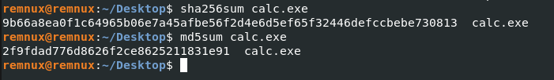
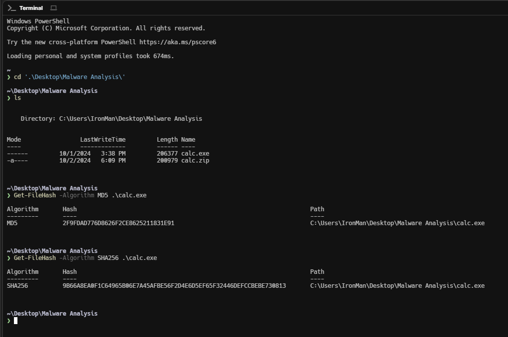
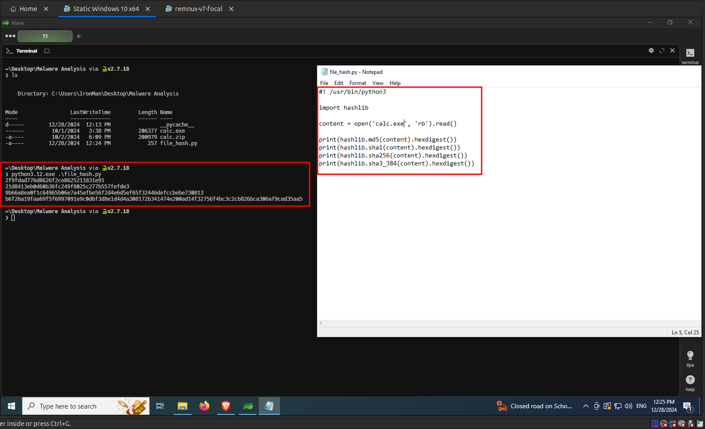

import { Code } from "@astrojs/starlight/components";

Fingerprinting the malware is the process of generating unqiue sigantures of the malicious file, which can be used to identify and classify the same malware if found somewhere else in the wild. A unique signature for a malware can be generated using [hashing](https://www.geeksforgeeks.org/what-is-hashing/) algorithms such as **MD5**, **SHA256** etc.,.

## Generating file hash in Linux

In Linux, to generate a **MD5** hash of a file, you can use the `md5sum` command. Likewise to generate a **SHA256** hash of a file, you can use the `sha25sum` command. The command syntax is as follows,

<Code lang="bash" title="Bash"
    code="
    # For calculating MD5 hash
    md5sum <path_to_file>

    # For calculating SHA256 hash
    sha256sum <path_to_file>
    "

/>



## Generating file hash in Windows

In Windows, we can use the **Powershell's** `Get-FileHash` utility to generate hashes. The command syntax is as follows,

<Code lang="powershell" title="Powershell"
    code="
    # For calculating MD5 hash
    Get-FileHash -Algorithm MD5 <path_to_file>

    # For calculating SHA256 hash

    Get-FileHash -Algorithm SHA256 <path_to_file>
    "

/>



## Generating file hash using Python

You can generate file the hash of a file in Python using the `hashlib` library. The following python script generates the `MD5`, `SHA1`, `SHA256` and `SHA384` hashes for the given file.

```python

```

<Code lang="python" title="file_hash.py"
    code="
    #! /usr/bin/python3

    import hashlib

    content = open('calc.exe', 'rb').read()

    print(hashlib.md5(content).hexdigest())
    print(hashlib.sha1(content).hexdigest())
    print(hashlib.sha256(content).hexdigest())
    print(hashlib.sha3_384(content).hexdigest())
    "

/>

The output of the above python script is shown in the following image.


