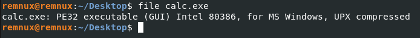
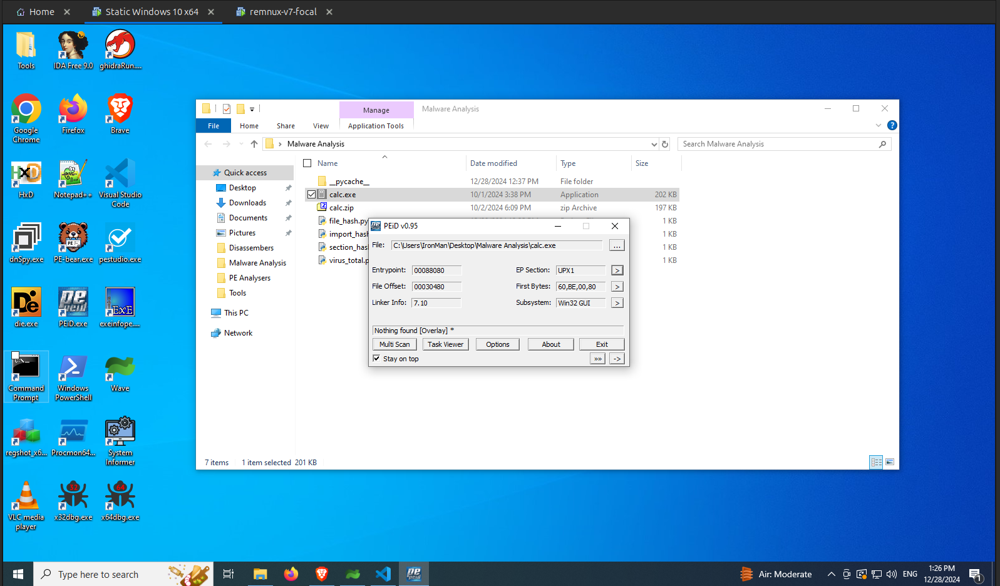
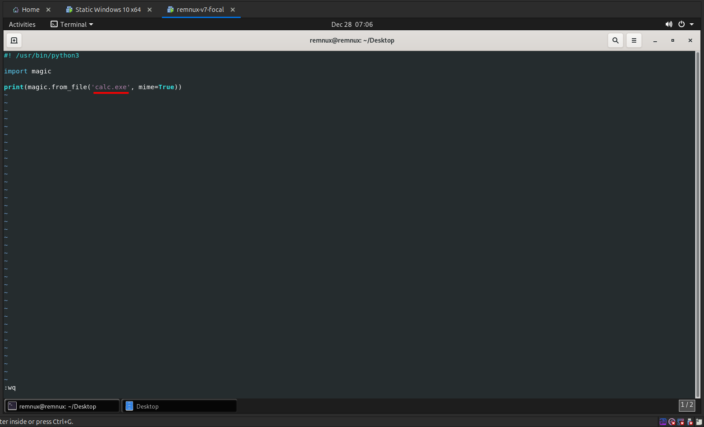

import { Aside } from "@astrojs/starlight/components";
import { Code } from "@astrojs/starlight/components";

The first point of analysing a malware is to identify the file type.

## Using file command

You can do it by using the `file` command present in the Remnux VM as shown in the following image.

<Aside type="note">
  The `file` command is available by default in Linux based systems, but not
  available in Windows. There are some workarounds for getting `file` command in
  Windows like [WSL](https://learn.microsoft.com/en-us/windows/wsl/),
  [Cygwin](https://cygwin.com/) or [fil](https://github.com/file-go/fil).
</Aside>

<Code lang="bash" title="Bash"
    code="
    file <path_to_file>
    "

/>

From the result of the `file` command, we can identify that the given malware is Portable Executable type. Also it mentions that the given file is compressed using `UPX`. We will learn more about `UPX` in the `Detecting Packing and Obfuscation` section.

## Using PEiD

PEiD is used to identify whether the given file is a Windows Executable or specifically Portable Executable. It can't identify other file types and will show the error `Not a valid PE file`.

## Using HEX Viewer/Editor

You can also manually identify the file type using any of the Hex viewers/editors. In my case I am using the `HxD` Hex editor.

Every file has a file signature know as [magic bytes](<https://en.wikipedia.org/wiki/Magic_number_(programming)#In_files>). You can detect the type of file by comparing the first few hex bytes of the file to this [List of File Signatures](https://en.wikipedia.org/wiki/List_of_file_signatures). A Portable Executable file always starts with the bytes `4D 5A` which is decoded as [MZ](https://en.wikipedia.org/wiki/DOS_MZ_executable) as shown in the following image.

## Using Python

You can identify the file type using the Python's [python-magic](https://pypi.org/project/python-magic/) library. You can install it using the `pip` using the following command.

<Code lang="bash" title="Bash"
    code="
    pip3 install python-magic
    "

/>

`python-magic` depends on the `libmagic` library which you can install by executing the installation commands as mentioned in the official documentation as shown in the image below.

Now open your favourite text editor, copy and paste the following python code and save it. The following python code reads the file and prints its MIME [ File ] type.

<Code lang="python" title="file_type.py"
    code="
    #! /usr/bin/python3

    import magic

    print(magic.from_file('calc.exe', mime=True))
    "

/>

Now execute the python script as shown in the following image.

The `python-magic` library identifies the given file as a `application/x-dosexec` MIME type, which refers to the Portable Executable file type. The `file` command is more descriptive compared to the above output.
