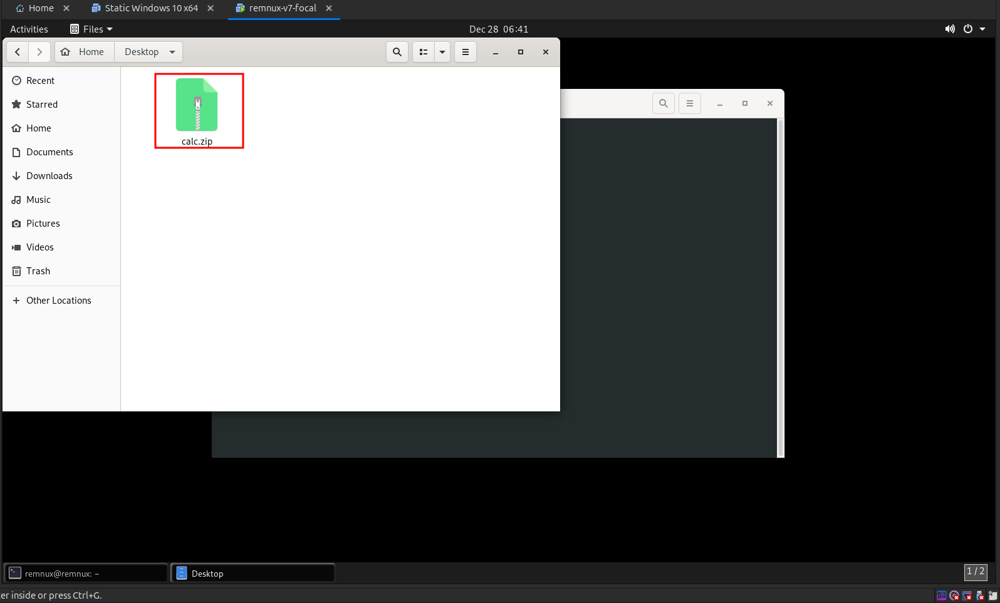
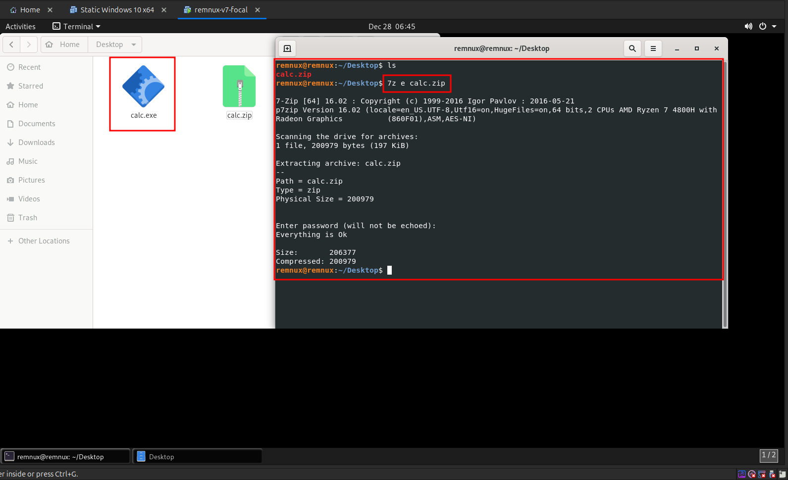
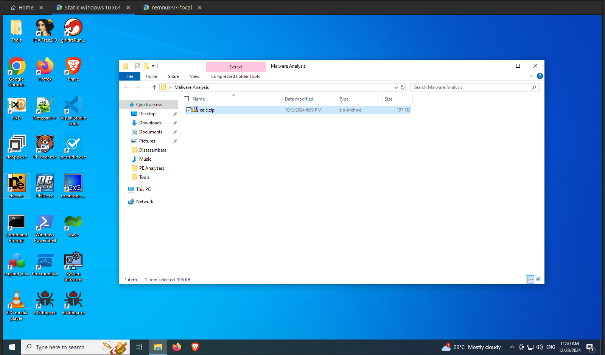
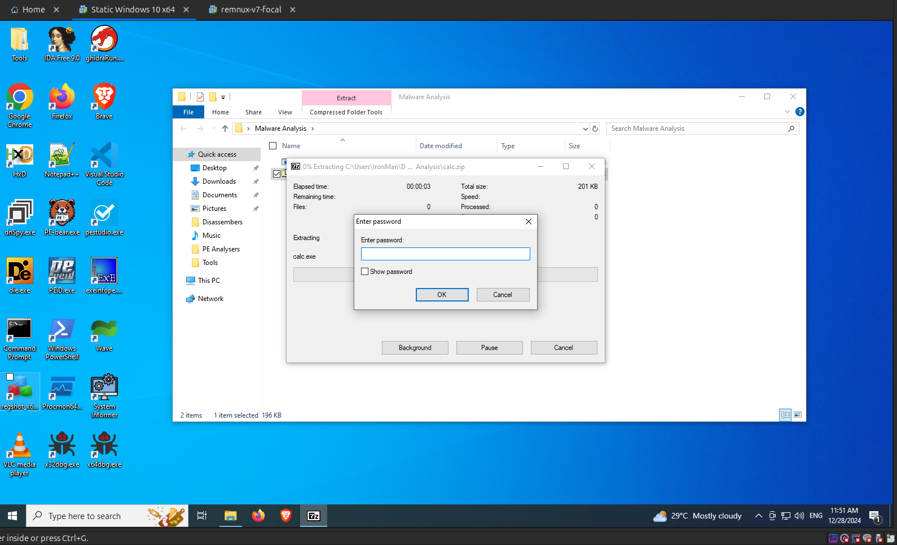

import { Steps } from "@astrojs/starlight/components";

The process of analyzing malware without executing it, but in a controlled environment.

## Environment Setup

For static analysis, we will be using the `calc.exe` file, which is from the Huntress CTF 2024 - `Strange Calc` challenge. Here are the file details:

| Key                | Value                |
| ------------------ | -------------------- |
| ZIP filename       | `strange_calc.zip`   |
| Password           | `strange_calc`       |
| Extracted filename | `calc.exe`           |
| File Type          | `Windows Executable` |

<Steps>

1. First copy the `calc.zip` file to the Remnux VM via drag and drop or `Ctrl + C` and `Ctrl + V`.
   
    

2. Now its time to extract the zip file on the Remnux VM.

3. You can unzip the file using the `7z` tool using the following command as shown in the following image. Enter the password mentioned above when prompted.

    ```bash
      7z e calc.zip
    ```

    

4. Now copy the same to file the static Windows VM.
   
    

5. You can extract the zip file using 7zip as shown in the following image.
   
    

</Steps>
