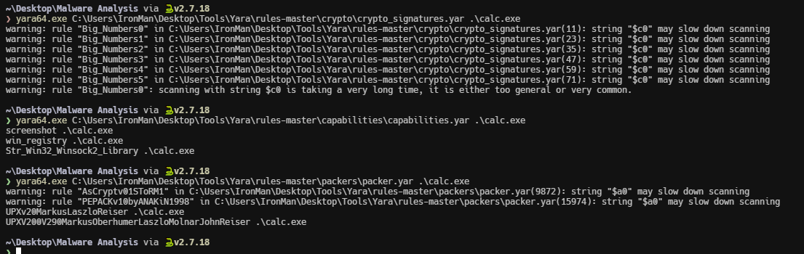
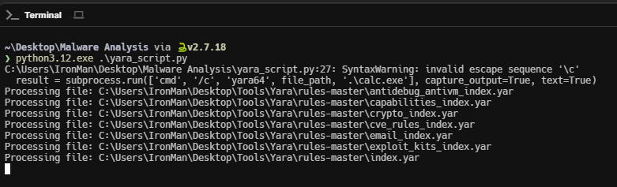
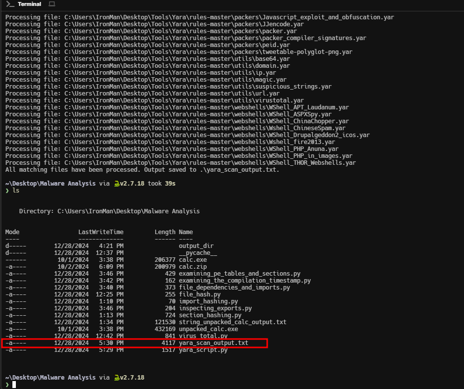
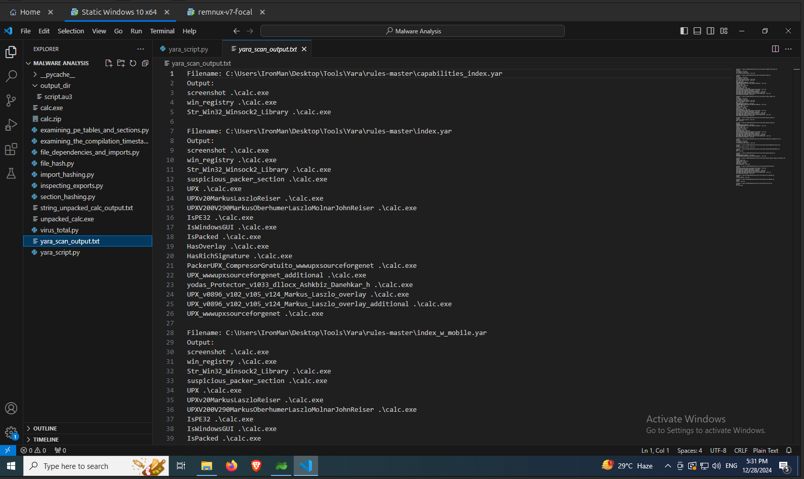

import { Code } from "@astrojs/starlight/components";
import YaraScriptPythonCode from "../scripts/yara_script.py?raw";

[Yara](https://yara.readthedocs.io/en/stable/index.html) is a tool aimed at (but not limited to) helping malware researchers to identify and classify malware samples. You can find the installation documentation for Yara [here](https://yara.readthedocs.io/en/stable/gettingstarted.html). The syntax for `yara` command is as follows.

<Code
  lang="powershell"
  title="Powershell"
  code="yara.exe <rule_file> <FILE | DIR | PID>"
/>

You can find a lot of yara rules [here](https://github.com/Yara-Rules/rules/). The following image shows the output of the yara tool for some yara rules for the `calc.exe` binary.

From the above image we can infer that the `calc.exe` has abilities to take screenshots, interact with windows registry and is packed with upx and more. But its also annoying to choose each script each time and execute it separately. So I have created the following python script which will loop through all the yara rules in the given directory, execute the `yara` command for each rule and writes the output to a text file.

<Code lang="python" title="yara_script.py" code={YaraScriptPythonCode} />

Update the rules directory and run the script. The script is processing each rule as shown in the following image.

The script ran successfully and have written all the output to a text file as shown in the image below.

Let's take a look at the output file. The first few yara rules has detected that the files the abilites to take screenshots, interact with registries, is packed with upx and more.

And some of them identified signatures of keylogger and anti debug features as shown in the following image.

